[English version](RTK1_Composite.md) | [トップページに戻る](README.ja.md)

# [RTK1_Composite](RTK1_Composite.js) プラグイン

RPGツクール MV 用に作成した、合成機能を実現するプラグインです。

ダウンロード: [RTK1_Composite.js](https://raw.githubusercontent.com/yamachan/jgss-hack/master/RTK1_Composite.js)

## 概要

[RTK1_Core プラグイン](RTK1_Core.ja.md) を前提としていますので、先に読み込んでください。 なるべく新しいバージョンをダウンロードして使うようにしてください。


パラメータは全て初期値のままで、特に変更する必要はありません。


## 基本的な使い方

プラグインを導入すると、ゲーム中のメニューで「合成」が使えるようになります。

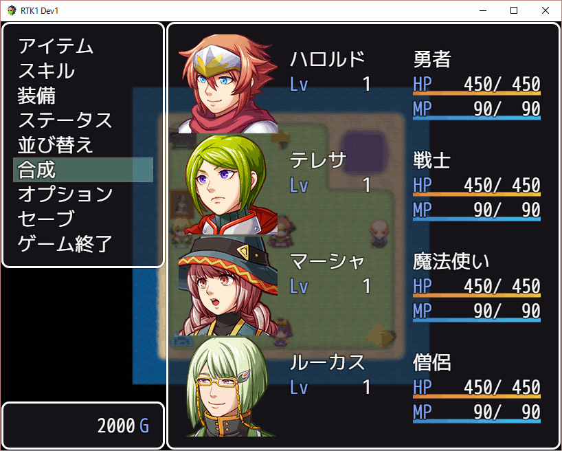

ただし初期状態では合成のレシピが定義されていませんので、合成メニューの中は空です。


RPGツクールMVのデータベースを開き、合成メニューで生成したい対象(アイテム、武器、防具を)を選びます。今回はアイテムのPotion Ex(ポーション改) にしましょう。 そしてメモ欄に以下のように記入します。 これがこの対象の合成レシピとなります。

```
<composite:1,i1,2,0,0>
```


はじめの 1 と、おわりの 0,0 はそのまま入力してください。 これらは次の章で説明します。

大事なのは2番目と3番目の値 i1,2 の部分です。 これは合成に必要な合成材料を指定しています。

値 i1,2 のうち、はじめの i1 は「IDが1のアイテム」を意味します。今回のケースですと、1番に登録されている Potion (ポーション) が該当します。 その後の 2 は必要な個数です。

つまりこの対象であるPotion Ex(ポーション改) を合成するためには、Portion(ポーション) が材料として2つ必要、だと定義されていることになります。

試しにこの合成レシピを、以下のように書き換えたらどうなるでしょうか？

```
<composite:1,i1,2,w1,1,a1,1,0,0>
```

合成材料の指定の部分が i1,2,w1,1,a1,1 と増えています。iがアイテムを示すように、wは武器を、aは防具を示します。よってこのレシピを設定した場合、合成にはPortion (ポーション) が2つに加え、武器のIDが1である Sword(ソード)が1つ、防具のIDが1であるShield(盾)が1つ、あわせて3種類の合成材料が必要ということになります。

合成材料は最大5種類まで指定できます。 最低でも1つの合成材料が指定されている必要があります。

さて合成レシピを i1,2 に戻して、次はプレイヤーに i6 であるPotion Ex(ポーション改)の合成レシピを覚えさせましょう。 マップに自動起動のイベントを追加し、プレイヤーに適当にアイテムを渡した後、以下のプラグインコマンドを使用します。

```
RTK1_Composite learn i6
```
※ カンマ区切りで複数まとめて指定することもできます


これでプレイヤーは i6、つまり ID 6のアイテムであるPotion Ex(ポーション改) の合成レシピを学びました。 さて、ゲーム中の合成メニューを実行してみましょう。


これでプレイヤーは冒険中はいつでも、Portion(ポーション)が2つあれば合成し、Potion Ex(ポーション改) を入手することができるようになりました。

なお本プラグインは、同じ RTK1シリーズの英語/日本語切り替えできる [RTK1_Option_EnJa プラグイン](RTK1_Option_EnJa.ja.md) にも対応しています。 以下が英語モードに切り替えたときの動作画面です。


## 合成レシピを忘れさせよう

いったん覚えた合成レシピはセーブファイルに自動保存され、以後、材料があればいつでも合成可能になります。

しかし、あるイベント限定の合成レシピなど、忘れてほしい場合もあるでしょう。 そんな場合には learn と同様に forget のプラグインコマンドで忘れさせることができます。

```
RTK1_Composite forget i6
```

## 費用を設定しよう

あまり気楽に合成されてしまうと、高価な品を売っている商店からクレームがくるかもしれませんね？そこで合成作業に費用を設定する方法を説明します。

```
<composite:1,i1,2,0,0>
```

前回、Potion Ex(ポーション改) のメモ欄に設定したこの合成レシピですが、最後の数字を 50 に変更してみましょう。

```
<composite:1,i1,2,0,50>
```

そう、この最後の数字が合成の費用なのです。 ゲームを実行してみると、合成に 50G の費用が取られるようになっているのが確認できます。


## 成功率を設定しよう

いつもいつも合成に成功していてはスリルがない？では合成レシピに成功率を設定してみましょう。

```
<composite:1,i1,2,0,50>
```

と設定されているメモ欄の最初の数値を 0.5 に減らしてみましょう。

```
<composite:0.5,i1,2,0,50>
```

そう、この最後の数字(0～1)が合成の成功率なのです。 ゲームを実行してみると、成功率が 50% に低下しているのがわかります。


なお今回の設定の場合、合成に失敗すると何も得られません。 丸損、ってやつですね。

## 合成失敗時に何か貰いたい

合成失敗したら何も貰えない設定、やっぱり評判悪いでしょうか？では、失敗しても何かアイテムを得ることができるようにしましょう。

```
<composite:0.5,i1,2,0,50>
```

はもうお馴染み、成功率 50% にしちゃったPotion Ex(ポーション改) の合成レシピです。 残ったひとつの謎の数字、最後から2番目の 0 を以下のようにアイテム指定に変更してみます。

```
<composite:0.5,i1,2,i1,50>
```

今回は地味に i1、つまり材料でもあるPortion(ポーション)を指定しています。 失敗しても、材料が1つ返ってくるから許してね、って感じでしょうか。

以下は合成に失敗した画面です。 何も出ないよりはマシ！って感じでしょうか。

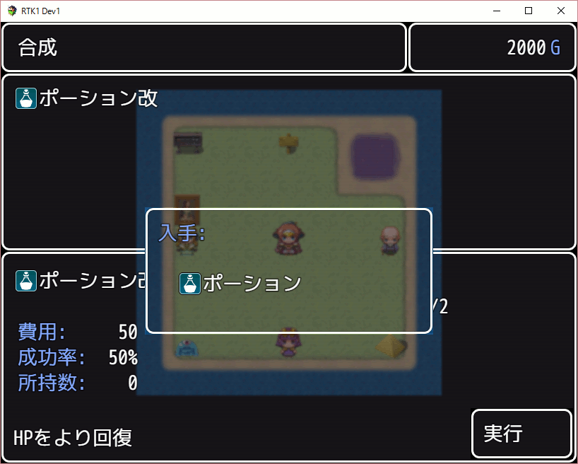

この仕組みを前向きに利用して、成功率は非常に高いのですが、失敗すると高価なアイテムに化ける、という仕組みも提供できます。

例えば「刀」の成功率は99.9%なのですが、わずか1%の確率で「名刀」ができてしまう！というのも面白そうです。シティーハンターにおける「ワンオブサウザンド」な銃みたいなもの？

以上で、合成に関する基本的な利用方法は完了です。 うまく組み込んで、楽しいゲームを作ってください。

## ショップ

これからは中級者向けに、ショップ関連の機能を説明していきます。

合成のショップを開くには、以下のプラグインコマンドを使用します。

```
RTK1_Composite shop
```

すると以下のような「合成の店」が開きます。


表示される合成メニューですが、プレイヤーのようにいちいちレシピを覚える必要はなく、定義された合成レシピがすべて自動的に陳列されています。 冒険のキーアイテムが想定外にあっさり合成されてしまわぬよう、合成材料の設定には気をつけてください。

更に item/weapon/armor の引数を追加すると、以下のようにその項目の専門店になります。 合成レシピが多い時には店を分けると良いでしょう。

```
RTK1_Composite shop item
```

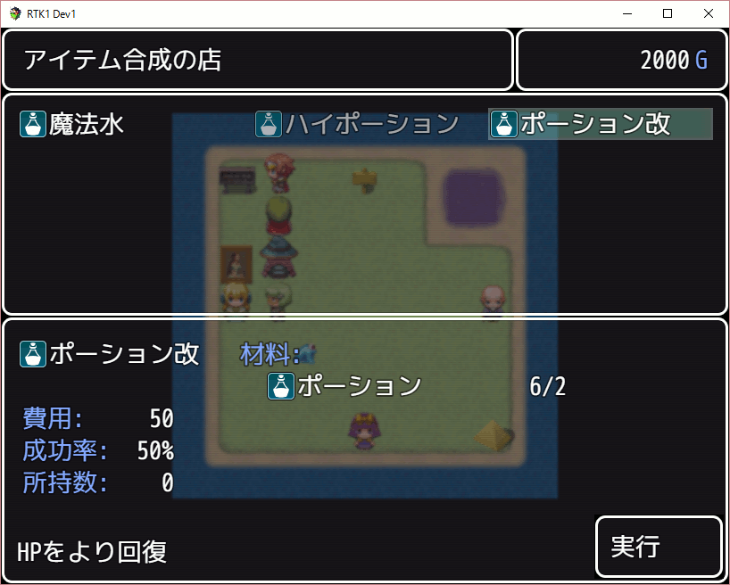

### ショップ名の変更

更に第3引数を追加すると、その値はショップ名として使用されます。 第2引数は省略できなくなりますので、全ての種類を表示したい場合には "all" と明示してください。

```
RTK1_Composite shop item en_name
RTK1_Composite shop all en_name
```

第4引数も指定すると、日本語のショップ名として利用されます。 以下のコマンドは英語名 en_name と、日本語名 ja_name が言語設定によって自動的に使い分けられます。

```
RTK1_Composite shop all en_name ja_name
```

なおプラグインコマンドの引数には空白スペース(" ")が指定できませんので、かわりに "%20" を使ってください。 例えば以下のように指定します。

```
RTK1_Composite shop all English%20name 日本語の名称
```


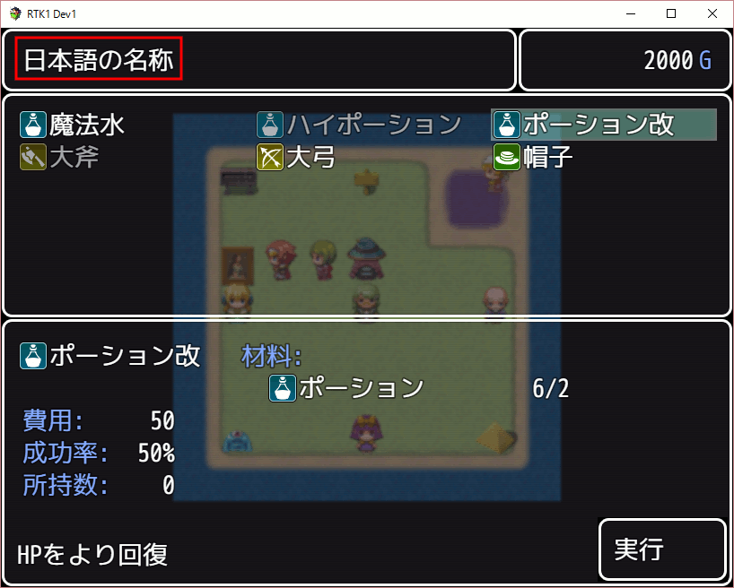

### カスタム・ショップ

ショップ機能は自動で合成レシピのリストを作成してくれる便利機能ですが、自分で陳列されるレシピをコントロールしたい場合もあります。

例えば冒険の序盤で訪れる合成の店で、「英雄の剣」などと終盤のアイテムまで並んでいたら、合成のレシピが多い場合には邪魔に感じてしまうかもしれません。 そんな場合にはカスタム・ショップの機能で適切な品揃えを提供してください。

カスタム・ショップの利用では、基本的に以下のプラグインコマンドを連続して使用します。 "clear" で現在の陳列用のレシピリストを空にし、"add" でレシピを加え、そして "shop custom" でカスタム・ショップを利用します。

```
RTK1_Composite clear
RTK1_Composite add i5,i6,w1
RTK1_Composite shop custom
```

補助コマンドとして "complete" があり、これは条件に合うレシピを自動的にリストに追加します。 例えば以下は "shop item" とほぼ同じ品揃えですが、それに加えて武器が1つだけリストに含まれます。

```
RTK1_Composite clear
RTK1_Composite complete item
RTK1_Composite add w1
RTK1_Composite shop custom
```

以下は武器と防具の全ての合成レシピを陳列した合成ショップを利用します。

```
RTK1_Composite clear
RTK1_Composite complete weapon
RTK1_Composite complete armor
RTK1_Composite shop custom
```

"clear" は種類を限定してリストを空にできるので、以下も同じ結果になります。

```
RTK1_Composite complete
RTK1_Composite clear item
RTK1_Composite shop custom
```

注意点としては、この作成したレシピのリストはセーブファイル保存されないことです。 よって "RTK1_Composite shop custom" で店を開く前に必ず、陳列するレシピを設定してください。

あまり使うことはないと思いますが、remove で店の陳列リストからアイテムを外すことができます。

```
RTK1_Composite remove i6
```

これら陳列されるレシピリストを制御する機能をうまく使って、プレイヤーにとって使いやすく楽しい合成ショップを作ってみてください。

## ソート機能

ver 1.13 でソート機能が実装されました。

| 値 | 役割 |
| --- | --- |
| 0 | ソート機能を利用せず、レシピは追加順に表示される (初期値) |
| 1 | 名前順に並べ替える |
| 2 | ID 順に並べ替える |
| 4 | 種別(Item/Weapon/Armor)順に並び替える |
| 8 | タイプ別に並び替える (4と同時に指定します) |

プラグインパラメーター 'list sort' でこれらの値を指定してください。 複数の値を指定するときは、その合計値を指定します。

例えば名前で並び替える場合には 1 を、名前と種別順で並べ替える場合には 1 + 4 なので 5 を、それを更にタイプ別(例:武器なら剣や斧など)並べ変える場合には 1 + 4 + 8 なので 13 を指定します。

このソート順は以下のプラグインコマンドで変更することも可能です。 ソート順はセーブファイルに保存されます。

```
RTK1_Composite sort #value
```

## 作業場

ショップとは別に、自宅などに「作業場」を設置することができます。

作業場の使い方はショップと同じですが、"shop" コマンドのかわりに "workroom" コマンドを使用してください。

```
RTK1_Composite workroom
```

ショップと同様のメニューが開きますが、タイトル部分が「作業場」になっています。

作業場の特徴として、合成の際に費用がかかりません(初期設定の場合)。 ですので作業場で合成をするときには、所持金や合成費用が表示されなくなります。


作業場もショップと同じく扱う種別を設定することができます。 カスタム機能も利用可能です。

```
RTK1_Composite workroom all
RTK1_Composite workroom item
RTK1_Composite workroom weapon
RTK1_Composite workroom armor
RTK1_Composite workroom custom
```

作業場の英語名、日本語名も同様に指定することができます。

```
RTK1_Composite workroom all en_name
RTK1_Composite workroom all en_name ja_name
```

### 作業場を差別化する

作業場での合成作業の成功率と費用は調整が可能で、プラグインパラメーターで初期設定できます。


プラグインパラメーターの初期値では、成功率の調整値(success adjust workroom)は 1 になっています。 これは 1 を掛ける、つまり合成レシピと同じ成功率ということです。

例えばこの値を 0.8 に変更すれば、作業場での合成の成功率は通常より下がります。　あまり推奨はしませんが、1より大きくすると逆に上がります。 ただし当然ながら、成功率の下限は0%で、上限は100%です。

もしレシピの失敗欄に「名刀」など貴重なアイテムを設定している場合、この成功率の調整には注意してください。 めったに出ないはずの貴重な「名刀」が、自宅では簡単に量産できる、となるとゲームバランスが崩れてしまうかもしれません。

またプラグインパラメーターの初期値では、費用の調整値(charge adjust workroom)は 0 になっています。 これは 0 を掛ける、つまり作業場での合成費用は常に無料ということです。

費用の調整値が 0 の場合にはシステム的に特別な扱いとなり、所持金や合成費用が表示されなくなります。 作業場の場合は、これが標準の状態です。

## 上級者向けの機能

### 調整値を利用する

「作業場を差別化する」で、作業場の成功率の調整値(success adjust workroom)と費用の調整値(charge adjust workroom)を説明しました。 実はこの調整値、作業場だけのものではありません。

合成メニュー用の調整値、そして合成ショップ用の調整値も用意されており、プラグインパラメーターで変更することができます。 合成メニューやショップでも、費用の調整値を 0 にすれば合成費用や所持金が表示されなくなります。 まあ、ショップで費用がかからなくするのは、珍しいケースだとはおもいますが…

それぞれの初期値は以下のようになっています。 実にシンプルですね。

| モード | 成功率の調整値 | 費用の調整値 |
| --- | :---: | :---: |
| メニュー | 1 | 1 |
| ショップ | 1 | 1 |
| 作業場 | 1 | 0 |

例えばですが、費用がかかるのはショップだけとし、そのかわりに成功率が高いとしましょう。 自分で合成する場合にはお金はかかりませんが、成功率が下がることにしましょう。 メニューからの合成は冒険中なので、わりと失敗しやすいことにしましょう。 自宅の作業場では道具が揃っているため、冒険中よりは成功率が高いとしましょう。 この場合は、例えば以下のような感じでプラグインパラメーターを設定します。

| モード | 成功率の調整値 | 費用の調整値 |
| --- | :---: | :---: |
| メニュー | 0.8 | 0 |
| ショップ | 1 | 1 |
| 作業場 | 0.95 | 0 |

メニューからの合成や、自宅の作業場での合成は、誰かに教わることで成功率が上昇する、というのも面白いかもしれません。 その場合には、次のセクションにあるプラグインコマンドを使ってみてください。

### 調整値をゲーム中に変更する

前の章で説明した調整値ですが、プラグインパラメーターで指定するのはあくまで初期値です。 プラグインコマンドで変更することができ、変更した値はセーブデータにも保存されます。

さて、作業場の成功率の調整値を 0.8 に、費用の調整値を 0.5 に修正してみましょう。

```
RTK1_Composite adjust workroom success 0.8
RTK1_Composite adjust workroom charge 0.5
```

"workroom" を "menu" にすればメニューからの合成の調整値を変更でき、"shop" に変更すればショップでの合成の調整値を変更できます。

例えば以下は、プラグインコマンドを利用した「合成スキルあげ爺さん」のイベント設定例です。 イベントページを増やしてセルフスイッチを使って切り替えることで、何段階かでプレイヤーの合成スキルを向上させることができるでしょう。

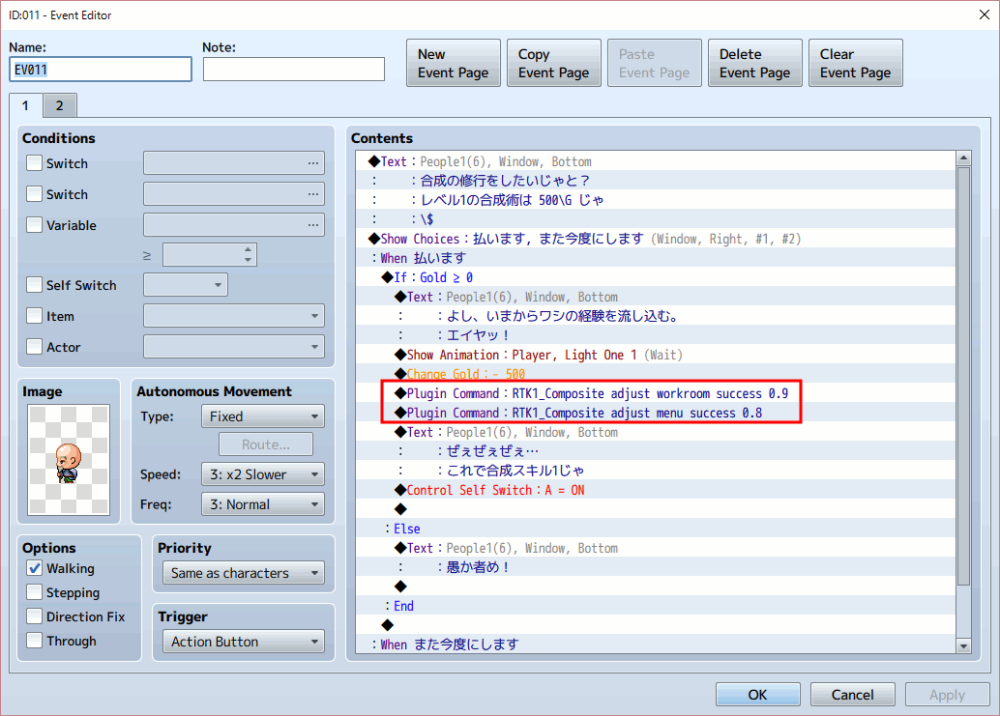

### 習得リストと選択リストを使い分ける

本プラグインには、プレイヤーが習得したレシピのリスト(learnリスト)と、実際に画面に表示される選択リスト(selectリスト)があります。

learnリストはゲームプレイ中にだんだん増えていくもので、セーブファイルにも保存されます。 それに対してselectリストは合成のメニューやショップ、作業場を開くときに一時的に利用されるものです。

以下はプレイヤーが習得するlearnリストに関連するプラグインコマンドをまとめてみたものですが、非常にシンプルになっています。 最初の "RTK1_Composite" は省略します。

| コマンド | 説明 |
| --- | --- |
| learn #id | #id のレシピを覚える |
| forget #id | #id のレシピを忘れる |
| reset | レシピを全て忘れる |

なお #id は i1,i3 のように複数値をカンマ区切りで設定することもできますし、i2-3 のように範囲も指定できます。 i2-4,w1 のように組み合わせても OK です。

それに対し、合成画面で利用される selectリストに対する操作コマンドは多くあります。 プラグイン利用者は、次の表にある custom モードのためにこれらを使うことがおおいでしょう。

| コマンド | 説明 |
| --- | --- |
| add #id | リストに#id のレシピを追加する |
| remove #id | リストから#id のレシピ外す |
| clear | リストから全てのレシピを外す |
| clear $type | リストから type のレシピを外す<br>$type は item/weapon/armor |
| complete | リストに全てのレシピを追加する |
| complete $type | リストに全ての type のレシピを追加する |
| fill | リストの内容をlearnリストと同じにする |

実際に合成画面を表示するのは以下のコマンドです。

| コマンド | 説明 |
| --- | --- |
| open | fill したリストで合成画面を開く<br>ゲームメニューから呼び出されるパーティ用の合成画面です |
| shop | complete したリストで合成ショップ画面を開く |
| shop $type | complete $type したリストで合成ショップ画面を開く |
| shop custom | リストを変更せず合成ショップ画面を開く |
| workroom | complete したリストで作業場の画面を開く |
| workroom $type | complete $type したリストで作業場の画面を開く |
| workroom custom | リストを変更せず作業場の画面を開く |

これらの合成画面を表示するコマンドは、追加の引数で英語、日本語の表示タイトルを設定できます。

## ゲーム中のレシピの覚え方

実際にゲーム中でレシピをどう提供するか、幾つか例を紹介します。

### 自動学習を利用する

ver1.15 より、自動学習(auto learn)をプラグインパラメータで設定できるようになりました。 標準では OFF(0) になっています。

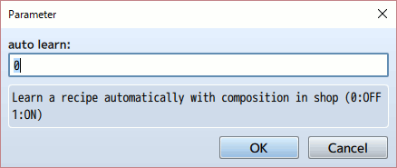

自動学習が ON(1) になっていると、合成ショップでアイテムを合成して成功すれば、そのレシピを自動的に覚えます。 プレイヤーは店の人が合成してくれるのをじっと見て、合成の材料を覚えてしまうわけですね。 一度レシピを覚えてしまえば、材料がある限り、冒険中にアイテムを合成することができるわけです。

この自動学習はアイテムごとに細かくコントロールできます。 合成する対象のメモ欄に &lt;composite auto&gt; と記載しておくと、上記のプラグインパラメータの設定に関わらず、自動学習の対象になります。

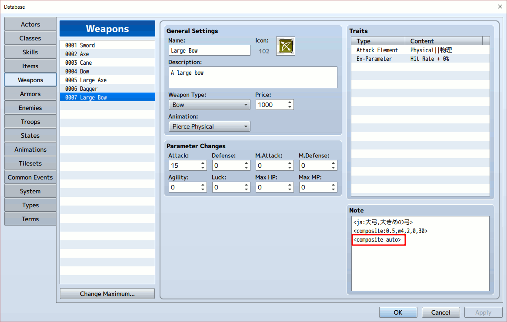

逆に合成する対象のメモ欄に &lt;composite !auto&gt; と記載しておくと、プラグインパラメータの設定に関わらず、自動学習の対象にはなりません。

以上、この自動学習を利用したレシピの取得が、いちばん簡単なゲーム設定だとおもいます。

### イベントでレシピを覚える (1)

本プラグインには、イベントで利用できる以下の関数があります。 指定したID(以下の例ではID=5のアイテム)のレシピを覚えていれば、真(true)を返します。 レシピを覚えていなければ偽(false)を返します。

```
RTK.CP.recipe("i5")
```

これを利用して、イベントで 「レシピを覚えられる本」 を作成してみます。 まずは以下のようにレシピを覚えているかどうかで場合分けをし

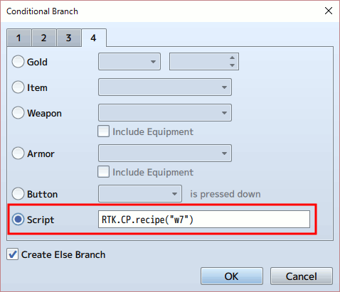

実際にイベントに設定するコマンドは以下のようにします。

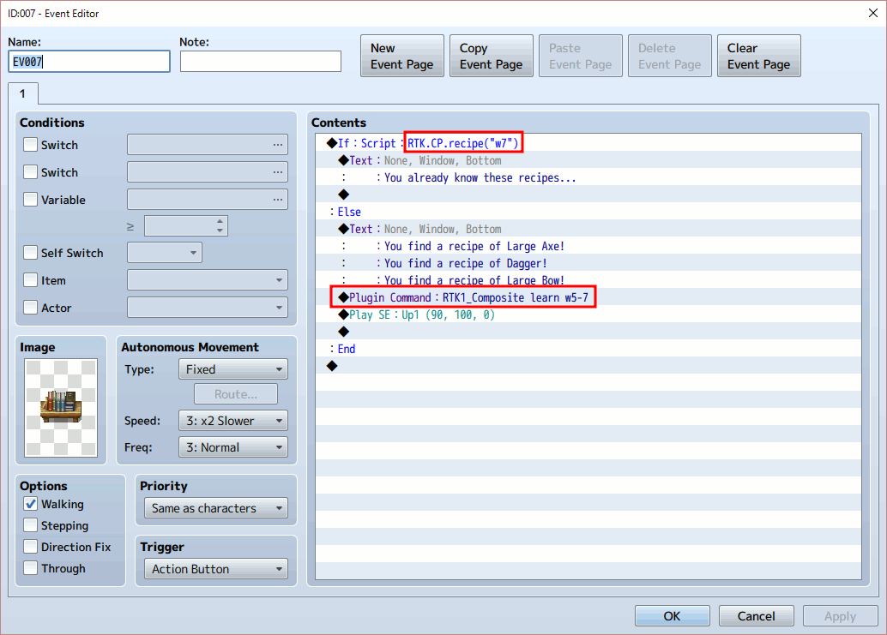

本を読むと効果音が鳴り、プラグインコマンドで3つの武器のレシピを覚えます。

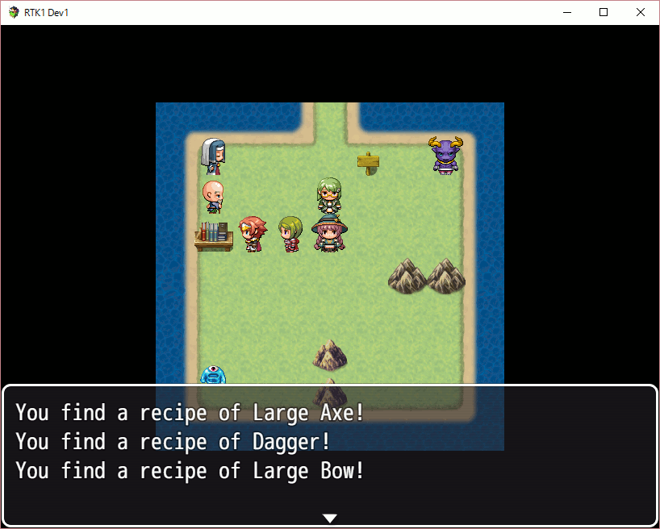

### イベントでレシピを覚える (2)

今度はより複雑に 「5000Gでレシピを教えてくれる爺さん」 イベントを作成してみます。

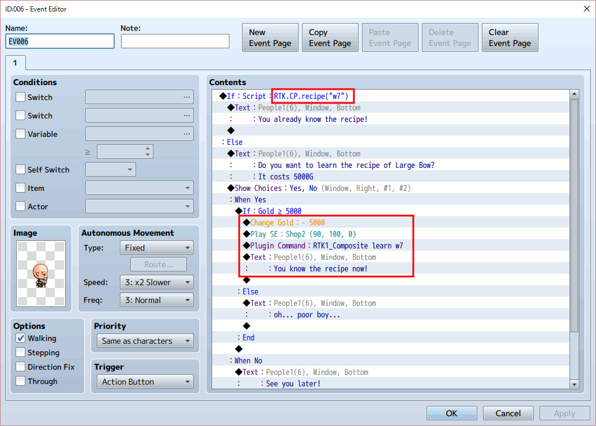

さきほどの本と基本は同じですが、お金が不足している場合を分け、会話を分岐させています。 5000G で　Large Bow (ID=7 の武器) のレシピを教えてもらえます。

## 更新履歴

| バージョン | 公開日 | 必須ライブラリ | 更新内容 |
| --- | --- | --- | --- |
| ver1.16 | 2017/03/14 | [RTK1_Core](RTK1_Core.ja.md)<br>ver1.11 以降 | 長いアイテム名と被らないように 材料: 表示を少し右に移動 |
| [ver1.15](archive/RTK1_Composite_v1.15.js) | 2016/07/22 | [RTK1_Core](RTK1_Core.ja.md)<br>ver1.11 以降 | 自動学習を追加 |
| [ver1.13](archive/RTK1_Composite_v1.13.js) | 2016/07/14 | [RTK1_Core](RTK1_Core.ja.md)<br>ver1.11 以降 | sort コマンドおよびパラメーターを追加 |
| [ver1.11](archive/RTK1_Composite_v1.11.js) | 2016/07/06 | [RTK1_Core](RTK1_Core.ja.md)<br>ver1.11 以降 | #id 指定にハイフンによる範囲指定が使えるようになった<br>forget コマンドのバグを修正 |
| [ver1.10](archive/RTK1_Composite_v1.10.js) | 2016/07/05 | [RTK1_Core](RTK1_Core.ja.md)<br>ver1.08 以降 | 日本語ヘルプを追加<br>作業場を追加<br>成功率と費用の調整機能を追加 |
| [ver1.09](archive/RTK1_Composite_v1.09.js) | 2016/07/02 | [RTK1_Core](RTK1_Core.ja.md)<br>ver1.08 以降 | 公開 |


## ライセンス

[The MIT License (MIT)](https://opensource.org/licenses/mit-license.php) です。

提供されるjsファイルからコメント等を削除しないのであれば、著作権表示は不要です。 むろん表示いただくのは歓迎します！

[トップページに戻る](README.ja.md)
