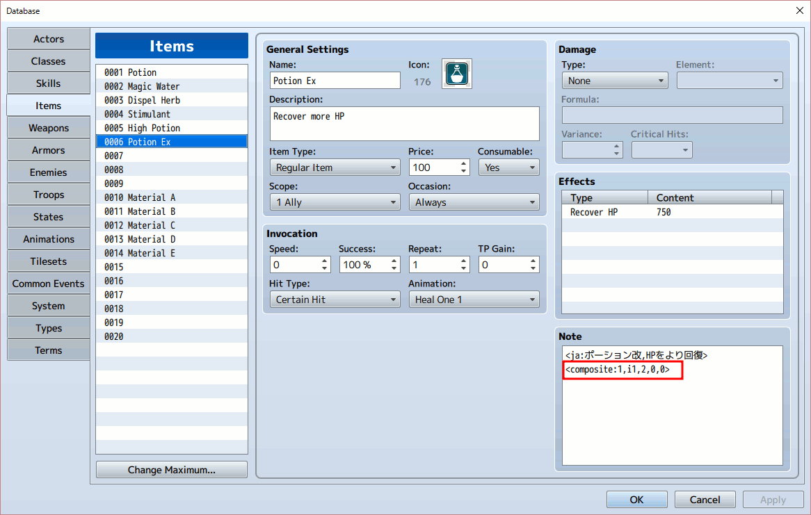
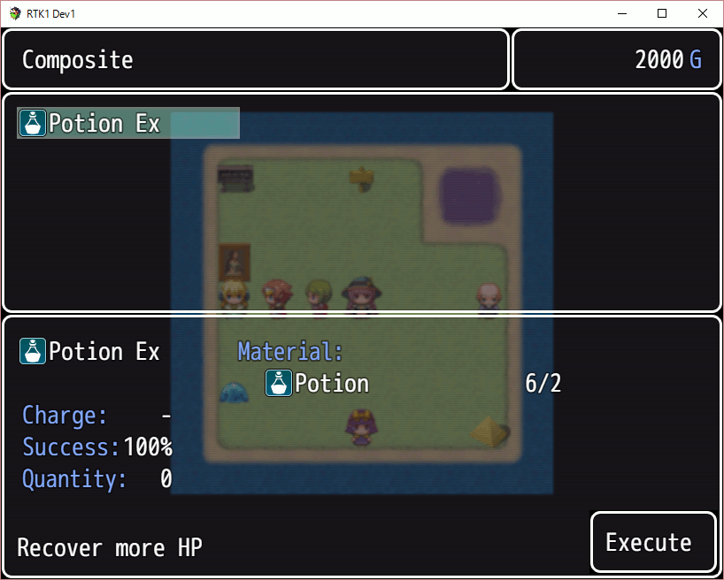
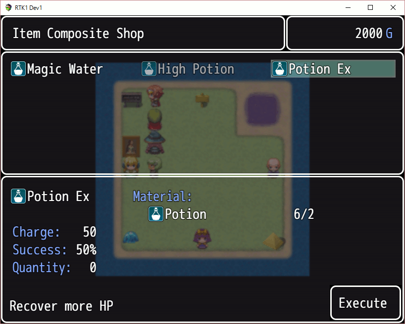
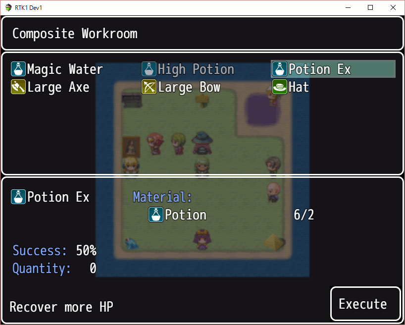
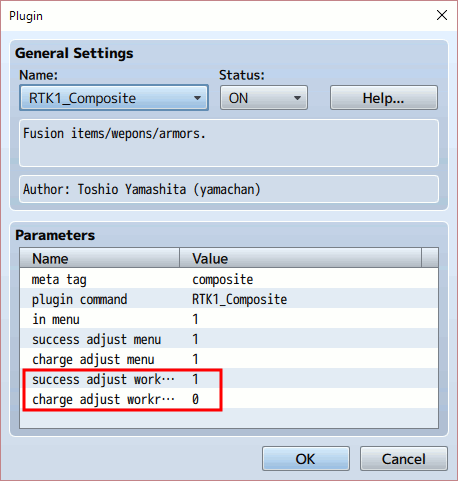

[Japanese version](RTK1_Composite.ja.md)

# [RTK1_Composite](RTK1_Composite.js) Plugin

Plugin to add the composite function for RPG Maker MV.

Download: [RTK1_Composite.js](https://raw.githubusercontent.com/yamachan/jgss-hack/master/RTK1_Composite.js)

## Overview

This plugin depends on [RTK1_Core plugin](RTK1_Core.jp.md). Please include it before this plugin, as follows;


Normally, you don't need to change parameters.


## 1st step

With this plugin player can use "Composite" in game menu.


But at first, player doesn't know any composite recipe, so "Composite" list is empty.


Let's open the database menu of RPG Maker MV, chose any target item, weapon or armor - for example, item "Potion Ex". Then let's input following tag into the note area of the target . This will be the composite recipe of this.

```
<composite:1,i1,2,0,0>
```


Please don't touch the 1st value '1', and the last 2 values '0,0'. I will explain about them in later section.

In this section, the 2nd and 3rd values 'i1,2' is important. These values show the necessary matelials of this composition.

In the values 'i1,2', the first "i1" value is a shorten version of "item which id is 1". It shows the ID 1 item in the databese, "Potion". The following value "2" means it requires 2 portions for this composition.

In the result, 'i1,2' means "2 Portions".

OK. Let's try to test the following sample.

```
<composite:1,i1,2,w1,1,a1,1,0,0>
```

You should check "i1,2,w1,1,a1,1" part.

Same as "i1", "w1" is a shorten version of "weapon which id is 1", and "a1" is a shorten version of "armor which id is 1" So this recipe means that it requires 2 Portions, 1 Sword and 1 Shield. Is it clear?

In this plugin, you can set 5 necessary matelials for one composition recipe. It must have at least one necessary matelial.

Then, let's back to the event setting - add an autorun event to set up the player's item bag in your map. Then, let's use the following plugin command;

```
RTK1_Composite learn i6
```
\# You can set more than 2 items with "," separator.


Finished! Now, player knows the composition recipe of i6 (item which id is 6 - means Portion Ex).



Now, player can composite a Potion Ex from 2 Portions anytime from the game menu.

By the way, this plugin can work with English/Japanese language switch [RTK1_Option_EnJa plugin](RTK1_Option_EnJa.md). The following screenshot is in Japanese mode.


## Forget recipes

Onece player learn a composition recipe, it will be kept after saving game.

But sometimes, we need a temporary event recipe which should be forgot after the event. For this purpose, this plugin has "forget" plugin command, as follows;

```
RTK1_Composite forget i6
```

## Set charge cost

You can set the charge cost in a composition recipe.

```
<composite:1,i1,2,0,0>
```

Let's change the last value '0', to '50'.

```
<composite:1,i1,2,0,50>
```

Yes, the last value means the charge cost. You can see the 50G cost in the game;


## Set success rate

You can set the success rate for a composition recipe.

```
<composite:1,i1,2,0,50>
```

Let's change the first value '1', to '0.5'.

```
<composite:0.5,i1,2,0,50>
```

Yes, the first value (from 0 to 1) means the success rate. You can see the 50% rate in the game;


In the current recipe, you will get nothing when the composition fails. You will lose money and materials.


## Get something when fail to composite

You don't want to lose everything? OK, you can change a composition recipe again.

```
<composite:0.5,i1,2,0,50>
```

Let's see the last value but two, '0'. It's the value for composition fail.'0' means nothing, so let's change it to 'i1'.

```
<composite:0.5,i1,2,i1,50>
```

With this recipe, you will get 1 Portion when the composition fails, as follows;


That's all to use basic functions of this plugin. I hope you will enjoy to develop your game with it.

## Shop function

OK, let's start an advanced level.

You can use "Composite shop" with using the following plugin command;

```
RTK1_Composite shop
```

Player will see the followng shop menu;


The shop function automatically create the list of composite recipe. It means all composite recipe will be shown in the shop. You must check the recipes will not break your rule or scenario.

In addition, an additional item/weapon/armor argument will show the specialty shop for them;

```
RTK1_Composite shop item
```



### Change shop name

If you set the 3rd argument, it will be a shop name. With a shop name, you can't pass over the 2nd value, so use "all" to list all recipes.

```
RTK1_Composite shop item en_name
RTK1_Composite shop all en_name
```

If you set the 4th argument, it will be a Japanese shop name. The following sample will switch en_name and ja_name with using language setting of the game.

```
RTK1_Composite shop all en_name ja_name
```

We can't use white space " " in plugin argument, so please use "%20" in lieu of it, as follows;

```
RTK1_Composite shop all English%20name 日本語の名称
```


### Select Shop

The shop function is easy to use - it creates a recipe list automatically. But sometimes, we want to control it by ourselves.

In the custom shop, we need to care the recipe list, before open the shop. "clear" deletes all recipes in the list, then you should use "add" some recipes, then open the custom shop with "shop custom" command.

```
RTK1_Composite clear
RTK1_Composite add i5,i6,w1
RTK1_Composite shop custom
```

You also can use "complete" command which adds item/weapon/armor recipes automatically like a normal shop. For example, the followng plugin command list will set an item shop but lists not only items but also one weapon (w1).

```
RTK1_Composite clear
RTK1_Composite complete item
RTK1_Composite add w1
RTK1_Composite shop custom
```

The following plugin command list creates a custom shop which lists all weapons and armors.

```
RTK1_Composite clear
RTK1_Composite complete weapon
RTK1_Composite complete armor
RTK1_Composite shop custom
```

"clear" can removes recipes with type, so the following plugin command list will show the same list as above.

```
RTK1_Composite complete
RTK1_Composite clear item
RTK1_Composite shop custom
```

The custom shop's recipe list will not be saved in the save files, so you must set your recipe lists always before using "shop custom" command.

Maybe it will not be worth for you, "remove" can remove the recipes from the shop recipe list.

```
RTK1_Composite remove i6
```

Let's set up your custom composite shop for your game players.

## Sort function

Sort function is available in ver 1.13 or later.

| value | description |
| --- | --- |
| 0 | Do't use sort function (default) |
| 1 | Sort by Name |
| 2 | Sort by ID |
| 4 | Sort by Type (Item/Weapon/Armor) |
| 8 | Sort by SubType (use with 4) |

You can set the value with the plugin parameter, 'list sort'. If you want to set more than two values, use the sum of them.

For example;

* Sort by Name -> 1
* Sort by Name and Type -> 1 + 4 -> 5
* Sort by Name, Type and SubType -> 1 + 4 + 8 -> 13

You can also use the following plugin command to change the sort order;

```
RTK1_Composite sort #value
```

## Workroom function

You also can use the workroom function which is free of charge composite shop. It's good for the workroom, workbench or craft table in players home.

This function is very similar with "shop" function, just use "workroom" command in lieu of it.

```
RTK1_Composite workroom
```

The screen almost same with a shop, but the title is "Workroom", and the gold/charge area will not be shown (with the default setting).




Optional values are same with the shop function.

```
RTK1_Composite workroom all
RTK1_Composite workroom item
RTK1_Composite workroom weapon
RTK1_Composite workroom armor
RTK1_Composite workroom custom
```

Optional title settings are also same with the shop function.

```
RTK1_Composite workroom all en_name
RTK1_Composite workroom all en_name ja_name
```

### Adjust rate and charge

The success rate and charge is configurable in plugin parameters.




In the default setting of plugin parameters, "success adjust workroom" is 1. The value means effective rate, so 1 means the same with the original recipe.

In the other hand, "charge adjust workroom" is 0. The rate value 0 means "free of charge". "free of charge" is the special mode in this plugin - it will hide the gold window and charge description in the composite screen.

## Update history

| version | date | require | update |
| --- | --- | --- | --- |
| ver1.13 | 2016/07/14 | RTK1_Core<br>ver1.11 or later | Add sort command and parameter. |
| [ver1.11](archive/RTK1_Composite_v1.11.js) | 2016/07/06 | RTK1_Core<br>ver1.11 or later | Support "i2-4" style #id list<br>Fix forget command bug. |
| [ver1.10](archive/RTK1_Composite_v1.10.js) | 2016/07/05 | RTK1_Core<br>ver1.08 or later | Add Japanese JS comments.<br>Add workroom function.<br>Adjust function of success rate and charge. |
| [ver1.09](archive/RTK1_Composite_v1.09.js) | 2016/07/02 | RTK1_Core<br>ver1.08 or later | Open |

## License

[The MIT License (MIT)](https://opensource.org/licenses/mit-license.php)

You don't need to display my copyright, if you keep my comments in .js files. Of course, I'll be happy, when you will display it. :-)
