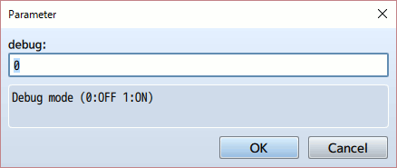

[English version](RTK1_Core.md)

# [RTK1_Core](RTK1_Core.js) プラグイン

RPGツクール MV 用に作成された RTK1ライブラリの基本(Core)部分です。

## 概要

RPGツクール MV 用に作成された RTK1系プラグイン(RTK1_*.js)で利用している共通部分をまとめたもの（Coreライブラリ）です。 開発に便利な機能をまとめていますので、ご自由にお使いください。

RTK1系プラグインを利用する場合には、それらより前に本プラグインを読み込んでください。


パラメータは全て 0 のまま特に変更する必要はありません。


以下、必要があれば読んでください。

## language パラメータ

language パラメータは、開発に使用しているRPGツクール MVの言語環境を指定します。 初期値は "0:Auto detect" となっており、動作に問題がなければこのままでかまいません。


"0:Auto detect" はデータベースの用語に設定した値をいくつか確認し、英語かそれ以外(日本語)か判断しています。

よって例えば、日本語環境で用語の幾つかをあえて英語にしている場合、RTK1_Core プラグインはそれを英語環境で開発されたゲームだと誤解しまうことがあります。 この場合には language パラメータを 2 に変更して、日本語環境であることを明示してください。

なおもし英語版のRPG Maker MVと、日本語版のRPGツクール MVを使い分けている場合、そのゲームの言語環境は、そのゲームのプロジェクトを最初に作成した環境に影響されます。 いまプロジェクトを操作しているアプリケーションの環境ではありませんので、注意してください。

不明な場合はデータベースの用語タブを確認してください。そこに並んでいるのが英語であれば英語環境で作成したプロジェクトでしょうし、日本語であれば日本語環境で作成したプロジェクトでしょう。

## debug パラメータ

debug パラメータをセットすると、デバッグモードになります。



デバッグモードでは、コンソールに RTK1系プラグインの動作ログが表示されるようになります。


RTK.log() 関数はデバッグモードの時だけコンソール出力する関数で、自由にお使いください。 引数に文字列を渡せばそれを console.log() 表示しますし、オブジェクトを渡せば console.dir() 表示します。 第1引数に文字列、第2引数にオブジェクトを渡せば両方表示します。

RTK.trace() 関数もあり、デバッグモードの時だけスタック状態をコンソール出力します。引数は不要ですが、文字列を指定すればそれをラベルとして表示します。


## json パラメータ

PC環境でゲームをプレイすると save フォルダにセーブデータが幾つか作成されます。 この中身は json 形式のデータなのですが、圧縮されていて中身の参照が困難です。


json パラメータを 1 に変更すると、セーブデータ作成の際に圧縮されない json ファイルも同時に同じ場所に生成します。 開発中にセーブデータを参照することが容易になります。

## onReady サービス

RTK.onReady() 関数で自分のプラグイン用の初期化関数を登録しておくと、ゲームデータが生成され、RTK1_Core が準備された後の適切なタイミングで、登録された関数が登録順に呼び出されます。

```js
RTK.onReady(function(){
  // your init code here
});
```

初期化ルーチンの実行タイミングを気にしなくて済み、またこのサービスを使っているプラグイン間では登録順に初期化処理が実行されますので、コーディングが楽になります。

## onCall サービス

プラグインコマンドを実装するためには Game_Interpreter.prototype.pluginCommand(command, args) を置き換える必要がありましたが、RTK.onCall() 関数を使えば以下のように簡単に実装できます。

    RTK.onCall(command, function(args){
      // your plugin command code here
    });

この仕組みを利用すれば、登録した command に一致する場合にだけ登録した関数がコールされるので、command の判断文が不要でコードが簡潔になり、また処理速度も向上します。

もし1つの関数で複数の command に対応したい場合、以下のように第2引数で渡される値を利用できます。

```js
RTK.onCall(command, function(args, command){
  // your plugin command code here
});
```

## ライセンス

[The MIT License (MIT)](https://opensource.org/licenses/mit-license.php) です。

提供されるjsファイルからコメント等を削除しないのであれば、著作権表示は不要です。 むろん表示いただくのは歓迎します！
