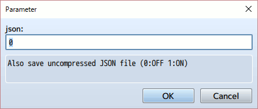

[Japanese version](RTK1_Core.ja.md)

# [RTK1_Core](RTK1_Core.js) Plugin

Core functions of RTK1 library for RPG Maker MV.

## Overview

RTK1_Core Plugin is Core function library for RTK1　series plugins (RTK1_*.js). It includes some useful functions for development, so please feel free to use it.


The parameters are set by 0. Normally, you don't need to change it.


If you need more information, please read following;

## language parameter

Language parameter shows your RPG Maker MV's language. The default value is "0:Auto detect", and normally you don't need to change it.


In "0:Auto detect" mode, plugin checks some terms in database, then automatically set "1:English" or "2:Japanese".

For example, you develop a game in Japanese environment, but change some terms into English, then plugin can get it wrong to select "1:English" value. In this case, you need to set language parameter by "2:Japanese" demonstratively.

## debug parameter

You can use the debug mode, when debug parameter is set by 1.


In the debug mode, you can see RTK1 series plugin's log messages in test console.


RTK.log() function is useful. It's a simple console log command, but it works only in the debug mode. Please feel free to use it.

If it gets a String as the 1st argument, it will pass it to console.log() function. If it gets an Object as the 1st argument, it will pass it to console.dir() function. It can get a String as the 1st argument, then an Object as the 2nd argument.

RTK.trace() function is also useful. It outputs the stack trace to console. It don't need an argument, but you can set a String for the label output.

## json parameter

In PC enviroment, you can find some save files in 'save' folder. These files are compressed, so not easy to read for us.



If you set json parameter by 1, plugin will automatically create uncompressed version of save files in same place. These files are useful for your development work.

## onReady service

You can implement your init function easily with using RTK.onReady() function, as follows;

```js
RTK.onReady(function(){
  // your init code here
});
```

onReady service will wait the initiation of game data, then sets up itself, finally calls all registered functions in a sequential order.

You don't worry about init timing and order with this service.

## onCall service

To implement your original plugin command, you need to replace (hook) Game_Interpreter.prototype.pluginCommand(command, args) function. But you can implement it easily with RTK.onCall() function, as follows;

```js
RTK.onCall(command, function(args){
  // your plugin command code here
});
```

With RTK.onCall() function, your code will be simple because you don't need to check command match. As the result, it will reduce the processing cost with skipping unncesessary functions.

If you have a function which processes more than 2 command String, you can refer the 2nd argument, as follwos;

```js
RTK.onCall(command, function(args, command){
  // your plugin command code here
});
```

## License

[The MIT License (MIT)](https://opensource.org/licenses/mit-license.php)

You don't need to display my copyright, if you keep my comments in .js files. Of course, I'll be happy, when you will display it. :-)
