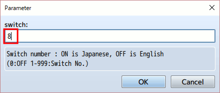
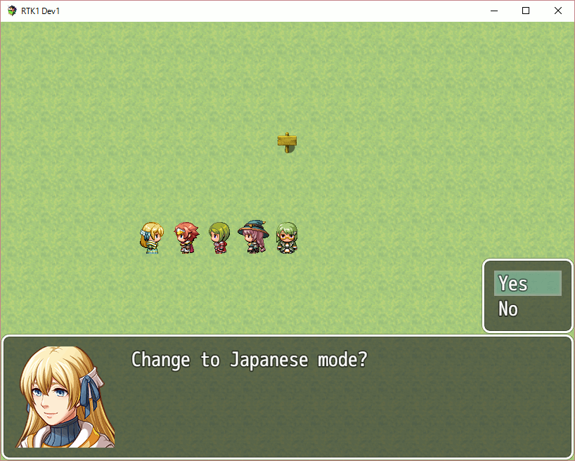
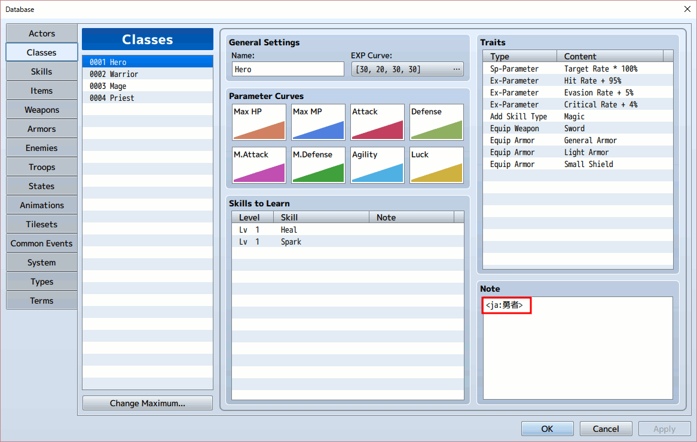
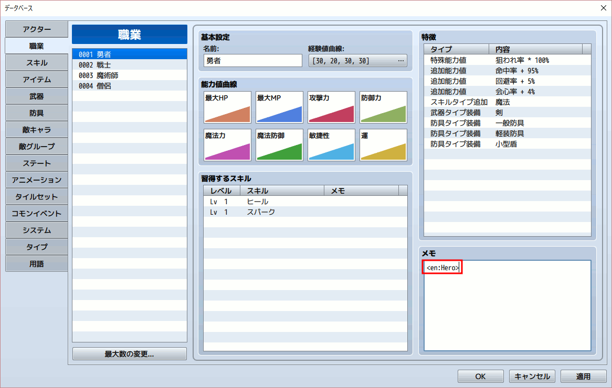
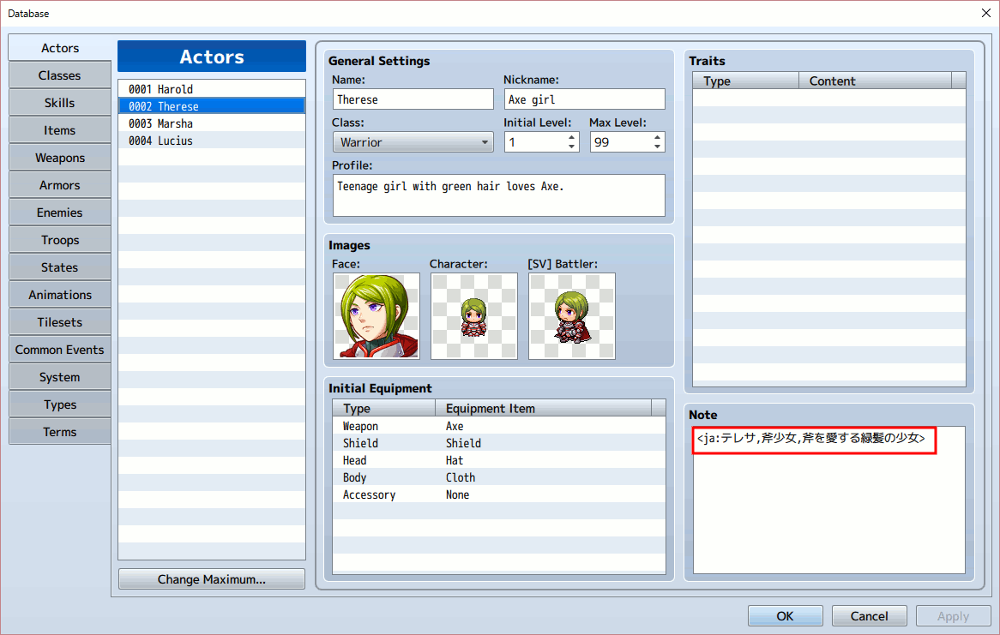
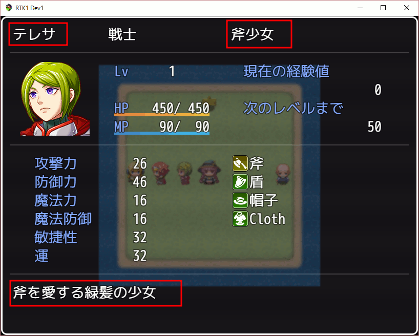
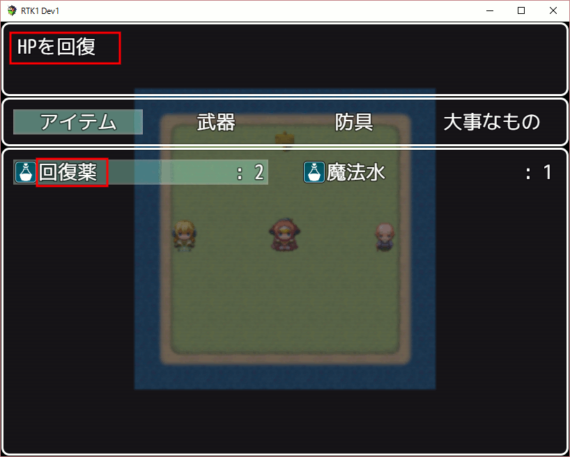
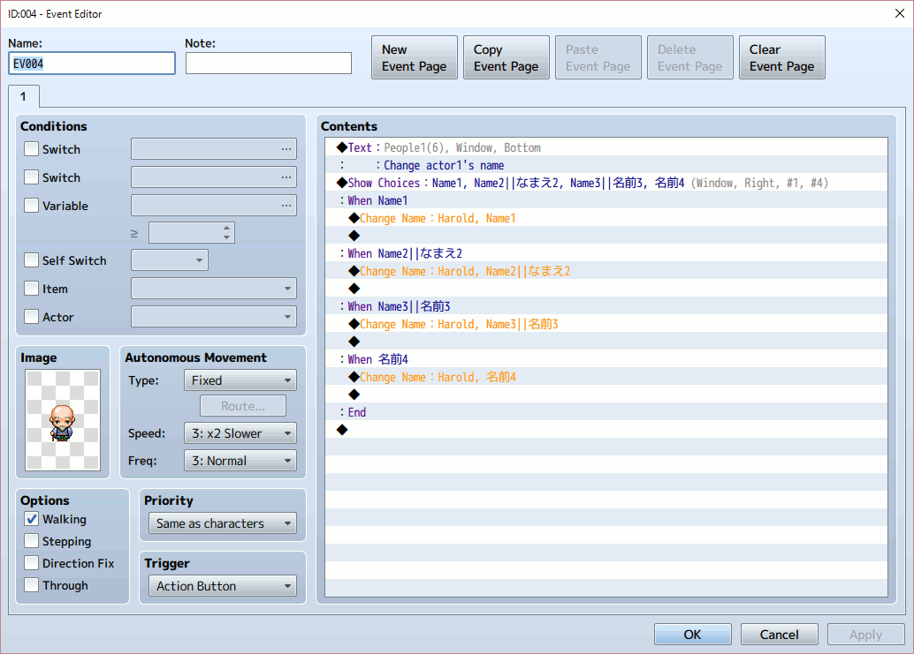

[English version](RTK1_Option_EnJa.md)

# [RTK1_Option_EnJa](RTK1_Option_EnJa.js) プラグイン

RPGツクール MV 用に作成した、英語/日本語環境の切り替えを実現するプラグインです。

ダウンロード: [RTK1_Option_EnJa.js](https://raw.githubusercontent.com/yamachan/jgss-hack/master/RTK1_Option_EnJa.js)

## 概要

私は英語版のRPG Maker MVを利用していますが、自作のゲームを英語が苦手な息子にプレイして貰うためこのプラグインを作成してみました。 組み込むだけでシステム部分の言語を簡単に切り替えできるようになりますので、ぜひ利用してみてください。

[RTK1_Core プラグイン](RTK1_Core.jp.md) を前提としていますので、先に読み込んでください。

パラメータは全て初期値のままで、特に変更する必要はありません。

これで完了です！

オープニング画面、もしくはゲーム中にあるオプションから、英語/日本語の切り替えが可能になります。 システムが用意した基本的な用語が切り替わります。

英語モードでの動作例がこちら。

日本語モードでの動作例がこちら。

システム部分だけでは物足りない、アバター名やゲーム中のメッセージも英語化/日本語化したい！と望まれるのであれば、以下の拡張方法を読んでみてください。

## switch パラメータ

英語/日本語どちらが選択されているか、ゲーム中に参照したい場合には switch パラメーターを利用します。 例えば英語モードの時は英語のメッセージを、日本語のときは日本語のメッセージを表示したい場合などに便利です。

プラグイン設定で switch パラメーターに 0 以外の値を設定してください。 以下の例では 8 を指定しています。

この設定した値に対応するスイッチが、言語状態に連動して変化します。 日本語環境なら ON になり、英語環境なら OFF になります。

そして、指定した8番目のスイッチにわかりやすい名前 (例: Japanese_Mode) を付けておきましょう。

そしてイベントの条件分岐で8番目のスイッチ(Japanese_Mode)を利用してメッセージの内容を変化させます。

日本語モードでの動作例がこちら。

英語モードでの動作例がこちら。

小規模なゲームであれば、この方法でゲーム内のメッセージ等の英語/日本語対応するのがわかりやすくて良いでしょう。

## 言語切り替え用 プラグインコマンド

言語の切り替え用のプラグインコマンドを用意しました。 英語モードに切り替えるには以下のどちらかを使用します。

* RTK1_Option_EnJa english
* RTK1_Option_EnJa en

日本語モードに切り替えるには以下のどちらかを使用します。

* RTK1_Option_EnJa japanese
* RTK1_Option_EnJa ja

以下はこれらを利用したイベントの例です。 金髪の女性に話しかけると、言語の切り替えをするかどうか質問されます。 さきほど説明したスイッチも利用しています。

以下が日本語モードでの実行画面です。 「はい」と答えるとプラグインコマンドを使用して英語モードに切り替えます。

以下が英語モードでの実行画面です。 「Yes」と答えるとプラグインコマンドを使用して日本語モードに切り替えます。

## hide パラメータ

勝手に言語を変更されて困る場合には、プラグインの hide パラメータを 1:ON に変更してください。 オプションメニューに「言語」選択が表示されなくなります。

例えば、ゲーム開始時にイベントで言語を選択させ、その後は特定の人物に話しかけた時だけ言語が切り替わるなど、ゲーム制作者の都合で切り替えをコントロールできます。

またゲームへの応用例としては、最初は異国の言葉で話していて意味不明だが、ある翻訳アイテムを入手すると言葉が理解できるようになる、という演出にも使えるかもしれません。 英語/日本語どちらかのテキストを異国の言葉にしてしまうのです。

## ゲームデータの拡張

システム周りの言語切り替えができたので、次はアクター名やクラス名などの切り替えをしてみましょう。 これにはプラグインの標準ともいえる、ノート欄へのタグ指定を使います。

例えば以下は英語版のRPG Maker MV のデータベースの「クラス」のタブですが、「Hero」クラスのノート欄に &lt;ja:勇者&gt; と日本語テキストを入力します。

アクター名も同様で、それぞれのアクター名とクラス名を指定すると以下のようになります。

日本語版のRPGツクール MVを利用されている方は、データベースの内容が日本語ベースなので、ノート欄には &lt;en:Hero&gt; と英語テキストを入力します。

カンマ(,)で区切ると、複数のテキストを指定できます。 例えば以下の例では、アクターの名前だけでなく、ニックネームとプロフィールも日本語テキストを指定しています。

以下が英語表示のステータス画面で、名前・ニックネーム・プロフィールはそれぞれデータベースで指定された値が表示されています。

以下が日本語表示のステータス画面で、名前・ニックネーム・プロフィールはそれぞれデータベースのノート欄で指定された値に置き換わっています。

もうひとつ例をみてみましょう。 データベースのアイテム欄で、Portion のノート欄に日本語テキストを設定します。

日本語モードのゲーム画面に反映されているのがわかります。

このようにノート欄に &lt;ja:日本語テキスト&gt; や &lt;en:英語テキスト&gt; を記載することにより、各ゲーム要素のテキストの英語/日本語切り替えが可能になります。

## ゲームデータの拡張に関する注意点

アバターの名前、ニックネーム、プロフィールを変更するイベントコマンドがありますが、これらを使用する場合には少し注意が必要です。

通常通りこれらのイベントコマンドを利用すると、英語・日本語どちらも同じ値に変更してしまいます。 この動作は意図的なもので、既存のゲームに後からプラグインを導入しても影響が少なくなる効果があります。

例えばあるイベントで、さきほどのテレサのニックネームを 「Iron fist girl」 に変更すると、英語モード・日本語モード共にこの表記になります。

値をセットする時、セパレータ文字列が1つ含まれていると、拡張モードで動作します。 セパレータ文字列は標準では縦棒2つ (||) で、この文字列で英語テキストと日本語テキストを挟みます。

先ほどのテレサのニックネームですが、イベントコマンドにセットする値を 「Iron fist girl||鉄拳少女」 にすれば、それぞれの言語モード用にニックネームが設定されます。

以下はサンプル用に作成したイベントです。

お爺さんに話しかけると選択肢が表示されますが、2番目と3番目がセパレータ文字列を含んだ例になります。

2番目の選択肢を選ぶと、英語名が Name2 に、日本語名が なまえ2 になります。

以上の機能を利用して、ニックネーム等をうまくゲーム中で生かしてください。

## message パラメータ

メッセージ表示の拡張... (書き途中)

## 辞書管理用 プラグインコマンド

## ライセンス

[The MIT License (MIT)](https://opensource.org/licenses/mit-license.php) です。

提供されるjsファイルからコメント等を削除しないのであれば、著作権表示は不要です。 むろん表示いただくのは歓迎します！
