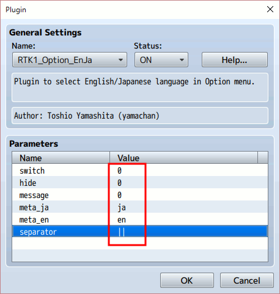
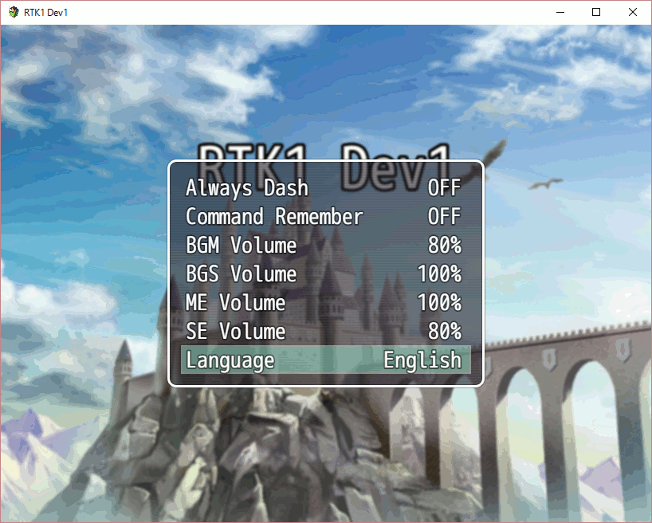
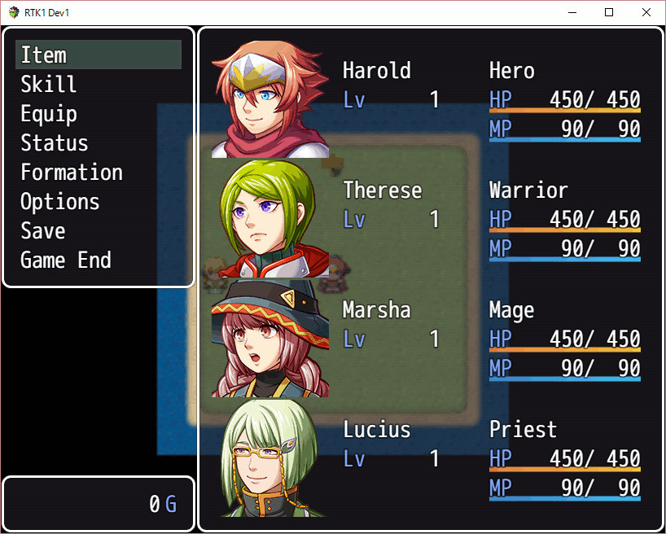
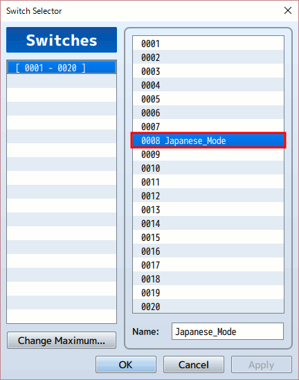
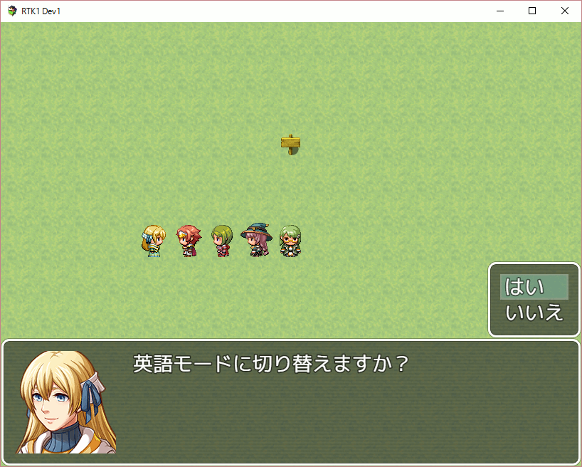

[Japanese version](RTK1_Option_EnJa.ja.md)

# [RTK1_Option_EnJa](RTK1_Option_EnJa.js) Plugin

Plugin to select English/Japanese language in Option menu for RPG Maker MV.

Download: [RTK1_Option_EnJa.js](https://raw.githubusercontent.com/yamachan/jgss-hack/master/RTK1_Option_EnJa.js)

## Overview

I'm using English version of RPG Maker MV. I hope my son to play my game, but he can't read English well. So I need to handle Japanese text in my game.

This plugin support to develop the game which runs in both English and Japanese mode easily. You can add system level language support without any setting and coding. enjoy!

This plugin depends on [RTK1_Core plugin](RTK1_Core.jp.md). Please include it before this plugin, as follows;

The parameters are set by 0. Normally, you don't need to change it.

Finished!

Now, you can use Language setting in Option　menu from the title screen and the game menu. It will switch system language (basic terms) during English and Japanese.

The following is game screen in English mode.

The following is game screen in Japanese mode.

If system level (basic terms) translation is not enough for you, please read the following sections. You can translate more - avator name, class name, text message, and so on. This plugin has some functions which will support your development.

## switch parameter

If you need to know the language selection in game, you should use switch parameter of this plugin. For example, you can show English text in English mode, and Japanese text in Japanese mode.

In plugin setting, please set 1-999 value for switch parameter. The following sample set "8" value.

This value shows the number of switch in RPG maker MV. The switch will engage the language selection - it will be ON in Japanese mode, OFF in English mode.

In this case, let's set the intelligible name (Japanese_Mode) for the 8th switch.

Then, let's use this 8th switch (Japanese_Mode) for "IF..Else..End" block in the event contents;

The following is game screen in Japanese mode.

The following is game screen in English mode.

This is a simple coding style to support English/Japanese mode, and it looks enough for small games.

## Language change plugin command

This plugin has plugin commands to change the language mode. The following commands applys English mode;

* RTK1_Option_EnJa english
* RTK1_Option_EnJa en

The following commands applys Japanese mode;

* RTK1_Option_EnJa japanese
* RTK1_Option_EnJa ja

The following is the sample event which uses these plugin commands. When you talk with the blond girl, you will see the question about the language change.

This sample event also uses switch parameter which I described before.

The following is game screen in Japanese mode.

The following is game screen in English mode.

## hide parameter

## Expand game data

Translate actor names, class names,,, (TBD)

## Caution about expanded game data

## message parameter

Expand text messege... (TBD)

## Maintenance Dictionary plugin command

## License

[The MIT License (MIT)](https://opensource.org/licenses/mit-license.php)

You don't need to display my copyright, if you keep my comments in .js files. Of course, I'll be happy, when you will display it. :-)
