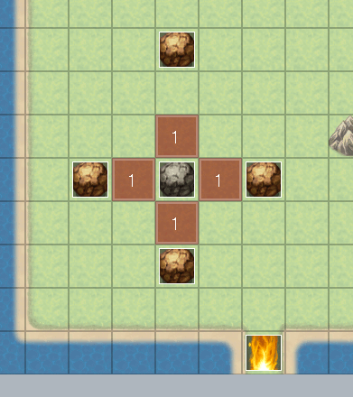
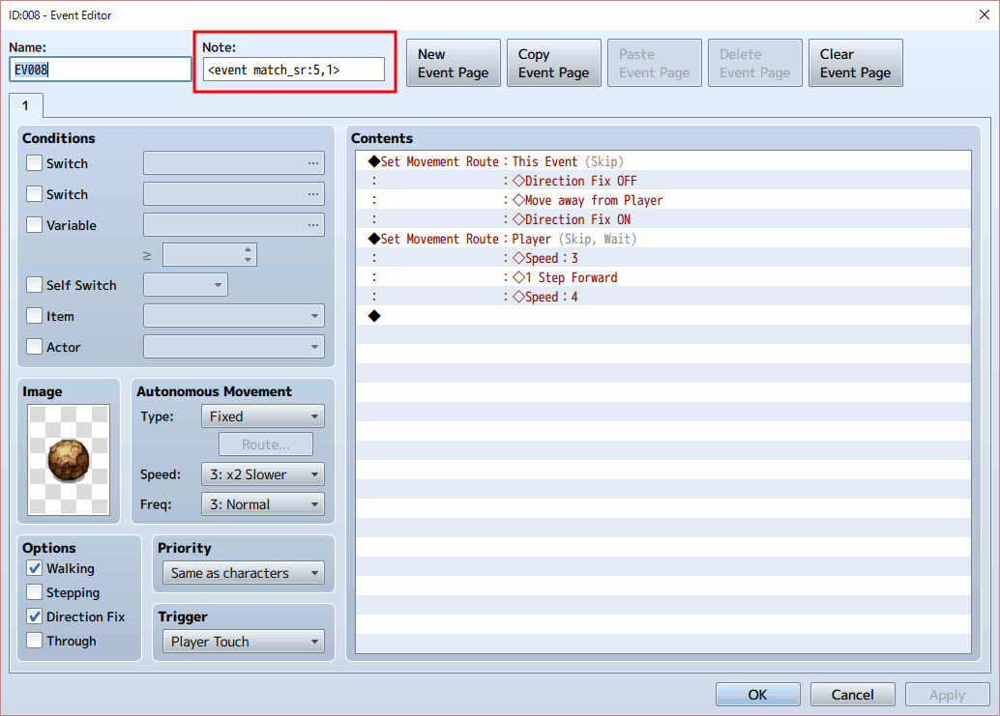
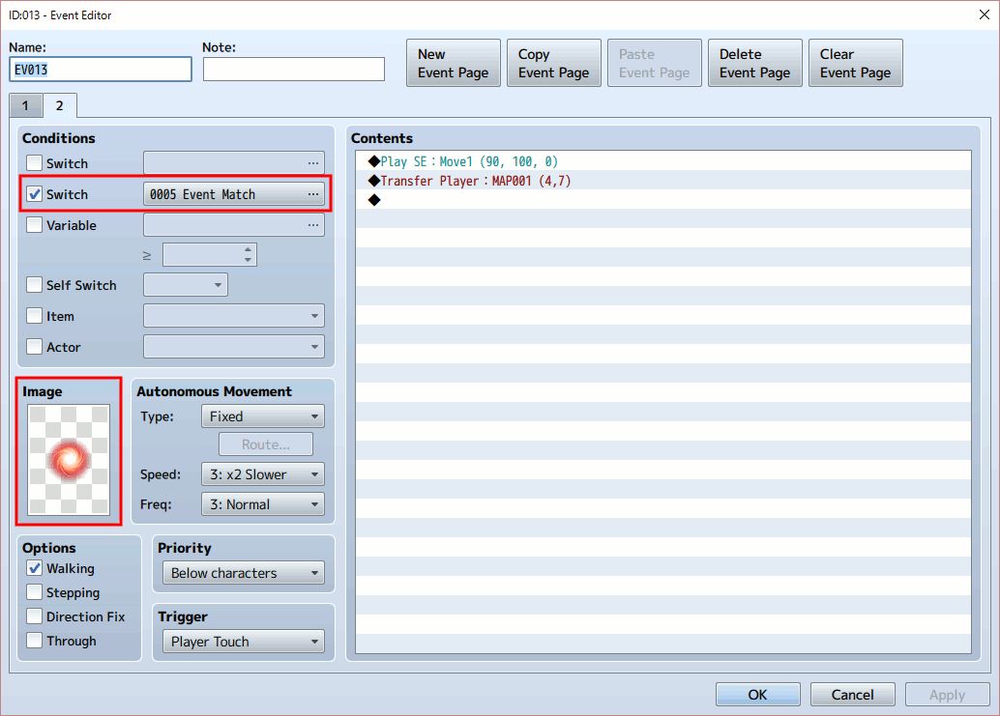
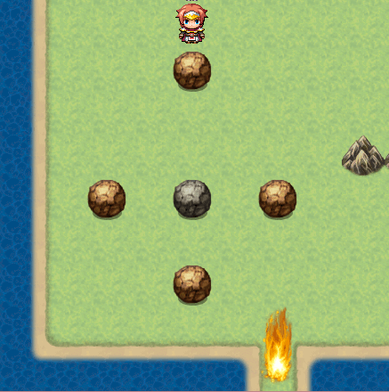
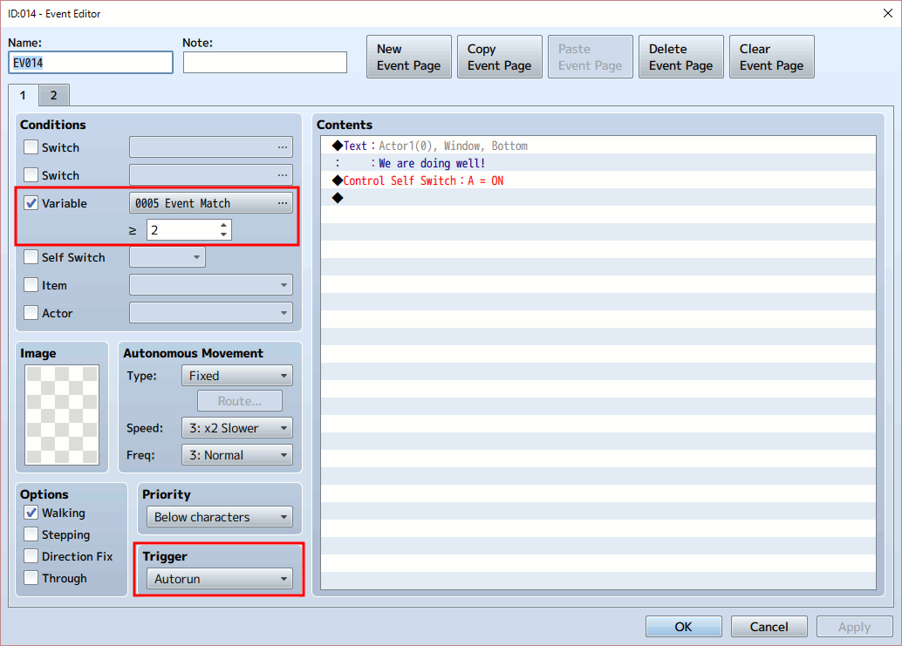
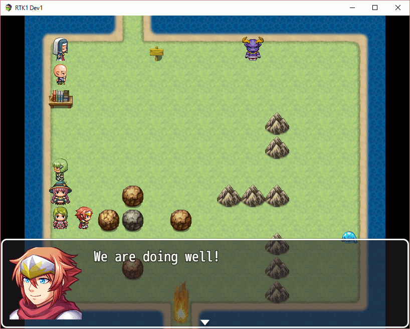
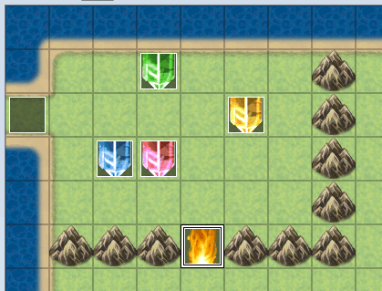
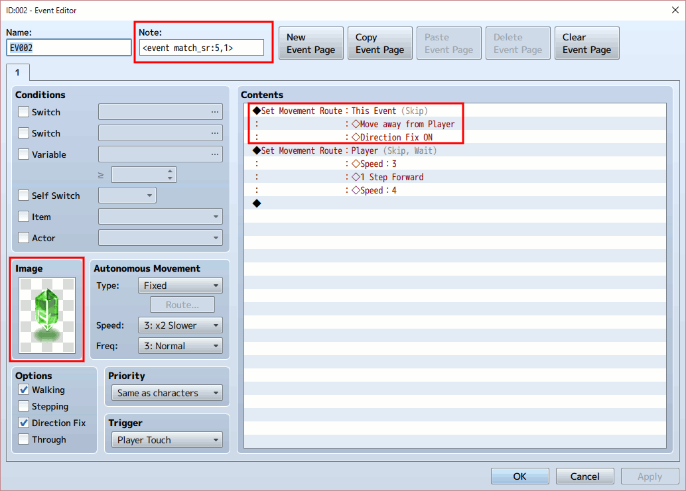
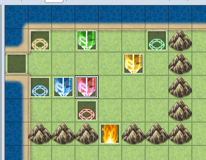
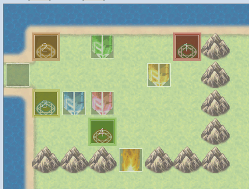

[トップページに戻る](README.ja.md)

# [RTK_EventMatch](RTK_EventMatch.js) プラグイン

RPGツクール MV 用に作成した、マップでイベントの条件が全て揃うとスイッチをONするための単独のプラグインです。

ダウンロード: [RTK_EventMatch.js](https://raw.githubusercontent.com/yamachan/jgss-hack/master/RTK_EventMatch.js)

## インストール

上記の js ファイルを RPGツクールMV　プロジェクトフォルダにある js/plugins フォルダに保存し、プラグインマネージャーで ON にしてください。

特に前提としている他のプラグインはありません。 基本的に置き換えている関数はありませんので、可能であればなるべく下のほうに配置してください。

## 本プラグインの目的

[倉庫番](https://ja.wikipedia.org/wiki/%E5%80%89%E5%BA%AB%E7%95%AA) という古典的なパズルゲームをご存じでしょうか？ プレイヤーは箱を押すことしかできず、マップの中で全ての荷物を指定された場所に配置できればステージクリア、といった感じのゲームです。

倉庫番は知らなくても、ドラクエなどの有名RPGで、岩などを押して動かすパズルのようなステージをプレイされた方は多いでしょう。 単純なルールながら、初期の配置によって様々な難易度のステージを用意することができます。

端的に言って、本プラグインはこの岩を押してプレイする、倉庫番のようなステージを実現するために作成しました。 ですのでマップ上で物を動かして先に進むタイプのゲームには、わりと使い易いプラグインになっているとおもいます。

## 本プラグインの概要

本プラグインの主な機能は、マップ上に配置されたイベントの状態を監視し、条件が全て成立した時は指定されたスイッチをONにすることです。

例えば岩を動かすゲームであれば、岩が正しい位置に置かれたかどうか、それぞれの岩の状態を確認します。 そして全ての岩が正しい位置に置かれたら、指定されたスイッチをONにします。このスイッチの状態で出口の扉のイベントページを切り替え、部屋から脱出する仕組み、などが簡単に定義できます。

また補助的な機能として、スイッチではなく、変数に状態を格納することもできます。 変数であれば、条件が成立した数が自動的に格納されていきます。 例えば4個の動かせる岩があれば、変数には正しい位置に置かれた岩の数が自動的にセットされます。 スイッチと異なり、途中の状態でイベントを切り替えることができます。 例えば岩を1つ正しい位置に置くたびに松明がともり、4個目の松明がともるのと同時に、出口の扉が開く、といった仕掛けが用意できます。

## 動く岩の定義方法

VX Ace のページですが [押せる岩を作る](https://tkool.jp/products/rpgvxace/lecture/006_003q) のイベント設定は MV でも有効です。 この押せる岩などが画面にあれば、岩で視界を塞ぐなど、更なるパズル要素が実現できそうです。

以下が定義した岩の例です。 これをコピー＆ペーストすれば、多くの動く岩を追加することができます。

これら動く岩ですが、いったん他のマップに移動して戻ってくると、元の位置に戻っています。 この仕様のおかげで、端に移動してしまって動かせなくなった岩も再度動かせるようになります。

## 動く岩を使用したイベントの例

本プラグインでは、動く岩の移動先をマップ上のリージョンで定義します。 以下は 「岩を十字に並べよ！」 というイベント用のマップ定義で、リージョン1を使って岩の正しい置き場所を指定しています。

真ん中の黒い岩は動かせない普通のイベントです。 周りの4つの岩が、さきほど紹介した「動く岩」になっています。

さて、4つの 「動く岩」 に条件を設定してみましょう。 それぞれのイベントのメモ欄に &lt;event match_sr:5,1&gt; というタグを入力します。

これが 「動く岩」 に設定された条件で  &lt;event match_sr:5,1&gt; の最初の 5 はスイッチの番号、二番目の 1 はリージョン番号です。 よってこの条件の意味は

* スイッチ5 がON になる条件は、このイベントがリージョン番号1の位置に配置されていること

となります。 同じ条件が4つの 「動く岩」　全てに設定されていて、本プラグインの機能は 「条件が全て揃うとスイッチをONする」 ですから、つまりは以下を指定していることになります。

* スイッチ5 がON になる条件は、4つの岩すべてがリージョン番号1の位置に配置されていること

では、このスイッチ5 を使用して、「十字に岩が並んだとき、次のステージへの扉が開く」 的なイベントを定義してみましょう。 今回は単純に、邪魔になる炎を置いておき、条件が整えばそれを消してワープゲートに変えます。

さて、さきほどのマップで下のほうに配置してある炎のイベントの定義が以下で、単に移動の邪魔をするだけの単純なイベントです。

本プラグインの機能で、「十字に岩が並んだとき」 にはスイッチ5がONになりますね。 それによりこのイベントはページ2に遷移します。

スイッチ5 がONで、邪魔な炎がワープゲートに変化しましたね。 これでプレイヤーは次のマップに移動可能になります。

実際のゲーム画面がこちら。

岩を押して十字に並べると、炎がワープゾーンに変わります。

なお条件が成立した後、またこのマップに戻ってきた場合、岩は元の位置にもどっていますが、スイッチはONのままのためワープゲートが表示されます。 本プラグインは条件が成立した時にはスイッチをONにしますが、その条件から外れても自動的にOFFにはしません。 OFFにしたい場合はイベントコマンドなどで明示的にOFFにしてください。

リージョンで移動先を指定していますので、プレイヤーには正しい移動先がわからないことに注意してください。 今回は 「十字に岩が並んだとき」 というイベントなので、あえて移動先を表示していません。 ステージによっては、正しい移動先のタイルを他と変えるなど、工夫が必要でしょう。

## 逆の条件を使う

'event match_sr' タグの逆の働きをする 'event match_!sr' タグも用意されています。 こちらは指定したリージョン以外の場所に配置されている時に条件が成立するものです。

あるイベントがマップのある領域に居てはいけない、といった場合に利用してみてください。

## 変数を使う

本プラグインでは、スイッチのかわりに変数を使って条件をチェックすることができます。 メモ欄には &lt;event match_vr:5,1&gt; のように、'event match_sr' のかわりに 'event match_vr' タグを使います。

スイッチはON/OFFだけでしたが、変数には 「条件を満たした数」 が自動的に入力されます。 例えば先ほどの4つの「動く岩」に &lt;event match_vr:5,1&gt; を指定しておけば、変数5 には正しい位置にある岩の数が入ります。 この値が 4 になった時が条件全て成立した時なのですが、途中の 1～3 の状態も利用することができます。

ただし注意点として、こちらの変数のほうは常に値が更新されています。 よって先ほどの 「十字の岩」 でいったん条件が成立しても、移動して戻ってくると岩の位置は戻ってしまっていますから、邪魔な炎が復活してしまいます。 それでも良いかもしれませんが、毎回岩を移動させるのはちょっと面倒ですね。

スイッチ用のタグと変数用のタグは一緒に利用できますので、基本的にはスイッチを用いて、途中経過をイベントで利用したい場合には変数を併用すると良いでしょう。

## 変数を使った例

さきほどの 「動く岩を使用したイベントの例」 を変数を併用して拡張してみましょう。 まず、4つの「動く岩」のメモ欄に &lt;event match_vr:5,1&gt; も追加します。

自動開始のイベントを新しく追加し、途中経過である 「変数5 の値が2」 の条件で開始させます。

実行させる内容ですが、今回は主人公のハロルド君に、ひとこと喋らせるだけにしました。 喋った後はセルフスイッチAをONにして、空っぽのページ2に遷移させて終わりとします。

以下が実行画面です。 2つの岩が正しく置かれた時点で、ハロルド君が喋るのがわかります。

## 複数のリージョンを使い分ける例

「十字に岩を並べる」 イベントより複雑な例として、4つのクリスタルを動かすステージを作成してみます。 以下のように4色のクリスタルと4色の魔法陣があるステージで

それぞれクリスタルを動かし、同じ色の魔法陣の上に配置できれば、やはり炎がワープゲートにかわります。

まずはさきほどの「十字に岩を並べる」から4つの岩と炎のイベントをコピーしましょう。

4つの岩は、イメージ画像をそれぞれ、各色のクリスタルに変更します。 クリスタル画像は岩とはパターンが違うので、'Direction Fix OFF' の移動命令を外しておくのもお勧めします。

そして大事なのがメモ欄に記載するタグです。1つ目の緑のクリスタルは岩と同じ &lt;event match_sr:5,1&gt; のままにしておいてください。 しかしその次の黄、青、赤はそれぞれリージョンの番号を増やしていきます。

実際にメモ欄に設定するタグの値は以下になります。

* 緑のクリスタル &lt;event match_sr:5,1&gt;
* 黄のクリスタル &lt;event match_sr:5,2&gt;
* 青のクリスタル &lt;event match_sr:5,3&gt;
* 赤のクリスタル &lt;event match_sr:5,4&gt;

次に正しい配置場所をプレイヤーに示すため、4色の魔法陣をイベントとして追加しましょう。

 単に位置を示すだけで、その上を通るので、プライオリティは「通常キャラの下」にしてください。

 またもうひとつ大事なのは、オプションにある「通り抜け(Through)」をチェックしておいてください。 これをチェックし忘れてしまうと、クリスタルを押しても魔法陣の上に載りません。 なのでクリア不能になってしまいます。

さて最後の仕上げです。 本プラグインに正しい配置場所を伝えるため、マップにリージョン値を設定します。そしてここが、4つの岩のサンプルとの大きな違いです。

4つの魔法陣の上にそれぞれリージョン値を設定するのですが、リージョン値は1～4を使います。 それぞれ対応するクリスタルのメモ欄で指定したリージョン値とあわせます。つまり以下になります。

* 緑の魔法陣にはリージョン値1をセット
* 黄の魔法陣にはリージョン値2をセット
* 青の魔法陣にはリージョン値3をセット
* 赤の魔法陣にはリージョン値4をセット

さてこれで完成です。　ちゃんと動作しましたか？

魔法陣の位置を変更したり、邪魔な岩を増やしてみたりして、難易度を変えて遊んでみてください。 ただし、魔法陣を移動した時には、そこに設定したリージョン値も一緒に移動するのを忘れないでください。 魔法陣はあくまでプレイヤー用の目印で、リージョン値がクリスタルごとの正しい配置場所を指定しています。

複雑にみえますが、よーく眺めてみると、さきほどの4つの岩のサンプルとあまり変わらないことがわかります。 4つの岩はどの岩をどこに配置しても同じでしたが、今回のクリスタルには色があります。 そこでリージョン値を4つ使って、それぞれ個別に位置を確認していること、が大きな違いです。

正しい配置場所をプレイヤーに示すために魔法陣を置いていますが、これは本当に見た目だけで、仕組み上は特に役にたっていません。 魔法陣用のイベントを削除しても、プレイヤーが正しい場所さえ知っていれば同様にクリアできます。

## 他のイベントとの連携

ver1.01 から条件の対象に他イベントを指定できるようになりました。 指定した他イベントと重なる(同じ位置になる)と条件が成立します。 イベントのメモ欄には 'event match_sr' タグの代わりに 'event match_se' タグを使用します。 これによりリージョン値を用いなくても条件を定義することができます。

↑の 「複数のリージョンを使い分ける例」 を、リージョン値を用いない方法に修正してみましょう。 それぞれのクリスタルのメモ欄のタグを以下のように修正してください。

* 緑のクリスタル &lt;event match_se:5,7&gt;
* 黄のクリスタル &lt;event match_se:5,8&gt;
* 青のクリスタル &lt;event match_se:5,9&gt;
* 赤のクリスタル &lt;event match_se:5,10&gt;

緑のクリスタルに指定している値 7 は、緑の魔法陣のイベント番号です。 同様に黄のクリスタルには黄の魔法陣のイベント番号8、青のクリスタルには青の魔法陣のイベント番号9、赤のクリスタルには赤の魔法陣のイベント番号10を指定しています。

さてこれでリージョン値 1-4 は不要になりましたので、マップ編集画面で削除しておいてください。 まあ、残しておいても邪魔にはなりませんが。

これで魔法陣に重ねてリージョン値を置いておく必要がなくなりました。 魔法陣だけを自由に動かして、マップをカスタマイズすることができます。

## 他のイベントとの連携の補足

他イベントとの連携タグである 'event match_se' は、リージョン指定と同様に、以下のような4つのバリエーションがあります。

* &lt;event match_se:s,e&gt;	スイッチ s の条件はこのイベントが e イベントと同じ位置にあること
* &lt;event match_!se:s,e&gt;	スイッチ s の条件はこのイベントが e イベントと同じ位置にないこと
* &lt;event match_ve:v,e&gt;	このイベントが  e イベントと同じ位置にあれば変数 v に1を加える
* &lt;event match_!ve:v,e&gt;	このイベントが  e イベントと同じ位置になければ変数 v に1を加える

## タグ名の変更

'event match_se' のタグ名が気に入らない場合、長すぎると感じる場合、もしくは他のプラグインと競合してしまう場合、ベース部分をプラグインパラメータで変更できます。

他と競合しないのであれば "em" など短くていいですね。

## 更新履歴

| バージョン | 公開日 | 必須ライブラリ | 更新内容 |
| --- | --- | --- | --- |
| ver1.01 | 2016/07/24 | なし | 条件の対象に他イベントを追加 |
| [ver1.00](archive/RTK_EventMatch_v1.00.js) | 2016/07/24 | なし | 公開 |

## ライセンス

[The MIT License (MIT)](https://opensource.org/licenses/mit-license.php) です。

提供されるjsファイルからコメント等を削除しないのであれば、著作権表示は不要です。 むろん表示いただくのは歓迎します！

[トップページに戻る](README.ja.md)
