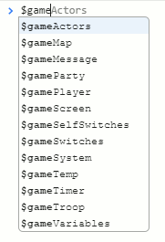
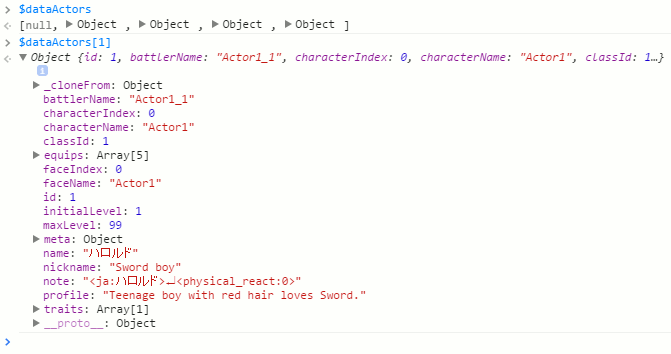
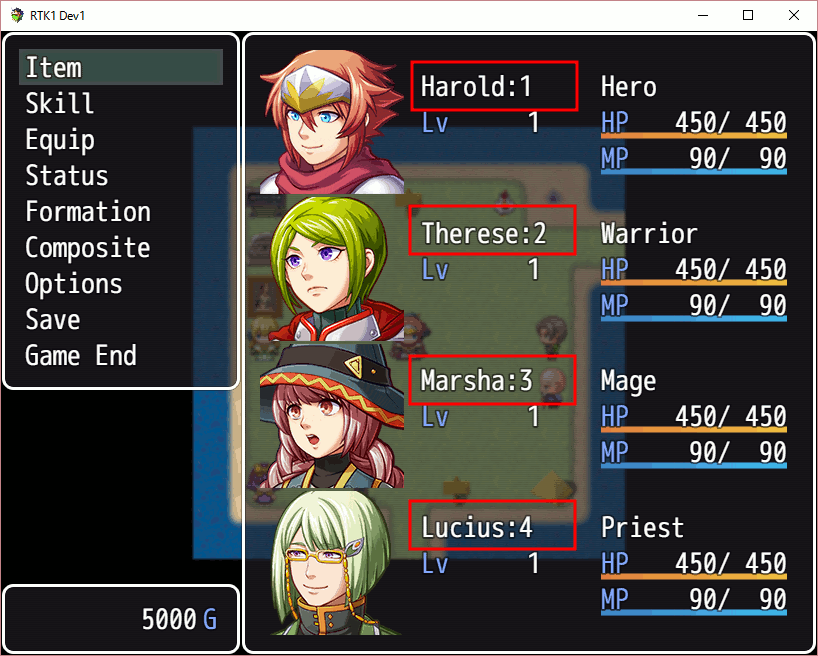
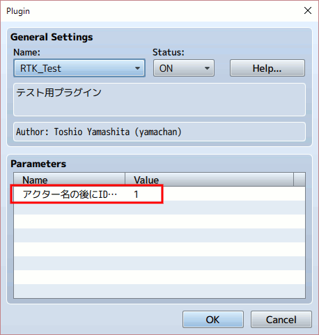

[トップページに戻る](../README.ja.md)

# RPGツクールMV プラグイン作成入門 (1)

RPGツクールMV で利用する JavaScript ベースの Game Scripting System (JGSS) で記述したプラグイン作成のための入門資料っぽい何か、です。 JS(JavaScript)の基本知識がある方が対象です。

## プラグインファイルの構成

以下は僕が良く使っているプラグインの元ファイル(スケルトン)です。

```js
//=============================================================================
// RTK_Test.js	2016/07/30
// The MIT License (MIT)
//=============================================================================

/*:
 * @plugindesc テスト用プラグイン
 * @author Toshio Yamashita (yamachan)
 *
 * @help このプラグインにはプラグインコマンドはありません。
 * テスト用に作成したものなので、実際に利用する場合には適当にリネームしてください
 */

(function(_global) {
  	// ここにプラグイン処理を記載
})(this);
```

ダウンロード等はこちら -> [RTK_Test.js](RTK_Test.js)

以下がRPGツクールMVでのプラグイン管理の画面です。 JSコメント中の @plugindesc と @author 行がそれぞれ反映されているのがわかります。


ここで 「Help...」 ボタンを押すと、@help 以降に記載した内容が表示されます。

## 開発ツールとゲーム変数の基礎

ゲーム中でよく利用される変数に、$data で始まるものがあります。 これはゲームの基本データで、RPGツクールMVによって自動的に生成され、dataファイルに*.json形式のファイルで保存されています。これらはゲームの開始時に読み込まれ、基本的には変更されない静的なデータで、本ガイドではこれらを「$data変数」とよび、格納されている値を「静的データ」とよびます。

それに対して $game で始まる変数は、ゲーム内で利用され更新されている動的もので、これらはセーブデータの中に保持されます。本ガイドではこれらを「$game変数」とよび、格納されている値を「動的データ」とよびます。

RPGツクールMVでゲームをテスト実行中に、F8キーを押すと開発ツールが起動します。開発ツールのなかでコンソールは非常に便利です。

実際にコンソールを起動し、$data と入力すると、$data で始まる変数がずらりと表示されるのがわかります。 $game も同様です。 コンソールのこの候補を表示してくれる機能は、ゲーム内の状態を理解するのに大きな助けとなります。




$data変数で最初に表示されている、$dataActors について、もう少しみていきましょう。 コンソール上で変数名を選択したら、そのままエンター(改行キー)を押して内容を表示させます。

$dataActors は長さが5の配列で、最初の要素は null で、他の4つの要素は Object であることがわかります。 では $dataActors[1] を入力して、その最初のオブジェクトをみてみましょう。



$dataActors[1] には name が "ハロルド" というアクターが設定されていることがわかります。 他にもいろいろ設定されているのがわかりますが、$data変数ですので、これらは基本的にはデータベース画面で自分で設定した値ですね。

一番下にある \__proto__ がこのオブジェクトの親要素なのですが、これが Object なので、これは上位クラスなどが設定されていない、単なるデータ用のオブジェクトであることがわかります。

ではもうひとつ、今度は $game変数の最初にある $gameActors をみてみましょう。

\__proto__ をみると、今度は単純なデータオブジェクトではなく、Game_Actors というクラス定義があることがわかりますね。


Game_Actors クラスには、actors という関数が定義されていることがわかります。 そこでコンソール上でその関数名を入力すると、その関数の定義(ソースファイル)まで見えてしまいます。 横に定義されたjsファイル名と行数が出ますので、より詳しく知りたい場合にはクリックで実際のソースを参照できます。

コンソールは便利ですので、ぜひ活用してみてください。

### ちょっと余談 - データ階層について

RPGツクールMVで作成されるゲームの中身をみていくと、$data の静的な世界(変数の定義)と、$game の動的な世界がうまく分離されているのがわかります。

システム開発に MVC(Model-View-Control)モデル がありますが、$data の世界は Model で、$game の世界は Contorol 層に近いと個人的には感じています。

例えば先ほど、Game_Actors に actors という関数がありました。 これは単なる便利関数にも見えますが、以下のような設計上の意図があるようにもおもえます。

* $game 層と $data 層の分離
  * $game オブジェクトは最低限の $data オブジェクトしか知らない
  * $game オブジェクトからみて $data 層は抽象化されている

ちょっと難しいですね。 もっと砕いて言えばこうなります。

* $game オブジェクトは　$data 層で Actor がどう管理されているか、は知らなくていい
  * $game オブジェクトが Actor の情報を知りたい場合は常に Game_Actors を通す

Game_Actors というクラスは、$game の世界で Actor に関する全てを任されている存在であり、SPE(single point of entry) なのです。 これにより $game の世界と $data の世界が適切に分離されているわけです。

よって $game側 動作することの多いコードを書く、プラグイン開発者にとって…

```js
var anActor = $dataActors[id];
var anActor = $gameActors.actors(id);
```

アクターの情報を参照したいのであれば、下の行がより適切ではないでしょうか。

## 簡単なプラグインを書いてみよう！

前置きが長くなりすぎましたね。 とりあえずの第一歩として、非常に簡単なプラグインを作成してみましょう。

Actor の話がでましたので、名前にちょっと悪戯してみましょう。 まずはコンソール、もしくはソースファイルの rpg_objects.js に定義されている元の関数を探してみます。

```js
Game_Actor.prototype.name = function() {
    return this._name;
};
```

簡単な内容ですね。 では、この名前の後にIDを足してみましょう。 さきほど紹介したプラグインの元ファイルに、プラグインの処理を記載します。

```js
(function(_global) {
  	// ここにプラグイン処理を記載
    Game_Actor.prototype.name = function() {
        return this._name + ":" + this.actorId();
    };
})(this);
```

コメント等はまだ書き換えていませんが、とりあえずこれで動作します。



ね、簡単でしょう？

## 他のプラグインとの競合を防ぐ

先ほどの例では、Actor の名前に悪戯をしてみました。 まあ、この機能は完全に無駄ではなくて、開発時のIDチェックに役には立ちます。

このプラグインを自分で使うぶんには問題はありません。 が、インターネットで公開したり、他人に渡すのは控えましょう。 現時点でこのプラグインは 「他のプラグインとの競合を考えていない」 わりと迷惑なプラグインです。

このプラグインと同じような構造の、アクターの名前に影響するようなプラグインがあると仮定しましょう。 で、二つのプラグインを読み込むと、表示はどうなるでしょうか？結果はたぶん、先に読み込んだプラグインの機能が無効化され、後に読み込まれたプラグインの機能だけが実行されるでしょう。

場所取りのようなものです。 Game_Actor.prototype.name という一か所しかない関数定義の場所に、定義を上書きしているわけですから、前の定義は消され、最後の定義のみが有効になります。 これは一番わかりやすい、プラグイン競合の例ですね。

この問題への対応は簡単で、定義を上書きしないで、追加してあげれば良いのです。 以下のようなコードになります。

```js
(function(_global) {
  	// ここにプラグイン処理を記載
    var _Game_Actor_name = Game_Actor.prototype.name;
    Game_Actor.prototype.name = function() {
        var ret = _Game_Actor_name.call(this);
        return ret + ":" + this.actorId();
    };
})(this);
```

\_Game_Actor_name という変数を用意して、以前の定義をいったん保存しておきます。 そして自分のプラグインコードを実行するとき、まずはその保存しておいた定義(関数)を実行します。 その実行した値をもとに、自分の処理、つまり末尾に ":" という文字と ID を追加する、という処理を実行しています。

このとき、実現したい処理が元の値と関係ないとします。 例えば 「もともとの定義に関係なく、名前には ID だけを表示する」 プラグインを実装したい場合には、以下のように書きます。

```js
(function(_global) {
  	// ここにプラグイン処理を記載
    var _Game_Actor_name = Game_Actor.prototype.name;
    Game_Actor.prototype.name = function() {
        var ret = _Game_Actor_name.call(this);
        return String(this.actorId());
    };
})(this);
```

たとえ戻り値である ret の値を使わなくても、元の定義をちゃんと呼んであげるのが 「良いマナー」 です。 世の中には様々なプラグインがあり、思いもよらぬ理由で関数を利用している場合があります。 なので、その値を使用しないとしても、関数だけはちゃんと呼んであげることで、そういったプラグインとの競合を防ぐことができます。

プラグイン作成には自分のロジックでの効率だけでなく、他のプラグインの動作になるべく影響を与えないようにコードを書く、という 「良いマナー」 を意識することが大切です。

なおここで使用している call関数ですが、詳細は JavaScript の参考書などで確認してください。 ただ一点、忘れないように注意して貰いたいのは、以下のように元の関数が受け取った引数(今回はname)は忘れずに元の定義に渡してあげる、ということです。

```js
(function(_global) {
  	// ここにプラグイン処理を記載
    var _Game_Actor_setName = Game_Actor.prototype.setName;
    Game_Actor.prototype.setName = function(name) {
        var ret = _Game_Actor_setName.call(this, name);
        // ここに自分の処理
        return ret;
    };
})(this);
```

上の例では、更に返ってきた値も可能ならばそのまま返しています。 今は setName関数は何も返しませんので、最後の return には意味がありません。 しかし将来のバージョンアップでなにか値を返すようになるかもしれませんし、また返すように拡張するプラグインが存在するかもしれません。 なので付けておいたほうが 「より安心」 です。

### ちょっと余談 - ローカルなスコープについて

上の例で \_Game_Actor_setName という変数を定義していますが、これはこのプラグインの中だけで有効で、他のプラグインには影響しません。 よってこのプラグインの中で名前が衝突していない限り、他のプラグインとの競合を心配する必要はありません。

これは一般的に、ローカル変数という概念ですが、JavaScript ではシンプルに 「関数の中で定義された定義(変数など)は関数内だけで有効なローカルなスコープになる」 となっています。 よって以下のプラグイン処理を記述する部分で定義した関数や変数名は、この中でだけ有効なローカルなものとなります。

```js
(function(_global) {
    // ここにプラグイン処理を記載
    // ここで定義した関数や変数はこの範囲内だけで有効
})(this);
```
JavaScript 自体の話になりますので、説明は簡単なものにしてあります。 より詳しく知りたい方は JavaScript 関連の書籍やサイトで勉強してみてください。

余談ですが、プラグイン中で関数の定義を保持しておく変数名は、元の関数の定義をもとに 「先頭にアンダーバー(\_)を付け、途中のピリオド(.)やプロトタイプ部分(.prototype.)をアンダーバー(\_)に置き換える」 というネーミングルールを用いるプラグイン作者が多いようです。

## パラメーターを参照しよう！

今度は試しに、プラグインパラメーターを利用してみましょう。 プラグインのコメント部分、@author の下あたりに以下のようなコメントを追加します。

```
* @param アクター名の後にIDを表示
* @desc アクター名の後にIDを表示する (0:OFF 1:ON)
* @default 1
```

するとプラグインの管理画面で以下のようにパラメータが表示され、



以下のように値を変更できるようになります。


さて、この設定した値をプラグイン側で参照してみましょう。 以下は僕がよく記載する書き方です。

```js
(function(_global) {
    // ここにプラグイン処理を記載
    var N = 'RTK_Test';
  	var param = PluginManager.parameters(N);
  	var show_id = Number(param['アクター名の後にIDを表示'])||1;

    // 以下略…
})(this);
```

PluginManager.parameters 関数に関しては、以下の定義をみたほうがはやいでしょう。 大文字小文字が関係ないのがわかりますね。

```js
PluginManager.parameters = function(name) {
    return this._parameters[name.toLowerCase()] || {};
};
```

最初にプラグインの名前を変数 'N' に定義しているのは、単に僕の個人的な癖です。 ただプラグインの名前はコード中に何度も使うことがありますし、将来的にはファイル名の変更の可能性もあるので、最初のほうで何らかのかたちで定義しておき、以降はその定義を利用するのがお勧めです。

定義したパラメータ値は show_id にはいりますが、最後にある ||1 はデフォルト値の設定です。 もし利用者がプラグインパラメータを空に数字以外など変な値を入力してしまうと Number() 関数は NaN を返してしまいます。　その場合には ||1 で代わりに 1　が値として代入されます。

||1 は JavaScript っぽい省略した書き方で、実行結果は以下のように if 文を用いて値を確認する処理とほぼ同じです。

```js
  var show_id = Number(param['アクター名の後にIDを表示']);
  if (show_id != 0) {
    show_id = 1;
  }
```

さて、この値を利用してプラグインの内部で処理を ON/OFF してみましょう。 以下でどうでしょうか。

```js
(function(_global) {
    // ここにプラグイン処理を記載
    var N = 'RTK_Test';
  	var param = PluginManager.parameters(N);
  	var show_id = Number(param['アクター名の後にIDを表示'])||1;

    var _Game_Actor_name = Game_Actor.prototype.name;
    Game_Actor.prototype.name = function() {
        var ret = _Game_Actor_name.call(this);
        if (show_id) {
          return ret + ":" + this.actorId();
        } else {
          return ret;          
        }
    };
})(this);
```

うん、問題なく動作しそうですね。

ただ show_id の値が外部から変更されないのであれば、ゲームに余計な負荷を与えないように、僕としては以下のほうが好みです。

```js
(function(_global) {
    // ここにプラグイン処理を記載
    var N = 'RTK_Test';
  	var param = PluginManager.parameters(N);
  	var show_id = Number(param['アクター名の後にIDを表示'])||1;

    if (show_id) {
      var _Game_Actor_name = Game_Actor.prototype.name;
      Game_Actor.prototype.name = function() {
          var ret = _Game_Actor_name.call(this);
          return ret + ":" + this.actorId();
      };
    }
})(this);
```

あくまで好みの問題な気がしますが。 「show_id の値が外部から変更されない」という条件があれば、そもそも関数の置き換え自体が不要で無駄なのでは？という発想です。

ただし、次のセクションから　「show_id の値が外部から変更される」 話が始まりますので、この後の例は使いません。 こんな書き方もあるよ、とあくまで参考程度に見ておいてください。

## コマンドで動作を変更しよう！

プラグインパラメータはゲーム開発者がプラグイン設定で設定するもので、ゲーム中に自由に変更できるものではありません。 ゲーム中に変更するためには、プラグインコマンドを実装するのが良いでしょう。

コマンドの仕様は単純に以下のようにしましょう。

```
RTK_Test show_id on
RTK_Test show_id off
```

さて、コマンドを処理する部分を実装してみましょう。 Game_Interpreter.prototype.pluginCommand 関数定義に追加して、プラグイン独自のコマンドを処理します。

```js
var _Game_Interpreter_pluginCommand = Game_Interpreter.prototype.pluginCommand;
Game_Interpreter.prototype.pluginCommand = function(command, args) {
  _Game_Interpreter_pluginCommand.call(this, command, args);
  if (command == N) {
    if (args[0] == "show_id") {
      if (args[1] == "on") {
        show_id = 1;
      } else if (args[1] == "off") {
        show_id = 0;
      }
    }
  }
};
```

pluginCommand 関数では、最初のコマンド名が command 引数で渡されます。 このコマンド名はプラグイン名にあわせるのがわかりやすいので、今回もあわせており、事前定義した N と比較してチェックしています。

自分へのコマンドと判明したら引数の args を処理して、show_id 変数の値を変更しています。

## とりあえず完成

ひととおりの機能を実装できましたので、今回はこれで完了としましょう。

アクターの名前の後にIDを追加表示する、シンプルなプラグインです。 プラグインパラメータで最初に表示するかどうかを設定でき、またゲーム中にプラグインコマンドで表示の切り替えができます。

ただし欠点として、状態のセーブ保存には対応していません。 それは次回の課題としましょう。

以下が今回作成した、全ソースコードになります。 ファイル名とコメントをちゃんと設定すれば、プラグインとして公開しても問題ないでしょう。 まあ、需要があるかどうかは別として…

```js
//=============================================================================
// RTK_Test.js	2016/07/30
// The MIT License (MIT)
//=============================================================================

/*:
 * @plugindesc テスト用プラグイン
 * @author Toshio Yamashita (yamachan)
 *
 * @param アクター名の後にIDを表示
 * @desc アクター名の後にIDを表示する (0:OFF 1:ON)
 * @default 1
 *
 * @help このプラグインにはプラグインコマンドはありません。
 * テスト用に作成したものなので、実際に利用する場合には適当にリネームしてください
 */

(function(_global) {
	// ここにプラグイン処理を記載
	var N = 'RTK_Test';
	var param = PluginManager.parameters(N);
	var show_id = Number(param['アクター名の後にIDを表示'])||1;

	Game_Actor.prototype.name = function() {
		if (show_id) {
			return ret + ":" + this.actorId();
		} else {
			return ret;          
		}
	};

	var _Game_Interpreter_pluginCommand = Game_Interpreter.prototype.pluginCommand;
	Game_Interpreter.prototype.pluginCommand = function(command, args) {
		_Game_Interpreter_pluginCommand.call(this, command, args);
		if (command == N) {
			if (args[0] == "show_id") {
				if (args[1] == "on") {
					show_id = 1;
				} else if (args[1] == "off") {
					show_id = 0;
				}
			}
		}
	};
})(this);
```

[トップページに戻る](../README.ja.md)
