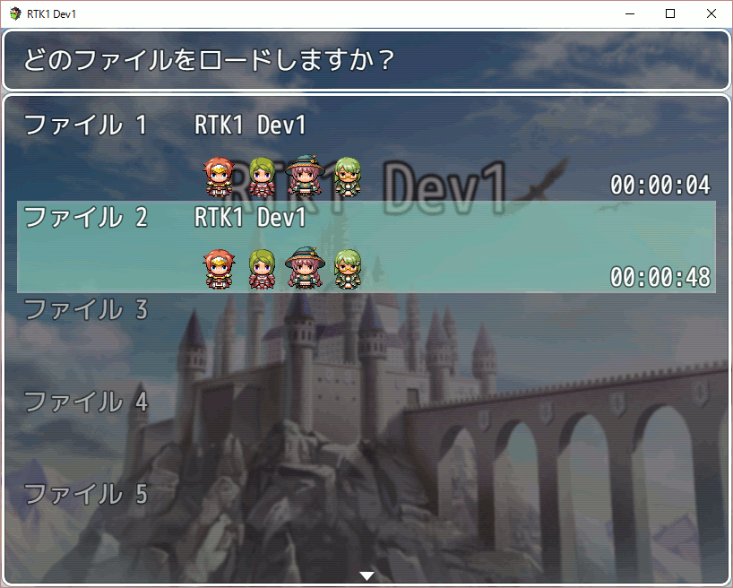
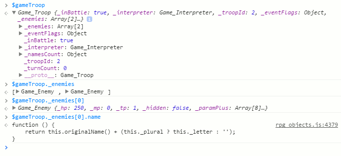

[トップページに戻る](../README.ja.md) | [前回の入門](plugin-dev-01.ja.md)

# RPGツクールMV プラグイン作成入門 (2)

RPGツクールMV で利用する JavaScript ベースの Game Scripting System (JGSS) で記述したプラグイン作成のための入門資料っぽい何か、です。 JS(JavaScript)の基本知識がある方が対象です。

## 前回のまとめ

前回の [作成入門 (1)](plugin-dev-01.ja.md) では、アクターの名前の後にIDを追加表示する、シンプルなプラグインを作成しました。 プラグインパラメータで最初に表示するかどうかを設定でき、またゲーム中にプラグインコマンドで表示の切り替えができましたね。

今回も引き続き、同じプラグインを拡張していきましょう。

## セーブファイルへの状態の保存

前回作成したプラグインにはプラグインコマンドを用意しましたが、まだ欠点がありましたね。 セーブファイルに状態を保存していないため、コマンドで On/Off を切り替えても、ゲームを再開すると初期値に戻ってしまいます。

そこで今回はまず、show_id の値をセーブファイルに保存し、再開しても状態が維持するように拡張してみます。

### 3種類のセーブファイル

RPGツクールMVで作成したゲームには、以下の3種類のセーブファイルがあります。

* config.rpgsave
* file*.rpgsave
* global.rpgsave

'config.rpgsave' はゲーム設定を保存するためのファイルです。 タイトル画面やゲームメニューにある 'オプション' の状態を保持しています。 例えば以下のオプション画面に対し、


保存されているデータは以下になります。

```js
{
  "alwaysDash":false,
  "commandRemember":false,
  "bgmVolume":100,
  "bgsVolume":100,
  "meVolume":100,
  "seVolume":100,
}
```

'file\*.rpgsave' が実際のセーブファイルで、ゲームの様々な状態が保持されています。 セーブファイルは複数作成でき、\*の部分には連番が入ります。 このファイルに格納されている内容については次のセクションで説明します。

'global.rpgsave' はセーブファイルの選択画面で利用するデータを格納したファイルで、セーブファイルが作成・更新される時に同時に更新されます。 例えば以下の選択画面に対し、



保存されているデータは以下になります。

```js
[
  null,
  {
    "globalId":"RPGMV",
    "title":"RTK1 Dev1",
    "characters":[["Actor1",0],["Actor1",7],["Actor3",7],["Actor2",6]],
    "faces":[["Actor1",0],["Actor1",7],["Actor3",7],["Actor2",6]],
    "playtime":"00:00:04",
    "timestamp":1468556954489
  },
  {
    "globalId":"RPGMV",
    "title":"RTK1 Dev1",
    "characters":[["Actor1",0],["Actor1",7],["Actor3",7],["Actor2",6]],
    "faces":[["Actor1",0],["Actor1",7],["Actor3",7],["Actor2",6]],
    "playtime":"00:00:48",
    "timestamp":1468855189632
  }
]
```

### ゲームのセーブファイルの中身

'file\*.rpgsave' が実際のセーブファイルだとわかりましたが、どんな内容が保存されているのでしょうか？省略しつつ、主要部分をざっと紹介します。

```js
{
	"system":{
		"_saveEnabled":true,
		"_menuEnabled":true,
		"_encounterEnabled":true,
		"_formationEnabled":true,
		"_battleCount":0,
		"_winCount":0,
		// 途中省略
		"@":"Game_System"
	},
	"screen":{
		"_brightness":255,
		"_fadeOutDuration":0,
		"_fadeInDuration":0,
		"_tone":[0,0,0,0],
		// 途中省略
		"@":"Game_Screen"
	},
	"timer":{"_frames":0,"_working":false,"@":"Game_Timer"},
	"switches":{"_data":[null,null,null,null,null,null,null,null,true],"@":"Game_Switches"},
	"variables":{"_data":[],"@":"Game_Variables"},
	"selfSwitches":{"_data":{"1,3,A":true},"@":"Game_SelfSwitches"},
	"actors":{
		"_data":[
			null,
			{
				"_actorId":1,
				"_name":"Harold",
				"_nickname":"Sword boy",
				"_hp":450,
				"_mp":90,
				"_tp":0,
				"_hidden":false,
				"_paramPlus":[0,0,0,0,0,0,0,0],
				// 途中省略
				"@":"Game_Actor"
			},{
				"_actorId":2,
				// 以降省略
			},{
				"_actorId":3,
				// 以降省略
			{
				"_actorId":4,
				// 以降省略
			}
		],
		"@":"Game_Actors"
	},
	"party":{
		"_inBattle":false,
		"_gold":2000,
		"_steps":0,
		"_lastItem":{"_dataClass":"","_itemId":0,"@":"Game_Item"},
		"_menuActorId":0,
		"_targetActorId":0,
		"_actors":[1,2,3,4],
		"_items":{"1":6,"2":1,"10":50,"11":2,"12":2,"13":2,"14":2},
		"_weapons":{"1":1,"2":2,"4":10},
		"_armors":{"3":1,"4":1},
		"@":"Game_Party"
	},
	"map":{
		"_interpreter":{
			"_depth":0,
			"_mapId":0,
			"_eventId":0,
			"_list":null,"_index":0,"_waitCount":0,"_waitMode":"","_comments":"","_character":null,"_childInterpreter":null,"_branch":{},
			"_params":[],"_indent":0,"_frameCount":47,"_freezeChecker":17,
			"@":"Game_Interpreter"
		},
		"_mapId":1,
		"_tilesetId":1,
		"_events":[
			null,
			{
				"_x":4,
				"_y":1,
				// 途中省略
				"@":"Game_Event"
			},
			// 以降省略
		],
		"_commonEvents":[],
		// 途中省略
		"@":"Game_Map"
	},
	"player":{
		"_x":4,
		"_y":4,
		// 途中省略
		"_followers":{
			"_visible":true,
			"_gathering":false,
			"_data":[ // 省略
			],"
			@":"Game_Followers"
		},
		"_encounterCount":603,
		"@":"Game_Player"
	}
}
```

前回の [作成入門 (1)](plugin-dev-01.ja.md) では、$game変数の一覧を紹介しました。 上記のゲームのセーブファイルのそれぞれの要素は、$game 変数に対応しているのがわかります。

つまりゲームのセーブファイルとは、$game変数の値を一時的にファイルに保管しておくもの、だとおもいます。

### どの変数を利用するか

また今回も前置きが長くなってしまいました…

これら $game変数はセーブファイルに保存されることがわかりましたから、利用しちゃいましょう！これらのうち一つを選んで値を格納しておけば、ゲームシステムのほうにセーブ/ロード関連は任せられそうです。

個人的によく利用するのは $gameSystem なので、今回もこれを使ってみます。

保存するときの名前ですが、あまり一般的ですと他のプラグインとの競合が心配です。 そこでお勧めの名称は、プラグインの名前そのまま、もしくは名前にデータ種別を追加したものです。

### 実際の処理

まずは show_id を利用する部分を拡張します。

```js
var _Game_Actor_name = Game_Actor.prototype.name;
Game_Actor.prototype.name = function() {
    var ret = _Game_Actor_name.call(this);
    var f = $gameSystem[N + "_show_id"];
    if (f === undefined ? show_id : f) {
      return ret + ":" + this.actorId();
    } else {
      return ret;          
    }
};
```

変更はわりと少なめで、1行足して、if文の条件式を変更しただけです。

足した1行は $gameSystem に保存した値を f 変数に読み込む処理です。 名称は N に定義したプラグインの名前に、"\_show_id" と保存する変数名を足したというベタなものです。

そしてif文の条件式ですが、保存した値がなければ f が undefined になりますので、代わりにこれまでどおり show_id を使用します。 保存した値があればその値を使用します。

保存した値を利用する部分はこれでOKですが、値を保存する処理がありませんね。 プラグインコマンドの部分を修正しましょう。

```js
var _Game_Interpreter_pluginCommand = Game_Interpreter.prototype.pluginCommand;
Game_Interpreter.prototype.pluginCommand = function(command, args) {
  _Game_Interpreter_pluginCommand.call(this, command, args);
  if (command == N) {
    if (args[0] == "show_id") {
      if (args[1] == "on") {
        $gameSystem[N + "_show_id"] = 1;
      } else if (args[1] == "off") {
        $gameSystem[N + "_show_id"] = 0;
      }
    }
  }
};
```

うーん、こちらも修正点は少ないです。 show_id に代入するかわりに、$gameSystem に値を設定しているだけですね。

そして、これでセーブファイル対応は完了です。 1行足して、3行修正しただけで済みました。 簡単でしょ？

修正前は以下のような仕様でした

* show_id の初期値はプラグインパラメータで指定される
* プラグインコマンドで show_id の値が変更される
* show_id の値はセーブファイルに保存されない

修正後は以下のような仕様になっています

* show_id の値はプラグインパラメータで指定され、以後は変更されない
* プラグインコマンドで $gameSystem.RTK_Test_show_id の値が変更される
* 実行時は $gameSystem.RTK_Test_show_id の値が使用される
  * ただし見つからない場合には show_id 値がかわりに使われる

show_id 変数が主役から、初期値を表現する脇役に退いたわけです。 代わりに $gameSystem.RTK_Test_show_id 変数が使用され、これは $gameSystem に含まれるのでセーブファイルで自動保存される、というわけです。

この仕組みにはメリットがひとつあって、プラグインコマンドを使わない限りはセーブファイルの領域を消費しません。

### ひと工夫してみよう

前のセクションで値の保存ができるようになりました。 動作としてはこれで十分です。 このセクションではオマケとして、ちょっとした小さな工夫について述べます。

いま利用している仕組みでは、show_id 変数はプラグインパラメータの値を反映したもの、でしたね。 つまりはゲーム開発時に設定した値になるので、実際にゲームが配布された後に変更されることはないわけです。

この前提のもとで、更にセーブファイルの領域を節約するコードが以下になります。

```js
var _Game_Interpreter_pluginCommand = Game_Interpreter.prototype.pluginCommand;
Game_Interpreter.prototype.pluginCommand = function(command, args) {
  _Game_Interpreter_pluginCommand.call(this, command, args);
  if (command == N) {
    if (args[0] == "show_id") {
      if (args[1] == "on") {
        if (show_id) {
          delete $gameSystem[N + "_show_id"];
        } else {
          $gameSystem[N + "_show_id"] = 1;          
        }
      } else if (args[1] == "off") {
        if (!show_id) {
          delete $gameSystem[N + "_show_id"];
        } else {
          $gameSystem[N + "_show_id"] = 0;
        }
      }
    }
  }
};
```

ちょっと複雑になりましたね。 このコードのコンセプトとしては以下になります。

* 初期値と同じ場合には、わざわざ値を保存する必要はない
  * 不要な値はきちんと delete してサイズ削減しよう

今回は単に値一つなので、ここまでこだわる必要は無いかもしれませんね。 ただ「マナーの良いコードを心がける」ことは大事で、常に意識していただきたいため、ひと工夫の例としてここで紹介させていただきました。

## 真面目にセーブ処理を実施したい場合

今回のサンプルでは、$game変数を利用して、ある意味手抜きをしてしまいました。 ちゃんとした処理を記述したい方のために要点をお伝えしておきます。

まず保存時は、以下のセーブデータを作成する処理を拡張すると良いでしょう。

```js
var _DataManager_makeSaveContents = DataManager.makeSaveContents;
DataManager.makeSaveContents = function() {
  var contents = _DataManager_makeSaveContents.call(this);
  // ここで自分のデータを contents に設定する
  return contents;
};
```

そして設定したデータを読み込むために、以下のセーブデータを処理する処理を拡張すると良いでしょう。

```js
var _DataManager_extractSaveContents = DataManager.extractSaveContents;
DataManager.extractSaveContents = function(contents) {
  var ret = _DataManager_extractSaveContents.call(this, contents);
  // ここで自分のデータを contents から読み込む
  return ret;
};
```

## プラグインに機能を追加してみよう

せっかくですから、プラグインにもう少し機能を追加してみましょう。 アクターだけでなく、敵の名称にも ID を表示させてみてはどうでしょうか？

戦闘中、コンソールでクラスを探ってみます。 $game変数のなかで $gameTroop がそれっぽいので、起点にしてみましょう。



なるほど、rpg_object.jsファイルの4379行、このあたりですね。

```js
Game_Enemy.prototype.name = function() {
    return this.originalName() + (this._plural ? this._letter : '');
};
```

plural って何だろう？とソースファイルの中を検索してみると、以下のようなコードがありました。 グループ(Troop)内に同じ名前があると true がセットされるようです。 あれですね、同じ敵がいる時に A とか B とか名前の後につくやつだろうと想像できます。

```js
  this.members().forEach(function(enemy) {
      var name = enemy.originalName();
      if (this._namesCount[name] >= 2) {
          enemy.setPlural(true);
      }
  }, this);
```

さて、敵の name 関数を拡張していきましょう。 まずはコードを追加せずに拡張の下準備だけしてみます。

```js
var _Game_Enemy_name = Game_Enemy.prototype.name;
Game_Enemy.prototype.name = function() {
  var ret = _Game_Enemy_name.call(this);
  return ret;
};
```

時間があるときは、この状態でゲームをテストプレイすることをお勧めします。 自分のコードをデバッグする前に、拡張することでゲームに何か悪影響が出ないか、そういった心配を先に潰しておくわけです。

いや、あるんですよ、実際。 何時間も悩んだ結果、この簡単な第一歩でスペルミスとかで失敗してて、肝心のコードが動いてなかった、なんて間抜けなことが… いや、僕だけかもしれませんが。

では、実際のコードを追記しましょう。 まあ、アクターの場合とほぼ同じなのですが…

```js
var _Game_Enemy_name = Game_Enemy.prototype.name;
Game_Enemy.prototype.name = function() {
  var ret = _Game_Enemy_name.call(this);
  var f = $gameSystem[N + "_show_eid"];
  if (f === undefined ? show_eid : f) {
    return ret + ":" + this.enemyId();
  } else {
    return ret;          
  }
};
```

一応、扱う変数を show_eid と変えてみました。 ですのでプラグインパラメーター、およびプラグインコマンドの部分も拡張が必要ですね。

まあアクターとほぼ同じですので、コードの説明は省きます。 最後にコードを全部置いておきますので、そちらで追加されたコードを確認してみてください。

## プラグインを完成しよう

さて、これまで説明してきたプラグインですが、キリも良いのでいったん完成させましょう。

名前も 'RTK_Test' のままでは格好悪いですね。 'RTK_ShowID' とでも名付けておきますか。 いや、そんな格好良い名前を貰えるほどのプラグインじゃないんですけどね… あ、ファイル名の変更の際、最初の N 変数の定義も変更することを忘れないでください。

ヘルプなども不十分 (プラグインコマンドはありません、と書いたままですが、実際はありますよね) なので、いろいろ表記を追加・変更します。

で、完成した結果がこちら -> [RTK_ShowID.js](RTK_ShowID.js)

けっこう長くなったので、GitHub の機能で見てください。 RAW のリンクからjsファイルのダウンロードもできます。

これでプラグイン開発に関して、最低限の説明はできたとおもいます。 次回以降はTipsとか小ネタをまとめたものになるかも。 いろいろプラグインを作成してみて、楽しんでください！

ではまた！

[トップページに戻る](../README.ja.md) | [前回の入門](plugin-dev-01.ja.md)
