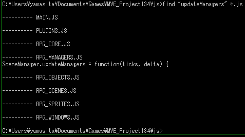
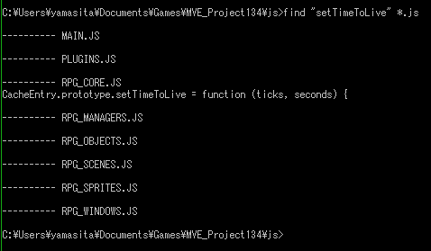
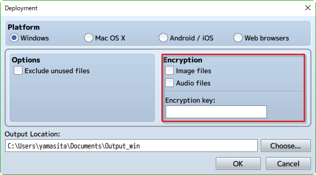
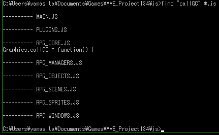

[トップページに戻る](../README.ja.md) | [JGSS 技術メモ](index.md)

# JGSS ver1.2.0 から ver1.3.4 への変化 (前編)

ちょっと離れている間に、JGSS が ver1.3.4 まで進化していました。コードの主要部分を眺めて、違いをざっと把握してみましょう。

ちょっと量が多いので、plugins.js と rpg_core.js で前編としておきます。

## pixi.js の更新

描画関係を司る pixi.js が ver2.2.10 から ver4.0.3 に更新されています。APIがいろいろ変わってそうですが、解説資料は他にありそうなので、今回はあまり深くは追わないことにします。

## plugins.js

プロジェクトを新規作成した状態で、プラグインが指定されていますね。

```js
var $plugins = [
  {
    "name":"MadeWithMv",
    "status":true,
    "description":"Show a Splash Screen \"Made with MV\" and/or a Custom Splash Screen before going to main screen.",
    "parameters":{
      "Show Made With MV":"true",
      "Made with MV Image":"MadeWithMv",
      "Show Custom Splash":"false",
      "Custom Image":"",
      "Fade Out Time":"120",
      "Fade In Time":"120","Wait Time":"160"}
    }
];
```

ゲーム開始時に表示されるスプラッシュスクリーン用のようです。不要であればPlugin ManagerからOFFにしましょう。

## rpg_core.js

基本機能を拡張する rpg_core.js から見ていきましょう。初っ端から Object.defineProperties を使うように書き換えられていますが、内容が大きく変わらなければ、表記の違いはスルーしていきます。

主な項目は以下になります

* [pixi.js クラスとの関係](#pixijs-クラスとの関係)
* [CacheEntry と CacheMap によるメモリ効率の改善](#cacheentry-と-cachemap-によるメモリ効率の改善)
* [画像を touch() する](#画像を-touch-する)
* [Decrypter によるリソース保護](#decrypter-によるリソース保護)
* [bltImage による画像表示の改善](#bltimage-による画像表示の改善)
* [iOS への対応](#ios-への対応)
* [dirty() の独自実装とブレンド処理の高速化](#dirty-の独自実装とブレンド処理の高速化)
* [その他](#その他)

### pixi.js クラスとの関係

最初に驚いたのが、ScreenSprite クラスの親が PIXI.Sprite から PIXI.Container に変更された点。

```js
ScreenSprite.prototype = Object.create(PIXI.Container.prototype);
```

まあ確かに格納しているだけで、これ自体が表示されるわけではないので、妥当な気がしますね。大きな差ではない気がしますが、ここらへんまで最適化するのは、開発側が効率化(速度向上や負荷の軽減)に本気な気がして嬉しいです。

親を変更しただけあって、やはり影響はあって。不要になった処理は削除され、足りない要素を少し足すコードがあります。が、今回は割愛します。

ついでですが、ScreenSprite に以下が追加されていたのが、個人的にちょっと面白かったです。YEP_CoreEngine が正式サポートされているんだなぁ、ってことでw

```js
ScreenSprite.YEPWarned = false;
ScreenSprite.warnYep = function () {
    if (!ScreenSprite.YEPWarned) {
        console.log("Deprecation warning. Please update YEP_CoreEngine. ScreenSprite is not a sprite, it has graphics inside.");
        ScreenSprite.YEPWarned = true;
    }
};

Object.defineProperty(ScreenSprite.prototype, 'anchor', {
    get: function () {
        ScreenSprite.warnYep();
        this.scale.x = 1;
        this.scale.y = 1;
        return {x: 0, y: 0};
    },
    set: function (value) {
        this.alpha = value.clamp(0, 255) / 255;
    },
    configurable: true
});
```

更に pixi.js で Deprecation になったクラスの影響で、元はこうだった定義が

```js
Stage.prototype = Object.create(PIXI.Stage.prototype);
WindowLayer.prototype = Object.create(PIXI.DisplayObjectContainer.prototype);
Weather.prototype = Object.create(PIXI.DisplayObjectContainer.prototype);
ToneFilter.prototype = Object.create(PIXI.AbstractFilter.prototype);
ToneSprite.prototype = Object.create(PIXI.DisplayObject.prototype);
```

以下のように変更されています。PIXI.Container への集約が進んでいる感ありますね。その影響で細かく修正されていますが、大きな影響はなさそうなので今回は割愛します。

```js
Stage.prototype = Object.create(PIXI.Container.prototype);
WindowLayer.prototype = Object.create(PIXI.Container.prototype);
Weather.prototype = Object.create(PIXI.Container.prototype);
ToneFilter.prototype = Object.create(PIXI.filters.ColorMatrixFilter.prototype);
ToneSprite.prototype = Object.create(PIXI.Container.prototype);
```

### CacheEntry と CacheMap によるメモリ効率の改善

CacheEntry というクラスが増えています。使用済みリソースのゴミ処理をしてメモリ効率を改善してくれそうな感じですかね？ TTL は Time To Live で生存期間でしょう。

```js
/**
 * The resource class. Allows to be collected as a garbage if not use for some time or ticks
 *
 * @class CacheEntry
 * @constructor
 * @param {ResourceManager} resource manager
 * @param {string} key, url of the resource
 * @param {string} item - Bitmap, HTML5Audio, WebAudio - whatever you want to store in the cache
 */
function CacheEntry(cache, key, item) {
    this.cache = cache;
    this.key = key;
    this.item = item;
    this.cached = false;
    this.touchTicks = 0;
    this.touchSeconds = 0;
    this.ttlTicks = 0;
    this.ttlSeconds = 0;
    this.freedByTTL = false;
}
```

そして CacheEntry を管理するために CacheMap クラスも追加されたようです。

```js
/**
 * Cache for images, audio, or any other kind of resource
 * @param manager
 * @constructor
 */
function CacheMap(manager) {
    this.manager = manager;
    this._inner = {};
    this._lastRemovedEntries = {};
    this.updateTicks = 0;
    this.lastCheckTTL = 0;
    this.delayCheckTTL = 100.0;
    this.updateSeconds = Date.now();
}
```

CacheMap.setItem メソッドで CacheEntry インスタンス(オブジェクト)が生成され \_inner 配列に登録されるようですね。

```js
CacheMap.prototype.setItem = function (key, item) {
    return new CacheEntry(this, key, item).allocate();
};

CacheEntry.prototype.allocate = function () {
    if (!this.cached) {
        this.cache._inner[this.key] = this;
        this.cached = true;
    }
    this.touch();
    return this;
};
```

CacheMap は \_inner に CacheEntry の配列を保持し、逆に CacheEntry は cache に CacheMap への参照を保持しているのがわかります。

そして CacheEntry は touch メソッドで生存(Alive)が延長され、isStillAlive メソッドで生存がチェックされることがわかります。

```js
/**
 * makes sure that resource wont freed by Time To Live
 * if resource was already freed by TTL, put it in cache again
 */
CacheEntry.prototype.touch = function () {
    var cache = this.cache;
    if (this.cached) {
        this.touchTicks = cache.updateTicks;
        this.touchSeconds = cache.updateSeconds;
    } else if (this.freedByTTL) {
        this.freedByTTL = false;
        //TODO: shall we log this event? its not normal
        if (!cache._inner[this.key]) {
            cache._inner[this.key] = this;
        }
    }
};

CacheEntry.prototype.isStillAlive = function () {
    var cache = this.cache;
    return ((this.ttlTicks == 0) || (this.touchTicks + this.ttlTicks < cache.updateTicks )) &&
        ((this.ttlSeconds == 0) || (this.touchSeconds + this.ttlSeconds < cache.updateSeconds ));
};
```

ttlTicks と ttlSeconds が寿命を定義していて、どちらか超過すれば生存が False になる、つまり寿命が来たことがわかります。また 0 がセットされている場合は、その寿命はチェックされない、つまり永遠だとわかります。

CacheMap.update メソッドが呼び出されると、この寿命のチェックがおこなわれ、不要になったリソースが free されるようです。

```js
CacheMap.prototype.update = function(ticks, delta) {
    this.updateTicks += ticks;
    this.updateSeconds += delta;
    if (this.updateSeconds >= this.delayCheckTTL + this.lastCheckTTL) {
        this.lastCheckTTL = this.updateSeconds;
        this.checkTTL();
    }
};

/**
 * checks ttl of all elements and removes dead ones
 */
CacheMap.prototype.checkTTL = function () {
    var cache = this._inner;
    var temp = this._lastRemovedEntries;
    if (!temp) {
        temp = [];
        this._lastRemovedEntries = temp;
    }
    for (var key in cache) {
        var entry = cache[key];
        if (!entry.isStillAlive()) {
            temp.push(entry);
        }
    }
    for (var i = 0; i < temp.length; i++) {
        temp[i].free(true);
    }
    temp.length = 0;
};
```

で、この update() ですが、rpg_managers.js で呼ばれていました。

```js
SceneManager.updateManagers = function(ticks, delta) {
    ImageManager.cache.update(ticks, delta);
};
```

でもあれれ、このメソッドは定義されているだけのようで、ちょっと不安になってきました…




ところでこの寿命ですが、ttlTicks と ttlSeconds も初期値は 0 ですよね。つまり寿命は永遠。以下のメソッドで変更できるのですが…

```js
/**
 * Sets the time to live
 * @param {number} ticks TTL in ticks, 0 if not set
 * @param {number} time TTL in seconds, 0 if not set
 * @returns {CacheEntry}
 */
CacheEntry.prototype.setTimeToLive = function (ticks, seconds) {
    this.ttlTicks = ticks || 0;
    this.ttlSeconds = seconds || 0;
    return this;
};
```

このメソッド、js/\*.js の中で一度も呼ばれていないようなんです。まさか、この機能はまだ未使用なんてオチでは…



実際のゲーム中でも寿命がセットされている様子は無いですね…


### 画像を touch() する

リソースに寿命の概念が導入されたので、画像 Bitmap クラスに、touch() 追加されています。画像リソースを使用したことを通知して、寿命を延ばしてもらうためのメソッドでしたね。

```js
/**
 * touch the resource
 * @method touch
 */
Bitmap.prototype.touch = function() {
    if (this.cacheEntry) {
        this.cacheEntry.touch();
    }
};
```

CacheEntry はキャッシュ対象を item に保持していますが、キャッシュされた Bitmap 側も cacheEntry を保持しているようです。互いに参照し合っているのが興味深いです。

この touch() はどのタイミングで呼ばれているのか？探してみましょう。

pixi.js の Sprite クラスでメソッドを置き換えて、先ほど追加した touch() を呼び出しているのがわかります。画像を使う直前に touch() することで寿命が延びる、まあ納得の拡張ですね。TilingSprite も同様です。

```js
Sprite.prototype._renderCanvas_PIXI = PIXI.Sprite.prototype._renderCanvas;
Sprite.prototype._renderCanvas = function(renderer) {
    if (this.bitmap) {
        this.bitmap.touch();
    }
    if (this.texture.frame.width > 0 && this.texture.frame.height > 0) {
        this._renderCanvas_PIXI(renderer);
    }
};
```

タイルマップのほうにも touch 処理が追加されてます。

```js
/**
 * Updates the tilemap for each frame.
 *
 * @method update
 */
Tilemap.prototype.update = function() {
    this.animationCount++;
    this.animationFrame = Math.floor(this.animationCount / 30);
    this.children.forEach(function(child) {
        if (child.update) {
            child.update();
        }
    });
    for (var i=0; i<this.bitmaps.length;i++) {
        if (this.bitmaps[i]) {
            this.bitmaps[i].touch();
        }
    }
};
```
上は forEach なのに、新しく追加された部分は for で回してるあたりが興味深い。ソースの読みやすさより処理速度を気にしだした、開発側の雰囲気を感じることができます。いや、想像ですがw

ここまでちゃんと実装してるのに、リソースの寿命を使っている雰囲気が無いのはなぜ？と不思議です。何か見落としているのかな… もし本当に使っていないなら、使うのはオプションならば、僕ならば利用フラグを用意して、フラグが立っていない場合には不要な機能を組み込まない(関数を置き換えない)ように実装しますがね…

### Decrypter によるリソース保護

作成したゲームを出力(Export)する際のオプションで、画像と音楽の暗号化ができるようになっています。



これを実現するため rpg_core.js の最後に、Decrypter が定義されています。 長いので詳細は実際のソースを見てください。

```js
function Decrypter() {
    throw new Error('This is a static class');
}
```

まあ、暗号化といってもシンプルなものですよね。仕組みを説明するのは野暮だと思いますので、それぞれの暗号化された拡張子を定義してあるメソッドをご紹介しておきます。

```js
Decrypter.extToEncryptExt = function(url) {
    var ext = url.split('.').pop();
    var encryptedExt = ext;

    if(ext === "ogg") encryptedExt = ".rpgmvo";
    else if(ext === "m4a") encryptedExt = ".rpgmvm";
    else if(ext === "png") encryptedExt = ".rpgmvp";
    else encryptedExt = ext;

    return url.slice(0, url.lastIndexOf(ext) - 1) + encryptedExt;
};
```

では実際に画像をロードするコード Bitmap.load を見てみましょう。暗号化されている場合には Decrypter.decryptImg メソッドを利用するように拡張されているのがわかります。

```js
/**
 * Loads a image file and returns a new bitmap object.
 *
 * @static
 * @method load
 * @param {String} url The image url of the texture
 * @return Bitmap
 */
Bitmap.load = function(url) {
    var bitmap = new Bitmap();
    bitmap._image = new Image();
    bitmap._url = url;
    bitmap._isLoading = true;

    if(!Decrypter.checkImgIgnore(url) && Decrypter.hasEncryptedImages) {
        Decrypter.decryptImg(url, bitmap);
    } else {
        bitmap._image.src = url;
        bitmap._image.onload = Bitmap.prototype._onLoad.bind(bitmap);
        bitmap._image.onerror = Bitmap.prototype._onError.bind(bitmap);
    }

    return bitmap;
};
```

また同様に \_onLoad も拡張されています。[window.URL.revokeObjectURL](https://developer.mozilla.org/ja/docs/Web/API/URL/revokeObjectURL) を使用しているのは、内部で暗号を解除した画像データをいったん [window.URL.createObjectURL](https://developer.mozilla.org/ja/docs/Web/API/URL/createObjectURL) でデータURLにして渡しているので、その後始末ですね。

```js
Bitmap.prototype._onLoad = function() {
    if(Decrypter.hasEncryptedImages) {
        window.URL.revokeObjectURL(this._image.src);
    }
    this._isLoading = false;
    this.resize(this._image.width, this._image.height);
    this._context.drawImage(this._image, 0, 0);
    this._setDirty();
    this._callLoadListeners();
};
```

音楽(WebAudio) あたりも同様なので、説明は割愛します。

### bltImage による画像表示の改善

おっと、Bitmap に新しい bltImage メソッドが定義されています。

```js
/**
 * Performs a block transfer, using assumption that original image was not modified (no hue)
 *
 * @method blt
 * @param {Bitmap} source The bitmap to draw
 * @param {Number} sx The x coordinate in the source
 * @param {Number} sy The y coordinate in the source
 * @param {Number} sw The width of the source image
 * @param {Number} sh The height of the source image
 * @param {Number} dx The x coordinate in the destination
 * @param {Number} dy The y coordinate in the destination
 * @param {Number} [dw=sw] The width to draw the image in the destination
 * @param {Number} [dh=sh] The height to draw the image in the destination
 */
Bitmap.prototype.bltImage = function(source, sx, sy, sw, sh, dx, dy, dw, dh) {
    dw = dw || sw;
    dh = dh || sh;
    if (sx >= 0 && sy >= 0 && sw > 0 && sh > 0 && dw > 0 && dh > 0 &&
        sx + sw <= source.width && sy + sh <= source.height) {
        this._context.globalCompositeOperation = 'source-over';
        this._context.drawImage(source._image, sx, sy, sw, sh, dx, dy, dw, dh);
        this._setDirty();
    }
};
```

元からある Bitmap.blt とほぼ同じコードなのですが、drawImage の第一引数が source.\_canvas から source.\_image に変更されています。画像に効果(hue)がかかっていない場合、高速に描画できるように用意されたものだと思われます。

以下は Tile を描くコードなのですが、最後に bitmap.blt の代わりに新規に定義した bitmap.bltImage を使っているのが修正点です。普通のタイルはhueなど指定されないので、高速版を使った、のでしょうか。これは類似の \_drawAutotile, \_drawTableEdge メソッドも同様です。

```js
/**
 * @method _drawNormalTile
 * @param {Bitmap} bitmap
 * @param {Number} tileId
 * @param {Number} dx
 * @param {Number} dy
 * @private
 */
Tilemap.prototype._drawNormalTile = function(bitmap, tileId, dx, dy) {
    var setNumber = 0;

    if (Tilemap.isTileA5(tileId)) {
        setNumber = 4;
    } else {
        setNumber = 5 + Math.floor(tileId / 256);
    }

    var w = this._tileWidth;
    var h = this._tileHeight;
    var sx = (Math.floor(tileId / 128) % 2 * 8 + tileId % 8) * w;
    var sy = (Math.floor(tileId % 256 / 8) % 16) * h;

    var source = this.bitmaps[setNumber];
    if (source) {
        bitmap.bltImage(source, sx, sy, w, h, dx, dy, w, h);
    }
};
```

### iOS への対応

iOS (iPhone/iPad) への対応が追加されているのを見つけたので、メモに加えておきます。ポーズ中のビデオをタッチしたら再開する、だけのハンドラのようですね。

```js
var waitForLoading = false;
var register = false;
function handleiOSTouch(ev) {
        if (Graphics._video.paused && Graphics.isVideoPlaying())Graphics._video.play();
}
```

そして以下の部分で、このハンドラを組み込んだり外したり、利用するよう拡張していますね。互換性を維持するための苦労が察せられます。

```js
Graphics.playVideo = function(src) {
    this._video.src = src;
    this._video.onloadeddata = this._onVideoLoad.bind(this);
    this._video.onerror = this._onVideoError.bind(this);
    this._video.onended = this._onVideoEnd.bind(this);
    this._video.load();

    if (Utils.isMobileSafari()) {
        waitForLoading = true;
        if (!register) {
            register = true;
            document.addEventListener('touchstart', handleiOSTouch);
        }
    }
};

Graphics.isVideoPlaying = function() {
    if (Utils.isMobileSafari()) return waitForLoading || (this._video && this._isVideoVisible());
    return this._video && this._isVideoVisible();
};

Graphics._onVideoLoad = function() {
    this._video.play();
    this._updateVisibility(true);
    if (Utils.isMobileSafari()) {
        waitForLoading = false;
    }
};

Graphics._onVideoEnd = function() {
    this._updateVisibility(false);

    if (Utils.isMobileSafari()) {
        if (register) {
            document.removeEventListener('touchstart', handleiOSTouch);
            register = false;
        }
    }
};
```

### dirty() の独自実装とブレンド処理の高速化

以前は this.\_baseTexture.dirty(); で済ませていた画像の更新処理を、自前で処理するように変更されているようです。これは pixi.js のほうで処理にバグがあるためだと思われます。

```js
Bitmap.prototype._setDirty = function() {
    this._dirty = true;
};

/**
 * updates texture is bitmap was dirty
 * @method checkDirty
 */
Bitmap.prototype.checkDirty = function() {
    if (this._dirty) {
        this._baseTexture.update();
        this._dirty = false;
    }
};
```
WebGLモードの時は pixi.js のメソッドを置き換えて、touch() とあわせ checkDirty() を明示的に呼び、その後に更に処理を追加しています。TilingSprite も \_isPicture 分岐は無いものの似たような感じ。

```js
Sprite.prototype._renderWebGL_PIXI = PIXI.Sprite.prototype._renderWebGL;
Sprite.prototype._renderWebGL = function(renderer) {
    if (this.bitmap) {
        this.bitmap.touch();
    }
    if (this.texture.frame.width > 0 && this.texture.frame.height > 0) {
        if (this._bitmap) {
            this._bitmap.checkDirty();
        }

        //copy of pixi-v4 internal code
        this.calculateVertices();

        if (this._isPicture) {
            // use heavy renderer, which reduces artifacts and applies corrent blendMode,
            // but does not use multitexture optimization
            this._speedUpCustomBlendModes(renderer);
            renderer.setObjectRenderer(renderer.plugins.picture);
            renderer.plugins.picture.render(this);
        } else {
            // use pixi super-speed renderer
            renderer.setObjectRenderer(renderer.plugins.sprite);
            renderer.plugins.sprite.render(this);
        }
    }
};
```

そして WebGLの時の高速化をめざした処理がなかなか興味深い… TilingSprite もこれ流用しています。

```js
Sprite.voidFilter = new PIXI.filters.VoidFilter();
/**
 * checks if we need to speed up custom blendmodes
 * @param renderer
 * @private
 */
Sprite.prototype._speedUpCustomBlendModes = function(renderer) {
    var picture = renderer.plugins.picture;
    var blend = this.blendMode;
    if (renderer.renderingToScreen && renderer._activeRenderTarget.root) {
        if (picture.drawModes[blend]) {
            var stage = renderer._lastObjectRendered;
            var f = stage._filters;
            if (!f || !f[0]) {
                setTimeout(function () {
                    var f = stage._filters;
                    if (!f || !f[0]) {
                        stage.filters = [Sprite.voidFilter];
                        stage.filterArea = new PIXI.Rectangle(0, 0, Graphics.width, Graphics.height);
                    }
                }, 0);
            }
        }
    }
};
TilingSprite.prototype._speedUpCustomBlendModes = Sprite.prototype._speedUpCustomBlendModes;
```

ついでですが Timemap には Tileset だけをリフレッシュする空のメソッドが追加されています。全体の整合性から定義しておいただけなのか、将来への布石なのか気になりますねぇ。

```js
Tilemap.prototype.refreshTileset = function() {
};
```

### その他

メモリ効率化と言えばもうひとつ、GC関連の関数が追加されています。これもどこから呼び出されるんでしょうかね？

```js
/**
 * Calls pixi.js garbage collector
 */
Graphics.callGC = function() {
    if (Graphics.isWebGL()) {
        Graphics._renderer.textureGC.run();
    }
};
```

ソースを検索したところ、やはり定義部分しか見つからなかったりしますが…



処理の効率化を求めるのは、Tilemap の以下のコードにも感じられます。

```js
/**
 * @method updateTransform
 * @private
 */
Tilemap.prototype.updateTransform = function() {
    var ox = Math.floor(this.origin.x);
    var oy = Math.floor(this.origin.y);
    var startX = Math.floor((ox - this._margin) / this._tileWidth);
    var startY = Math.floor((oy - this._margin) / this._tileHeight);
    this._updateLayerPositions(startX, startY);
    if (this._needsRepaint || this._lastAnimationFrame !== this.animationFrame ||
        this._lastStartX !== startX || this._lastStartY !== startY) {
        this._frameUpdated = this._lastAnimationFrame !== this.animationFrame;
        this._lastAnimationFrame = this.animationFrame;
        this._lastStartX = startX;
        this._lastStartY = startY;
        this._paintAllTiles(startX, startY);
        this._needsRepaint = false;
    }
    this._sortChildren();
    PIXI.Container.prototype.updateTransform.call(this);
};
```

以前は if 文が無く、\_paintAllTiles を毎回呼び出していました。\_needsRepaint がポイントで、dirty と同様の役割をしているのでしょう。

また Tilemap を継承した ShaderTilemap クラスが新規に追加されています。

```js
/**
 * The tilemap which displays 2D tile-based game map using shaders
 *
 * @class Tilemap
 * @constructor
 */
function ShaderTilemap() {
    Tilemap.apply(this, arguments);
    this.roundPixels = true;
};

ShaderTilemap.prototype = Object.create(Tilemap.prototype);
ShaderTilemap.prototype.constructor = ShaderTilemap;
```

そして珍しく以下のコードはバッサリ削除されていますね。

```js
TilingSprite.prototype.generateTilingTexture = function(arg) {
    PIXI.TilingSprite.prototype.generateTilingTexture.call(this, arg);
    // Purge from Pixi's Cache
    if (Graphics.isWebGL()) {
        if (this.tilingTexture.canvasBuffer)
            PIXI.Texture.removeTextureFromCache(this.tilingTexture.canvasBuffer.canvas._pixiId);
    }
};
```

古いコードは以下が使われていたようですが、

```js
/**
 * @method updateTransform
 * @private
 */
TilingSprite.prototype.updateTransform = function() {
    this.tilePosition.x = Math.round(-this.origin.x);
    this.tilePosition.y = Math.round(-this.origin.y);
    if (!this.tilingTexture) {
        this.originalTexture = null;
        this.generateTilingTexture(true);
    }
    PIXI.TilingSprite.prototype.updateTransform.call(this);
};
```

以下に書き換わっていますので、どうやら pixi.js のバージョンアップで Texture が null の場合の対応が不要になったようです。

```js
/**
 * @method updateTransform
 * @private
 */
TilingSprite.prototype.updateTransform = function() {
    this.tilePosition.x = Math.round(-this.origin.x);
    this.tilePosition.y = Math.round(-this.origin.y);
    this.updateTransformTS();
};

TilingSprite.prototype.updateTransformTS = PIXI.extras.TilingSprite.prototype.updateTransform;
```

## 前編は以上です

調査を進めて、中編、後編も書く予定です。たぶん…

[トップページに戻る](../README.ja.md) | [JGSS 技術メモ](index.md)
