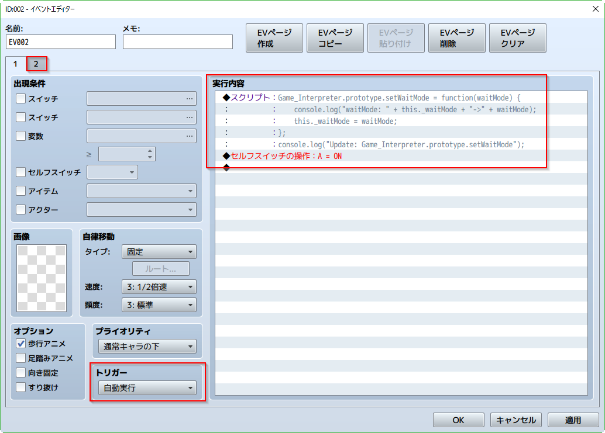
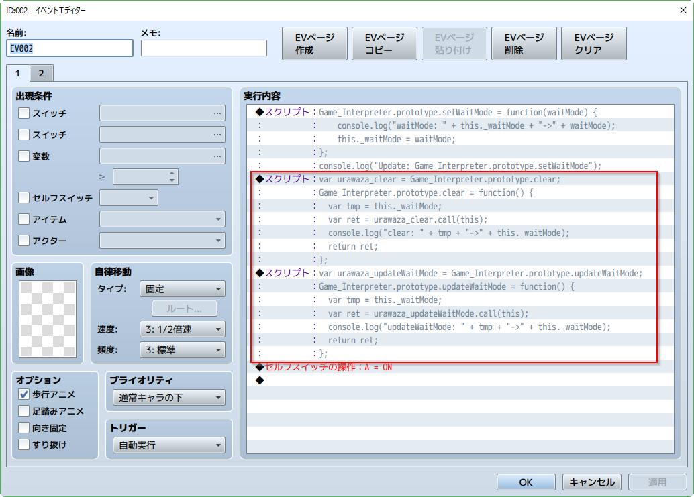
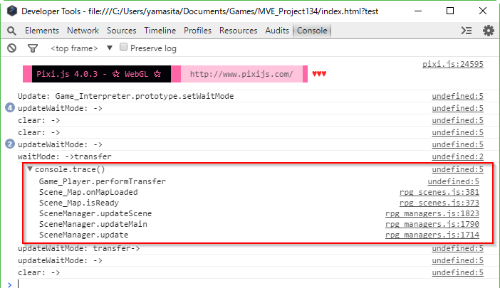

[トップページに戻る](../README.ja.md) | [JGSS 技術メモ](index.md)

# マップ移動中のコードの流れ その2

[前回](201701-scenes.md) に引き続き、今回もマップ上でキャラが動いている時のコードを追ってみます。対象は ver1.3.4 です。

前回はおおまかな流れを見ていったので、今回はその補足というか、気になったところを適当に眺めてみる予定です。ぶらぶら散歩、的なw

## 移動イベントの簡単作成

RPGツクールMVのマップ画面で右クリックすると「イベントの簡易作成」メニューがあって便利ですよね。そのなかでも「移動」はマップ移動によく使います。何気なく使っていますが、どういった仕組みなのでしょうか？


実際に作成された移動イベントが以下になります。赤枠の部分がポイントでしょうかね。


ここでまず、右側の「実行内容」に注目してみます。


プラグインとか作成していると、ツクールの開発は、RPGツクールVX Ace は Ruby で、MV は JavaScript ですよね、とか思いますが…たぶん違いますよね？ゲーム開発者にとって、RPGツクールでの開発言語といえば、上記の「実行内容」であり、以下のイベントコマンドのリストだとオモイマス。

みてください、この充実した3ページを！


僕はこれがけっこう好きで、よくできた言語環境だとおもいます。なので、今回の「実行内容」が内部的にはどうなっているか、ちょっと追ってみましょう！

### イベントコマンドの格納方法

まず作成されたマップですが、data フォルダのなかに Map001.json として保存されています。json 形式ですから、JavaScript ベースのデータファイルってことですね。そのファイルを見て… も長いですから、上記の「実行内容」の部分を抜き出してみます。コメント付きで。

```js
"list":[
  // SEの演奏 : Move1 (90, 100, 0)
  {"code":250,"indent":0,"parameters":[{"name":"Move1","pan":0,"pitch":100,"volume":90}]},
  // 場所移動 : NAP002 (8,1)
  {"code":201,"indent":0,"parameters":[0,2,8,1,0,0]},
  // 何もしない (イベントの終了)
  {"code":0,"indent":0,"parameters":[]}
]
```

さあ、この「実行内容」は内部的にどう処理されているのでしょうか？コードのどこを見ればわかるのでしょうか？

ここで皆さんに、コード内を散歩する際の強い味方をご紹介しましょう。実行内容の最後に「スクリプト」として console.trace() を追加してください。


さきほどの Map001.json には以下の行が挿入されたはず。code 355 が「スクリプト」コマンドなんですね。

```js
{"code":355,"indent":0,"parameters":["console.trace()"]},
```

そしてゲームをテストプレイし、移動イベントのあるところまで移動してから F8 で開発者コンソールを開いてみてください。以下のように関数の呼び出し状況が表示されているはずです。


この呼び出しは下から上に向かって呼び出されています。 Comannd355 というのは「スクリプト」処理用でしょうから、その上にある Game_Interpreter クラスの executeCommand とか update が怪しいですね。あ、Game_Interpreter の update って、[前回出てきた](201701-scenes.md#マップを更新) 気もしますね。

### イベントコマンドの実行方法

さて、見つかった関数のなかで、直接の呼び出し元の executeCommand がこちら。

```js
Game_Interpreter.prototype.executeCommand = function() {
    var command = this.currentCommand();              // 現在の実行行を入手
    if (command) {
        this._params = command.parameters;
        this._indent = command.indent;
        var methodName = 'command' + command.code;    // code から処理関数を入手
        if (typeof this[methodName] === 'function') { // 処理関数が存在するならば
            if (!this[methodName]()) {                // 処理関数を実行
                return false;
            }
        }
        this._index++;
    } else {
        this.terminate();                             // イベント処理終了
    }
    return true;
};
Game_Interpreter.prototype.currentCommand = function() {
    return this._list[this._index];
};
```

どうやら commandXXX という、code から探せる関数があって、それが各イベントコマンドの実態のようです。 というわけでまず、code 250 であるSEの演奏は…

```js
// Play SE
Game_Interpreter.prototype.command250 = function() {
    AudioManager.playSe(this._params[0]);
    return true;
};
```

そして code 201 である場所移動は…

```js
// Transfer Player
Game_Interpreter.prototype.command201 = function() {
    if (!$gameParty.inBattle() && !$gameMessage.isBusy()) {
        var mapId, x, y;
        if (this._params[0] === 0) {  // Direct designation
            mapId = this._params[1];
            x = this._params[2];
            y = this._params[3];
        } else {  // Designation with variables
            mapId = $gameVariables.value(this._params[1]);
            x = $gameVariables.value(this._params[2]);
            y = $gameVariables.value(this._params[3]);
        }
        $gamePlayer.reserveTransfer(mapId, x, y, this._params[4], this._params[5]);
        this.setWaitMode('transfer');
        this._index++;
    }
    return false;
};
```

コードを見ると、json にあったパラメータ [0,2,8,1,0,0] の意味がわかりますね。

0. 直接指定なら0、それ以外は変数で指定
1. 直接指定ならマップ番号、変数で指定ならマップ番号の指定された変数
2. 直接指定ならx座標、変数で指定ならx座標の指定された変数
3. 直接指定ならy座標、変数で指定ならy座標の指定された変数
4. 向きの指定
5. フェードの指定

またマップ移動の場合には $gamePlayer.reserveTransfer で移動の準備をしておき、this.setWaitMode で 'transfer' という待ちモードに設定していることがわかりますね。このあたりを次で見てみましょう。

### さらに余談ですが

さて、開発言語好きの方なら、Game_Interpreter の「インタープリター」という言葉に反応するかもしれませんね。この方式は順番に命令を解釈していくので柔軟性があり、デバッグも容易なのですが、実行速度に劣る面があります。それに対して事前に一括で解釈してしまう「コンパイル」という方式があり、こちらは処理速度が速いです。

RPGツクールMVで作成されたゲームですが、今回の場所移動のように定型化されたもので、かつ頻繁に呼び出される処理が幾つかあるとおもいます。それらだけでも事前にコンパイルしておく、つまり事前に作成した JavaScript の関数 (できれば asm.js も使って？) の呼び出しに置き換えてあげるだけで、そこそこの手間で有効な、ゲームの高速化ができそうな気がします。誰か実装してみませんか？ (他力本願すぎる…)

## 更に移動イベント

マップ移動の場合には $gamePlayer.reserveTransfer で移動の準備をしておき、setWaitMode で 'transfer' という待ちモードに設定している、あたりを追っていきましょう。

まずは setWaitMode を見つけます。

```js
Game_Interpreter.prototype.setWaitMode = function(waitMode) {
    this._waitMode = waitMode;
};
```

そしてここで更なる裏技「プラグインを用いないで、システムを好き勝手いじくろう！」を伝授しておきましょう。最初に登場するマップで、自動起動のイベントを作成します。



「実行内容」はスクリプトと、セルフスイッチAの操作です。セルスイッチAがONになると、何もしない2ページ目に遷移します。つまり、この「実行内容」は一度しか実行されません。そしてスクリプトの内容は以下です。

```js
Game_Interpreter.prototype.setWaitMode = function(waitMode) {
    console.log("waitMode: " + this._waitMode + "->" + waitMode);
    this._waitMode = waitMode;
};
console.log("Update: Game_Interpreter.prototype.setWaitMode");
```

これ、普通はプラグインで実行するメソッドの書き換えを、スクリプトコマンドで実行しちゃってます。しかもコードの追加でなく上書きです。ものすごく乱暴なやり方ですが、まあ調査用の使い捨てコードですので、裏技として許してください。

さてゲームをテスト実行してマップ移動し、F8で開発者コンソールを確認してみましょう。


裏技は動いている！ようですね。でも、アレレ… です。 \_waitMode は確かに 'transfer' にセットされていますが、それだけです。マップ移動を繰り返しても、同じログが続くだけです。これはおかしい。そう、誰が \_waitMode を空に戻しているんでしょうか？

そこでソースの中を \_waitMode で検索すると、clear と updateWaitMode というメソッド関数がヒットします。中身は以下のような感じ。

```js
Game_Interpreter.prototype.clear = function() {
    this._mapId = 0;
    this._eventId = 0;
    this._list = null;
    this._index = 0;
    this._waitCount = 0;
    this._waitMode = '';
    this._comments = '';
    this._character = null;
    this._childInterpreter = null;
};

Game_Interpreter.prototype.updateWaitMode = function() {
    var waiting = false;
    switch (this._waitMode) {
    case 'message':
        waiting = $gameMessage.isBusy();
        break;
    case 'transfer':
        waiting = $gamePlayer.isTransferring();
        break;
    case 'scroll':
        waiting = $gameMap.isScrolling();
        break;
    case 'route':
        waiting = this._character.isMoveRouteForcing();
        break;
    case 'animation':
        waiting = this._character.isAnimationPlaying();
        break;
    case 'balloon':
        waiting = this._character.isBalloonPlaying();
        break;
    case 'gather':
        waiting = $gamePlayer.areFollowersGathering();
        break;
    case 'action':
        waiting = BattleManager.isActionForced();
        break;
    case 'video':
        waiting = Graphics.isVideoPlaying();
        break;
    case 'image':
        waiting = !ImageManager.isReady();
        break;
    }
    if (!waiting) {
        this._waitMode = '';
    }
    return waiting;
};
```

さきほどの裏技で「スクリプト」で以下のコードを追加して、これら2つの関数にログを仕込んでみましょう。

```js
var urawaza_clear = Game_Interpreter.prototype.clear;
Game_Interpreter.prototype.clear = function() {
  var tmp = this._waitMode;
  var ret = urawaza_clear.call(this);
  console.log("clear: " + tmp + "->" + this._waitMode);
  return ret;
};

var urawaza_updateWaitMode = Game_Interpreter.prototype.updateWaitMode;
Game_Interpreter.prototype.updateWaitMode = function() {
  var tmp = this._waitMode;
  var ret = urawaza_updateWaitMode.call(this);
  console.log("updateWaitMode: " + tmp + "->" + this._waitMode);
  return ret;
};
```

自動実行のイベントは以下のような感じになります。



さてゲームをテスト実行してマップ移動し、F8で開発者コンソールを確認してみましょう。


今度は \_waitMode の遷移がちゃんとわかります。setWaitMode がセットした 'transfer' をクリアしたのは、updateWaitMode でしたね。

## 実際の移動処理

updateWaitMode 関数のコードを見ると、'transfer' の場合には $gamePlayer.isTransferring() を呼んでいて、その戻り値が false の場合には処理が終了したと判断して、\_waitMode を空にしているようです。なるほど、という感じですね。

では実際に移動処理をしているらしい $gamePlayer.isTransferring 関数を見てみましょう。

```js
Game_Player.prototype.isTransferring = function() {
    return this._transferring;
};
```

ん、これは状態を返しているだけでは…？ と、慌てて \_transferring を検索してみると、ありました…

```js
Game_Player.prototype.reserveTransfer = function(mapId, x, y, d, fadeType) {
    this._transferring = true;
    this._newMapId = mapId;
    this._newX = x;
    this._newY = y;
    this._newDirection = d;
    this._fadeType = fadeType;
};
```

お、お前はまさかの reserveTransfer 関数！ だいぶ前に、command201 のところで、[更に移動イベント](#更に移動イベント) で移動の準備してたやつ！setWaitMode の前の行！こっちが本命だったのかー orz

そしてその下にありましたよ、怪しいメソッド関数 performTransfer が。

```js
Game_Player.prototype.performTransfer = function() {
    if (this.isTransferring()) {
        this.setDirection(this._newDirection);
        if (this._newMapId !== $gameMap.mapId() || this._needsMapReload) {
            $gameMap.setup(this._newMapId);
            this._needsMapReload = false;
        }
        this.locate(this._newX, this._newY);
        this.refresh();
        this.clearTransferInfo();
    }
};
```

仕方ない、またやりますか裏技。今度は trace() を仕込みます。

```js
var urawaza_performTransfer = Game_Player.prototype.performTransfer;
Game_Player.prototype.performTransfer = function() {
  var tmp = this._waitMode;
  var ret = urawaza_performTransfer.call(this);
  console.trace();
  return ret;
};
```

で、得られた結果がこちら。



くー、なるほど Scene_Map クラスの onMapLoaded が呼んでましたか。それっぽいコードだと思いましたが、これはマップが遷移後の後処理ですな。マップ切り替えそのものじゃなくて…

僕の勘が悪すぎるのか、気軽に始めたわりには、なんか長引いてますね、このネタ。

## 真の移動処理

さーて長いことひっぱってきましたが、マップ移動中の待ちやら、マップ移動の準備やら、マップ移動後の後処理やらありますが、実際のマップ移動処理はどこじゃー！と。

いや、実はさっきの isTransferring() 関数が、やはり重要なキーだったのですよ。rpg_objects.js ファイルばかり見ていて、rpg_scenes.js を探し忘れていました。それだけじゃなくて、コレ、[前回の マップ間の移動](201701-scenes.md#マップ間の移動) に出てきましたよねw

```js
Scene_Map.prototype.updateTransferPlayer = function() {
    if ($gamePlayer.isTransferring()) {
        SceneManager.goto(Scene_Map);
    }
};
```

要は command201 を処理する際に呼ばれた reserveTransfer で、isTransferring() が true になり、シーン更新のメインループで上記の updateTransferPlayer が SceneManager.goto(Scene_Map) する、が答えだったんですよ。

わかれば簡単ですが、ここまで半日近く過ぎてますよ… (主にこのメモまとめてる時間ですが)

## 移動処理のラスボス

…で納得しそうになりますが、ちょっと不思議ではないですか？SceneManager.goto(Scene_Map) だけで、次に行くマップがどうやってわかるのか？ここまできたんです、一応確認しておきましょう。

そこでまず、以下の関数を三度、復習しましょう。reserveTransfer は訳すと「遷移の予約」だし、やたら並んでいる this.\_newXXX が怪しいですよね。

```js
Game_Player.prototype.reserveTransfer = function(mapId, x, y, d, fadeType) {
    this._transferring = true;
    this._newMapId = mapId;
    this._newX = x;
    this._newY = y;
    this._newDirection = d;
    this._fadeType = fadeType;
};
```

そして SceneManager.goto 内で呼び出されるのは、そのシーンの初期化。つまりは以下の関数です。

```js
Scene_Map.prototype.create = function() {
    Scene_Base.prototype.create.call(this);
    this._transfer = $gamePlayer.isTransferring();
    var mapId = this._transfer ? $gamePlayer.newMapId() : $gameMap.mapId();
    DataManager.loadMapData(mapId);
};
```

やはりここで \_newMapId が出てきました。isTransferring() ならば遷移されてきたので、\_newMapId が新しいマップ番号になります。そうでない場合は $gameMap.mapId() で現在居るマップ番号になりますね。

そして \_newX, \_newY, \_newDirection あたりの他の予約された値は、さきほど出てきたマップ遷移後の後処理 performTransfer で、プレイヤーを適切な位置にセットするため利用されていますね。

## というわけで

いや、ネタの1つとして始めたつもりが、思った以上に長くなってしまいました…

まあ内容はともかく、探し方や、ご紹介した裏技などは、皆様が自身でシステム内部を散策される際に、いつか役に立つかもしれません。それを期待して、このグダってしまった散策のメモを公開させていただきます。

[トップページに戻る](../README.ja.md) | [JGSS 技術メモ](index.md)
