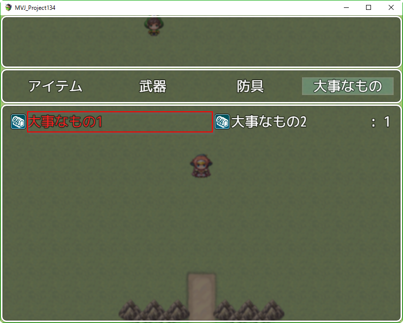

[トップページに戻る](../README.ja.md) | [JGSS 技術メモ](index.md)

# ハクスラRPG的なプラグインを作ってみる1

今回はちょっと趣向を変えて、自分で作成するプラグインの構想段階からメモにしていこうとおもいます。完成すると自分でも忘れそうなので…

## ベースとなる考え方

僕はいわゆるハクスラ系のRPGがけっこう好きです。だんだん強くなっていく爽快感が根っこだと思うんですが、個人的には楽しさを2要素に分類していて

* 蓄積型 (農耕民族的、安心、費やした能力・労力が報われる喜び)
* 賭博型 (狩猟民族的、驚き、入手したときの喜び、射幸心)

これをベースに、ゲームとして以下のサブ要素があります。

* 思考 (状況判断、自分なりの最適解を探す楽しみ)
* 知識 (ストーリー理解、マップ踏破、図鑑完成など対象に対する知識欲)

例えばランダム要素のある戦闘は、蓄積された現在の強さをベースに、行為の結果に賭博的な要素があり、敵に対する知識を用いて、思考で対応する楽しみだとおもいます。

### 2要素に関する補足

「蓄積」は経験値の増加によるレベルアップ、スキルの取得、所持金の増加による武具の買い替え、など地道な努力で確実に入手できる報酬(強さ)です。適切なバランスがとれていれば、これだけでもゲームは成立します。

「蓄積」のもつ課題はカンスト、つまりシステム的な上限です。家庭用などで、レベル99で成長がストップしてしまうRPGなど多く、同時に所持金も使い道がなくなるため、それ以上のプレイが困難になることがあります。これは商品である以上は妥当(次のゲームを買ってもらう)ですが、それ以後のプレイは報いが少ないものとなり、個人的には少し寂しく思います。

例えばWizardryのようにレベルが上がり続ければ、それに対する報酬(HPの上限のみ)は少なくても、ゼロではない。延々とプレイし続けてしまう人達も出てくるわけです。終盤は無意味になりがちな所持金も、強化に使えれば意味もでてきます。

「賭博」はゲーム中におけるカジノなどを連想しがちですが、最も多い実装としては、Diabllo などに代表されるランダムな付加価値をもったドロップ品です。炎の短剣+1(素早さ+1,防御力+1%) という武器を戦闘終了後に敵が落とす、計算上は 炎の短剣+5(素早さ+8,防御力+10%) まであるよ、みたいな。より良い装備、より数値の高いボーナスを求めて、プレイヤーは探索を続けるわけです。

「賭博」は実装の容易さに対して、効果はかなり大きいと考えます。例えばドロップ品にしても、複数のボーナス数値を考えれば、それが全て最高値になるアイテムの入手は難しいことです。またどんなボーナスの種類が適切か、は「思考」の楽しさに繋がります。

また「賭博」は上限に余裕があるため、「蓄積」の報酬ともなり得ます。蓄積したもので「賭博」できれば、蓄積がカンストしづらくなり、行為の意味を失わなくて済むのです。よくある実装としては、不要になった武具や消費アイテム、所持金を投資すれば何らかのドロップアイテム品が手に入る、という「錬金のツボ」や「合成屋さん」的な何かです。

### ローグ的要素

「賭博」をランダム要素と考えると、ローグ的な要素を考慮する必要があります。僕も好きなジャンルですし。

ただローグというゲーム自体は、RPGというシステムを採用しているものの、いわゆるCRPG(コンピューターRPG)とは別ジャンルだと思っています。重要な柱である「蓄積」を捨て、それをプレイヤースキルの蓄積という「知識」で代用したゲームジャンル、とでもいいましょうか…

ランダム生成の迷宮は価値があります。個人的には全マップを製作者が作成するのがベストだと思いますが、現実的には多くのマップを制作することは難しく、特に今回のように長時間プレイを前提としたシステムでは無理が生じます。少なくとも稼ぐダンジョン、的なマップに自動生成の技術を利用するのは有効です。ただ今回は、とりあえずこれも話題から外しましょう。

### それ以外の要素

今回は、プレイヤーにとってマイナスになるゲーム要素は考えません。キャラクターのロストや、何かを維持するために稼ぐ、耐久度による武具の消失などです。

またストーリー重視で、RPG要素が主要な構成要素ではないゲームも、システムが主題の今回の話題からは外します。

### RPGツクールMVへの実装

僕はわりと開発環境オタクな面があり、各種のゲーム開発環境はとりあえず入手しちゃいます。Clickteam Fusion とか GameMaker とか PICO-8 も買っちゃいました。

その中でも RPGツクールMV は基本のゲームシステムが気に入っていて、プラグインはあくまでそれを無理なく拡張するものが好ましいと考えています。向かないタイプのゲームを無理に実装すると遅くなるし、根っこから変えるなら他の開発環境で作ればいいじゃん、と思います。

なので今回も、そのあたりを注意しながら、欲張りすぎないようなプラグインにするつもり。

## 実は過去にトライしたことが

実は RPG Maker VX Ace の時代にハクスラっぽい拡張は試したことがあって、[2014/06 My 1st study](/yamachan/rgss3-hack/blob/master/memo/201406-1st-study.md) や、英語だけど [What is ktr1 tool](/yamachan/rgss3-hack/blob/master/memo/201605-ktr1-tool_01.md) あたりにメモが残っています。

実はこの時点で既に

* レアやレジェンドアイテムの色を変える
* 数量を表示しないアイテム
* コードでユニーク武器を生成して所持させる (セーブも対応)

まで出来ているんですよね。実用化しなかったのは、武器を生成し続けると武器データがどんどん増えて処理が重くなるのが想像できて、いわゆるガベージコレクション的な処理が足りなかったからです。

たぶん武器を手放す(捨てる、販売する)などの段階、もしくはセーブ時にまとめて、所持しなくなって不要になった武器登録を削除する必要があります。削除しないとしても不要フラグはつけておいて、次に新規作成する時にはそのIDを再利用するようにしないと。

今回はそのあたりを含めて検討し、この過去の VX Ace 用のライブラリを MV で蘇らせたいと思っています。

## まずはプラグインのベース

[RTK_Test.js](../guide/RTK_Test.js) をRPGツクールMV プロジェクトの js/plugins フォルダに RTK_HS_RPG.js というファイル名で保存します。コメント部分を適当に書き換えます。

今回は僕の基本ライブラリ [RTK_Core](RTK1_Core.ja.md) を利用しましょう。現時点での最新バージョン ver1.16 が事前に読み込まれているかどうかチェックも加えます。

```js
//=============================================================================
// RTK_HS_RPG.js  ver1.0 2017/03/04
// The MIT License (MIT)
//=============================================================================

/*:
 * @plugindesc ハクスラっぽいRPGを実現するプラグイン
 * @author Toshio Yamashita (yamachan)
 *
 * @help このプラグインにはプラグインコマンドはありません。
 */

(function(_global) {
	if (!_global["RTK"]) {  // RTK_Core ライブラリの存在チェック
		throw new Error('This plugin requires RTK1_Core.js plugin previously.');
	}
	if (RTK.VERSION_NO < 1.16) {  // RTK_Core ライブラリのバージョンチェック
		throw new Error('This plugin requires version 1.16 or later of RTK1_Core plugin. the current version looks ' + RTK.VERSION_NO + ".");
	}

	var N = "RTK_HS_RPG";  // 正式なプラグイン名(ファイル名)
	var NK = "RTK_HS";     // HS がRTK内でのこのプラグインの短縮名
	var M = RTK["HS"] = RTK._modules[N] = {};  // M はプラグイン内の共通データ

    // ここにプラグイン処理を記載
})(this);
```

ここまではお約束(僕の基本的な書き方)なので、あまり細かいところは気にしないでください。

[RTK_Core](RTK1_Core.ja.md) と一緒に実際のプロジェクトに組み込んで、問題なく動作することを確認しておきましょう。

## アイテム名に色をつけてみる

VX Ace の [The Code for Item colors](/yamachan/rgss3-hack/blob/master/memo/201605-ktr1-tool_01.md#the-code-for-item-colors) では Window_Base クラスの draw_item_name メソッドを置き換えていました。MV では名前ルールが異なりますので、drawItemName メソッドが該当します。

```js
Window_Base.prototype.drawItemName = function(item, x, y, width) {
    width = width || 312;
    if (item) {
        var iconBoxWidth = Window_Base._iconWidth + 4;
        this.resetTextColor();
        this.drawIcon(item.iconIndex, x + 2, y + 2);
        this.drawText(item.name, x + iconBoxWidth, y, width - iconBoxWidth);
    }
};

Window_Base.prototype.resetTextColor = function() {
    this.changeTextColor(this.normalColor());
};
```

とりあえず、わかりやすくロジックを追加してみましょう。

```js
  // ここにプラグイン処理を記載

  var colors = {"E":13,"K":18,"L":20,"M":16,"R":14,"S":3,"U":11};  // 追加

Window_Base.prototype.drawItemName = function(item, x, y, width) {
    width = width || 312;
    if (item) {
        var iconBoxWidth = Window_Base._iconWidth + 4;
        this.resetTextColor();
        if (item.meta["r"] && colors[item.meta["r"]]) {                  // 追加
          this.changeTextColor(this.textColor(colors[item.meta["r"]]));  // 追加
        }                                                                // 追加
        this.drawIcon(item.iconIndex, x + 2, y + 2);
        this.drawText(item.name, x + iconBoxWidth, y, width - iconBoxWidth);
    }
};
```

さてこれで、データベースでアイテムのメモ欄に &lt;r:U&gt; や &lt;r:R&gt; のようにレア度を指定してみましょう。


すると実行画面で、アイテムにレア度に応じた色が付いているのがわかります。


言語環境が変わっても、クラス構成や色の番号がほぼ同じなので、移植は簡単そうですね。いい感じです。

### 処理を改善

ちゃんと動くことがわかったので、タグ名(r)をパラメータで変更できるようにし、またメソッドを置き換えではなく、競合の少ないフック型(乗っ取り型)に変更してみましょう。

ちょっと長いですが、現在の RTK_HS_RPG.js コード全部を記載します。

```js
//=============================================================================
// RTK_HS_RPG.js  ver1.0 2017/03/04
// The MIT License (MIT)
//=============================================================================

/*:
 * @plugindesc ハクスラっぽいRPGを実現するプラグイン
 * @author Toshio Yamashita (yamachan)
 *
 * @param r_tag
 * @desc ノート欄でレア度を指定するタグ名
 * @default r
 *
 * @help このプラグインにはプラグインコマンドはありません。
 *
 * --- レア度の指定と色 ---
 *  L : Legendary/Unique item - Orange (20)
 *  E : Epic item - Purple (13)
 *  R : Rare item - Yellow (14)
 *  M : Magic item - Blue (12)
 *  U : Uncommon item - Green (11)
 *  S : Set item - Light green (03)
 *  K : Key item - Red (18)
 */

(function(_global) {
	if (!_global["RTK"]) {  // RTK_Core ライブラリの存在チェック
		throw new Error('This plugin requires RTK1_Core.js plugin previously.');
	}
	if (RTK.VERSION_NO < 1.16) {  // RTK_Core ライブラリのバージョンチェック
		throw new Error('This plugin requires version 1.16 or later of RTK1_Core plugin. the current version looks ' + RTK.VERSION_NO + ".");
	}

	var N = "RTK_HS_RPG";  // 正式なプラグイン名(ファイル名)
	var NK = "RTK_HS";     // HS がRTK内でのこのプラグインの短縮名
	var M = RTK["HS"] = RTK._modules[N] = {};  // M はプラグイン内の共通データ

	// ここにプラグイン処理を記載

	var param = PluginManager.parameters(N);
	M.r_tag = String(param['r_tag'] || "r");

	var colors = {"E":13,"K":18,"L":20,"M":16,"R":14,"S":3,"U":11};

	var _Window_Base_drawItemName = Window_Base.prototype.drawItemName;
	Window_Base.prototype.drawItemName = function(item, x, y, width) {
		if (item && item.meta[M.r_tag]) {
			width = width || 312;
			var iconBoxWidth = Window_Base._iconWidth + 4;
			if (colors[item.meta[M.r_tag]]) {
				this.changeTextColor(this.textColor(colors[item.meta[M.r_tag]]));
			} else {
				this.resetTextColor();
			}
			this.drawIcon(item.iconIndex, x + 2, y + 2);
			this.drawText(item.name, x + iconBoxWidth, y, width - iconBoxWidth);
		} else {
			return _Window_Base_drawItemName.call(this, item, x, y, width);
		}
	};

})(this);
```

## キーアイテムの数を非表示にする

VX Ace の [Uncountable items](/yamachan/rgss3-hack/blob/master/memo/201605-ktr1-tool_01.md#uncountable-items) では Window_ItemList クラスの draw_item_number メソッドを置き換えていました。MV では名前ルールが異なりますので、drawItemNumber メソッドが該当します。

```js
Window_ItemList.prototype.drawItemNumber = function(item, x, y, width) {
    if (this.needsNumber()) {
        this.drawText(':', x, y, width - this.textWidth('00'), 'right');
        this.drawText($gameParty.numItems(item), x, y, width, 'right');
    }
};

Window_ItemList.prototype.needsNumber = function() {
    return true;
};
```

おや、needsNumber という表示をコントロールするメソッドがあります。が、惜しい… 対象の item を渡してもらっていれば、メモ欄の情報を参照できたのに…

レア度の指定で K : Key item という赤色の定義を追加しましたね。今回はこの赤色の数を非表示にする機能を作成します。ついでに、プラグインのパラメーターで機能を OFF できるようにしておきます。追加したコードはこちら。

```js
 /*
 * @param k_number
 * @desc レア度 K のキーアイテムは数を表示しない (0:OFF 1:ON)
 * @default 1
 */

  M.k_number = Number(param['k_number'] || "1");

  if (M.k_number == 1) {
		var _Window_ItemList_drawItemNumber = Window_ItemList.prototype.drawItemNumber;
		Window_ItemList.prototype.drawItemNumber = function(item, x, y, width) {
			if (item && item.meta[M.r_tag] == "K") {
				// 何もしない
			} else {
				return _Window_ItemList_drawItemNumber.call(this, item, x, y, width);
			}
		};
	}
```

プラグインパラメーターで OFF にされた時は、メソッドのフックもしない、というあたりが注目ポイントでしょうか。お行儀良く、ね。

実行結果はこちら。大事なもの1 のメモ欄に &lt;r:K&gt; を指定して実行した結果がコチラ。赤いキーアイテムには数量が表示されていないことがわかります。



とりあえず、今回はここまでにしておきますー。

[トップページに戻る](../README.ja.md) | [JGSS 技術メモ](index.md)
