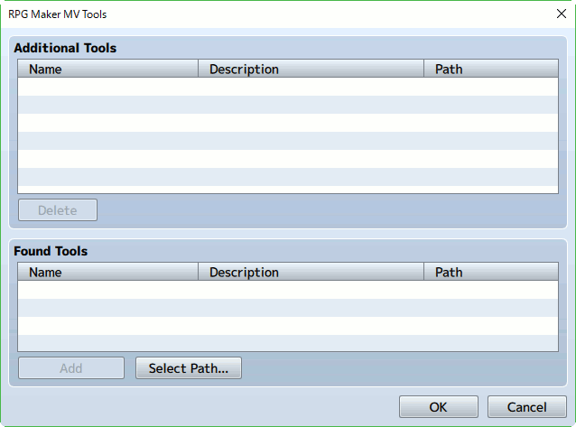

[トップページに戻る](../README.ja.md) | [JGSS 技術メモ](index.md)

# JGSS ver1.3.4 から ver1.4.0 への変化

JGSS が ver1.4.0 に更新されましたが、2nd の数字が上がったのは、バグフィックスではない何かがあるのでしょうか。コードの主要部分を眺めて、違いをざっと把握してみましょう。

## rpg_objects.js

return 部分が修正されています(コメントされているのがver134)が、これは親メソッドを呼ぶようにしただけで、呼び先の処理は同じです。バグ修正でしょう。

```js
Game_Actor.prototype.meetsUsableItemConditions = function(item) {
    if ($gameParty.inBattle() && !BattleManager.canEscape() && this.testEscape(item)) {
        return false;
    }
    // return this.canMove() && this.isOccasionOk(item);
    return Game_BattlerBase.prototype.meetsUsableItemConditions.call(this, item);
};
```

## rpg_core.js

以下が修正されていますが、1.4.0 の間違いですよね、コレ。

```js
Utils.RPGMAKER_VERSION = "1.3.5";
```

WebAudio の部分に10行の追加がありますね。タッチ操作(touchendイベント)に対するリスナーが追加されています。例えばタッチでアプリが起こされた時、touchend しか送ってこない環境があったのかもしれませんね。

```js
WebAudio._setupEventHandlers = function() {
    document.addEventListener("touchend", function() {                                              // v1.4.0で追加
            var context = WebAudio._context;                                                        // v1.4.0で追加
            if (context && context.state === "suspended" && typeof context.resume === "function") { // v1.4.0で追加
                context.resume().then(function() {                                                  // v1.4.0で追加
                    WebAudio._onTouchStart();                                                       // v1.4.0で追加
                })                                                                                  // v1.4.0で追加
            } else {                                                                                // v1.4.0で追加
                WebAudio._onTouchStart();                                                           // v1.4.0で追加
            }                                                                                       // v1.4.0で追加
    });                                                                                             // v1.4.0で追加
    document.addEventListener('touchstart', this._onTouchStart.bind(this));
    document.addEventListener('visibilitychange', this._onVisibilityChange.bind(this));
};
```

これが今回、最大の変更かもしれず…

## rpg_managers.js

一か所だけ変わっていますが、これはコメントの変化で察しましょう。v1.3.4が

```js
AudioManager.shouldUseHtml5Audio = function() {
    // We use HTML5 Audio to play BGM instead of Web Audio API
    // because decodeAudioData() is very slow on Android Chrome.
    return Utils.isAndroidChrome() && !Decrypter.hasEncryptedAudio;
};
```

で Android chrome の専用処理だったのが、v1.4.0 では以下のようにOFFられたようです。

```js
AudioManager.shouldUseHtml5Audio = function() {
    // The only case where we wanted html5audio was android/ no encrypt
    // Atsuma-ru asked to force webaudio there too, so just return false for ALL
 // return Utils.isAndroidChrome() && !Decrypter.hasEncryptedAudio;
 return false;
};
```

## rpg_sprites.js

変化なし

## rpg_windows.js

変化なし

## rpg_scenes.js

変化なし

## 結論

いやー、ビックリするぐらい Script に変化がなかったです。

v1.3.4 から v1.4.0 への変化は、生成されるゲームではなく、RPG Maker MV Tools や Tutorial がメニューに追加された、つまりツール側の進歩が主みたいですね。




[トップページに戻る](../README.ja.md) | [JGSS 技術メモ](index.md)
