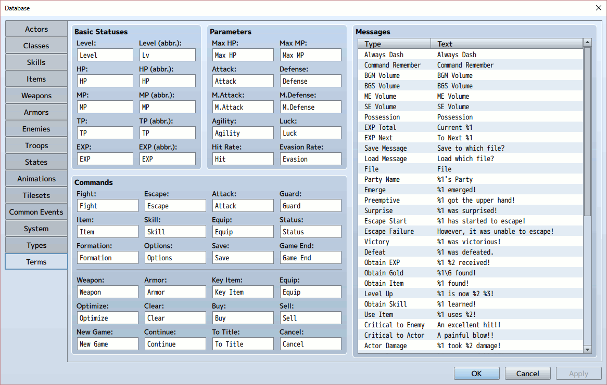
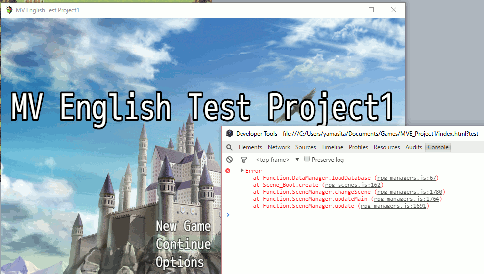
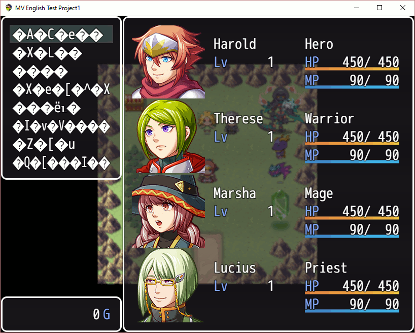
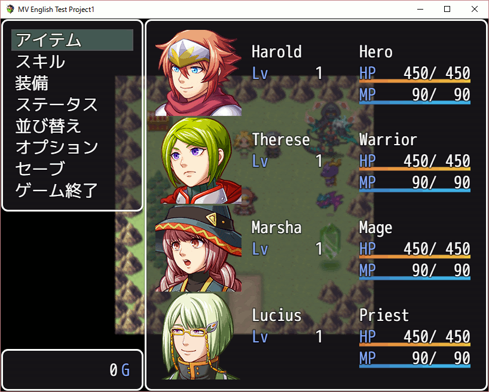
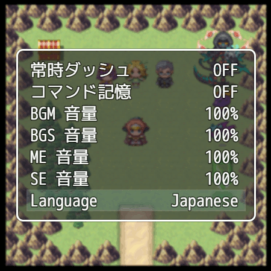

# 201606-multi-language

## Terms setting

RPG Maker MV has a term setting tab in game database. It looks good for tranlation of game terms.

Terms can be referd by TextManager like follows;

    Window_Options.prototype.addGeneralOptions = function() {
        this.addCommand(TextManager.alwaysDash, 'alwaysDash');
        this.addCommand(TextManager.commandRemember, 'commandRemember');
    };

Let's see TextManager's code. It has very JavaScript like flavor, depends on Object.defineProperties method and closure.

    Object.defineProperties(TextManager, {
        level           : TextManager.getter('basic', 0),
        levelA          : TextManager.getter('basic', 1),
        ...
        alwaysDash      : TextManager.getter('message', 'alwaysDash'),
        commandRemember : TextManager.getter('message', 'commandRemember'),
        ...
        actionFailure   : TextManager.getter('message', 'actionFailure'),
    });

    TextManager.getter = function(method, param) {
        return {
            get: function() {
                return this[method](param);
            },
            configurable: true
        };
    };

    TextManager.basic = function(basicId) { return $dataSystem.terms.basic[basicId] || ''; };    
    TextManager.param = function(paramId) { return $dataSystem.terms.params[paramId] || ''; };
    TextManager.command = function(commandId) { return $dataSystem.terms.commands[commandId] || ''; };
    TextManager.message = function(messageId) { return $dataSystem.terms.messages[messageId] || ''; };

This tool uses closure to refer dynamic value of text list ($dataSystem.terms.*), doesn't cache values. It means we can change these terms anytime. It's cool. :-)

## $dataSystem.terms

Let's check the initiation process of $dataSystem.terms.

You can find the terms data in 'data/System.json' file. And you can find this file name;

    DataManager._databaseFiles = [
        { name: '$dataActors',       src: 'Actors.json'       },
        ...
        { name: '$dataSystem',       src: 'System.json'       },
        { name: '$dataMapInfos',     src: 'MapInfos.json'     }
    ];

    DataManager.loadDatabase = function() {
        var test = this.isBattleTest() || this.isEventTest();
        var prefix = test ? 'Test_' : '';
        for (var i = 0; i < this._databaseFiles.length; i++) {
            var name = this._databaseFiles[i].name;
            var src = this._databaseFiles[i].src;
            this.loadDataFile(name, prefix + src);
        }
        if (this.isEventTest()) {
            this.loadDataFile('$testEvent', prefix + 'Event.json');
        }
    };

Let's take a stack trace of DataManager.loadDatabase function;

About stack trace, refer -> [Load function of Config Manager | 201606-enhance-options](https://github.com/yamachan/jgss-hack/blob/master/memo/201606-enhance-options.md#load-function-of-config-manager)

## Create language data

We are lucky, because 'data/System.json' file is plane, uncompressed text file. So we can use RPG Maker MV tool itself to create a translated text data.

It's easy. For example, I will create another RPG Maker MV project for Japanese text resource. I will input Japanese text into fields in Database's term tab. After input, I will copy necessary JSON data from 'data/System.json' file.

For example;

    ConfigManager.terms_Japanese = {
        "basic":["Level","Lv","HP","HP","MP","MP","TP","TP","EXP","EXP"],
        "commands":["戦う","逃げる","攻撃","防御","アイテム",,,],
        ...
     };

## Switch language

Let combine this function with my previous memo -> [201606-enhance-options](https://github.com/yamachan/jgss-hack/blob/master/memo/201606-enhance-options.md)

I add a new function to switch term set;

    ConfigManager.terms_change = function() {
        if ($dataSystem.terms.basic) {
            if (!this.terms_English) {
                this.terms_English = $dataSystem.terms;
            }
            $dataSystem.terms = this.langSelect == "Japanese" ? this.terms_Japanese
             : this.langSelect == "Chinese" ? terms_Chinese
             : this.terms_English;
        }
    };

Then, call this function in game logic;

    Scene_Title.prototype.create = function() {
        Scene_Base.prototype.create.call(this);
        this.createBackground();
        this.createForeground();
        this.createWindowLayer();
        ConfigManager.terms_change();
        this.createCommandWindow();
    };

    Scene_Options.prototype.terminate = function() {
        Scene_MenuBase.prototype.terminate.call(this);
        ConfigManager.save();
        ConfigManager.terms_change();
    };

## Font probrem?

The progress is great. Let's play Japanese mode... Oh?

My RPG Maker MV is an English version, but it can handle Japanese message in Event text. And the CSS (fonts/gamefont.css) setting looks no problem for multi language...

    @font-face {
        font-family: GameFont;
        src: url("mplus-1m-regular.ttf");
    }

Oh! It's an entry level mistake... I forgot to change "UTF-8" code mode in JSON file... Try again!

The Language option menu in game also can work, and affect the game immediately. Good.

## Future plan?

This is a technical test, so maybe, we need to enhance this for the production use;

* Not change the system js, impliment it into plugin mechanism
* Translate other words - Class name, Item name, Weapon name,,,
