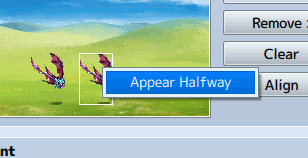
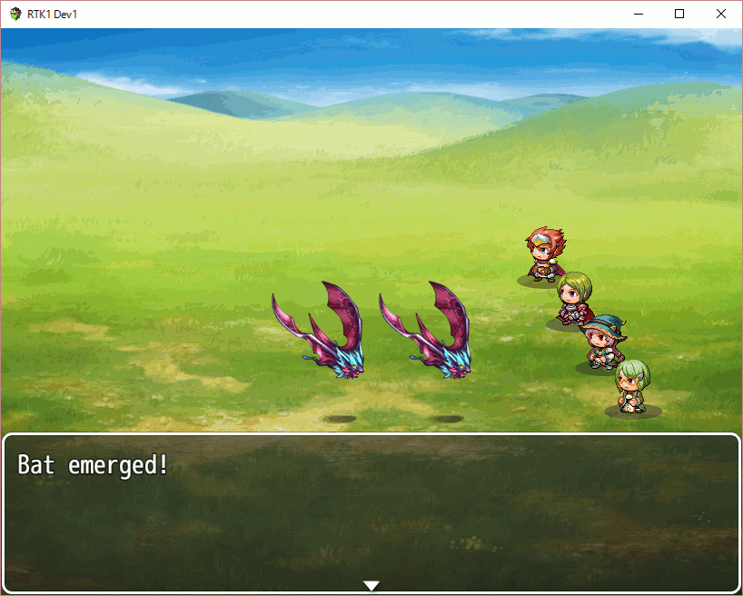
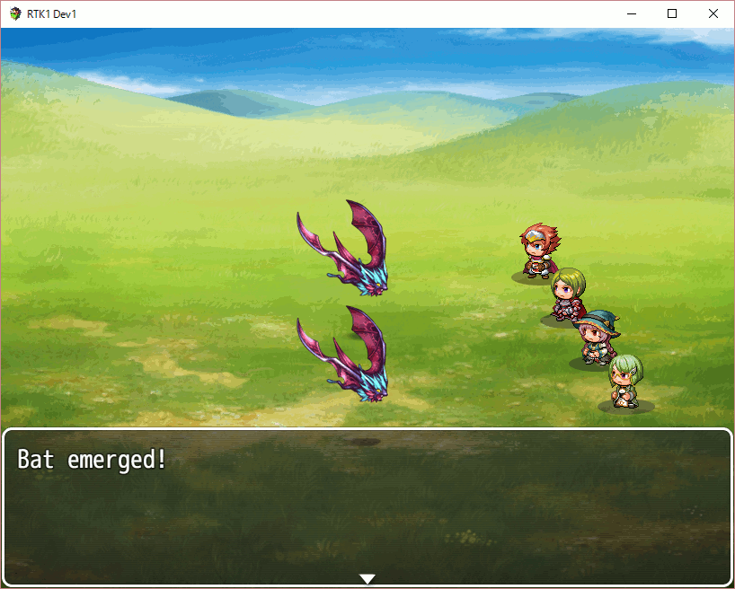

# 201607-battle

## BattleManager

To understand the battle of RPG Maker MV, let's check the BattleManager in 'rpg_managers.js' file.

```js
function BattleManager() {
    throw new Error('This is a static class');
}

BattleManager.setup = function(troopId, canEscape, canLose) {
    this.initMembers();
    this._canEscape = canEscape;
    this._canLose = canLose;
    $gameTroop.setup(troopId);
    $gameScreen.onBattleStart();
    this.makeEscapeRatio();
};

BattleManager.initMembers = function() {
    this._phase = 'init';
    this._canEscape = false;
    this._canLose = false;
    this._battleTest = false;
    this._eventCallback = null;
    this._preemptive = false;
    this._surprise = false;
    this._actorIndex = -1;
    this._actionForcedBattler = null;
    this._mapBgm = null;
    this._mapBgs = null;
    this._actionBattlers = [];
    this._subject = null;
    this._action = null;
    this._targets = [];
    this._logWindow = null;
    this._statusWindow = null;
    this._spriteset = null;
    this._escapeRatio = 0;
    this._escaped = false;
    this._rewards = {};
};
```

'$gameTroop' is a instance of '' class. Let's follow this.

```
Game_Troop
  Game_Unit
    Object
```

## Setup of troops

Troop is set of enemies in this system.

```js
Game_Troop.prototype.troop = function() {
    return $dataTroops[this._troopId];
};

Game_Troop.prototype.setup = function(troopId) {
    this.clear();
    this._troopId = troopId;
    this._enemies = [];
    this.troop().members.forEach(function(member) {
        if ($dataEnemies[member.enemyId]) {
            var enemyId = member.enemyId;
            var x = member.x;
            var y = member.y;
            var enemy = new Game_Enemy(enemyId, x, y);
            if (member.hidden) {
                enemy.hide();
            }
            this._enemies.push(enemy);
        }
    }, this);
    this.makeUniqueNames();
};
```

It looks almost simple, but I wonder about 'hidden' value. Then, I found the hidden value is from;



The following is naming logic of enemies;

```js
Game_Troop.prototype.makeUniqueNames = function() {
    var table = this.letterTable();
    this.members().forEach(function(enemy) {
        if (enemy.isAlive() && enemy.isLetterEmpty()) {
            var name = enemy.originalName();
            var n = this._namesCount[name] || 0;
            enemy.setLetter(table[n % table.length]);
            this._namesCount[name] = n + 1;
        }
    }, this);
    this.members().forEach(function(enemy) {
        var name = enemy.originalName();
        if (this._namesCount[name] >= 2) {
            enemy.setPlural(true);
        }
    }, this);
};

Game_Enemy.prototype.setPlural = function(plural) {
    this._plural = plural;
};
Game_Enemy.prototype.name = function() {
    return this.originalName() + (this._plural ? this._letter : '');
};
```

## Idea: location of enemies

'Game_Troop.prototype.setup' function set the location of each enemy. So we can modift it to fit sideview battle mode.

I think the location of enemy should be rotated at 90-degree backspin for the sideview battle. The sample code is as follws;

```js
        //var x = member.x;
        var x = $dataSystem.optSideView ? Graphics.width - member.y : member.x;
        //var y = member.y;
        var y = $dataSystem.optSideView ? member.x : member.y;
```

OK, let's check. The following the default logic;



And the following is the rotated one;



Of course, this is a simple sample. I need to add more code to use this type of service.

## Game_Enemy class

Next, let's check the instanciate of Game_Enemy.

```
Game_Enemy
  Game_Battler
    Game_BattlerBase
      Object
```

```js
function Game_Enemy() {
    this.initialize.apply(this, arguments);
}
Game_Enemy.prototype = Object.create(Game_Battler.prototype);
Game_Enemy.prototype.constructor = Game_Enemy;

Game_Enemy.prototype.initialize = function(enemyId, x, y) {
    Game_Battler.prototype.initialize.call(this);
    this.setup(enemyId, x, y);
};

Game_Enemy.prototype.setup = function(enemyId, x, y) {
    this._enemyId = enemyId;
    this._screenX = x;
    this._screenY = y;
    this.recoverAll();
};

```

There is no code to create PIXI.Sprite object... OK, let's back to the start point, 'BattleManager.setup'.

## Game_Screen class

```
Game_Screen
  Object
```

This class looks somple. Let's check the onBattleStart function which is called in 'BattleManager.setup'.

```js
Game_Screen.prototype.onBattleStart = function() {
    this.clearFade();
    this.clearFlash();
    this.clearShake();
    this.clearZoom();
    this.eraseBattlePictures();
};

Game_Screen.prototype.eraseBattlePictures = function() {
    this._pictures = this._pictures.slice(0, this.maxPictures() + 1);
};
```

It's wrong way... Back to BattleManager...

```js
SceneManager.push(Scene_Battle);
```

Oh, that's it. I forgot about 'Scene_Battle'...

## Scene_Battle

The battle starts in map with following code;

```js
Scene_Map.prototype.stop = function() {
    Scene_Base.prototype.stop.call(this);
    $gamePlayer.straighten();
    this._mapNameWindow.close();
    if (this.needsSlowFadeOut()) {
        this.startFadeOut(this.slowFadeSpeed(), false);
    } else if (SceneManager.isNextScene(Scene_Map)) {
        this.fadeOutForTransfer();
    } else if (SceneManager.isNextScene(Scene_Battle)) {
        this.launchBattle();
    }
};

Scene_Map.prototype.launchBattle = function() {
    BattleManager.saveBgmAndBgs();
    this.stopAudioOnBattleStart();
    SoundManager.playBattleStart();
    this.startEncounterEffect();
    this._mapNameWindow.hide();
};
```

Then, scene will start;

```js
function Scene_Battle() {
    this.initialize.apply(this, arguments);
}
Scene_Battle.prototype = Object.create(Scene_Base.prototype);
Scene_Battle.prototype.constructor = Scene_Battle;

Scene_Battle.prototype.initialize = function() {
    Scene_Base.prototype.initialize.call(this);
};

Scene_Battle.prototype.create = function() {
    Scene_Base.prototype.create.call(this);
    this.createDisplayObjects();
};
```

```js
Scene_Battle.prototype.createDisplayObjects = function() {
    this.createSpriteset();
    this.createWindowLayer();
    this.createAllWindows();
    BattleManager.setLogWindow(this._logWindow);
    BattleManager.setStatusWindow(this._statusWindow);
    BattleManager.setSpriteset(this._spriteset);
    this._logWindow.setSpriteset(this._spriteset);
};

Scene_Battle.prototype.createSpriteset = function() {
    this._spriteset = new Spriteset_Battle();
    this.addChild(this._spriteset);
};
```

OK, 'Spriteset_Battle' looks important to show enemies.

```
Spriteset_Battle
  Spriteset_Base
    Sprite
      PIXI.Sprite
        PIXI.DisplayObjectContainer
          PIXI.DisplayObject
            Object
```

```js
function Spriteset_Battle() {
    this.initialize.apply(this, arguments);
}
Spriteset_Battle.prototype = Object.create(Spriteset_Base.prototype);
Spriteset_Battle.prototype.constructor = Spriteset_Battle;

Spriteset_Battle.prototype.initialize = function() {
    Spriteset_Base.prototype.initialize.call(this);
    this._battlebackLocated = false;
};

Spriteset_Base.prototype.initialize = function() {
    Sprite.prototype.initialize.call(this);
    this.setFrame(0, 0, Graphics.width, Graphics.height);
    this._tone = [0, 0, 0, 0];
    this.opaque = true;
    this.createLowerLayer();
    this.createToneChanger();
    this.createUpperLayer();
    this.update();
};

Spriteset_Battle.prototype.createLowerLayer = function() {
    Spriteset_Base.prototype.createLowerLayer.call(this);
    this.createBackground();
    this.createBattleField();
    this.createBattleback();
    this.createEnemies();
    this.createActors();
};
```

OK, I met the enemies again!

```js
Spriteset_Battle.prototype.createEnemies = function() {
    var enemies = $gameTroop.members();
    var sprites = [];
    for (var i = 0; i < enemies.length; i++) {
        sprites[i] = new Sprite_Enemy(enemies[i]);
    }
    sprites.sort(this.compareEnemySprite.bind(this));
    for (var j = 0; j < sprites.length; j++) {
        this._battleField.addChild(sprites[j]);
    }
    this._enemySprites = sprites;
};

Spriteset_Battle.prototype.createActors = function() {
    this._actorSprites = [];
    for (var i = 0; i < $gameParty.maxBattleMembers(); i++) {
        this._actorSprites[i] = new Sprite_Actor();
        this._battleField.addChild(this._actorSprites[i]);
    }
};
```

So, let's check the 'Sprite_Enemy' class.

```js
function Sprite_Enemy() {
    this.initialize.apply(this, arguments);
}

Sprite_Enemy.prototype = Object.create(Sprite_Battler.prototype);
Sprite_Enemy.prototype.constructor = Sprite_Enemy;

Sprite_Enemy.prototype.initialize = function(battler) {
    Sprite_Battler.prototype.initialize.call(this, battler);
};

Sprite_Battler.prototype.initialize = function(battler) {
    Sprite_Base.prototype.initialize.call(this);
    this.initMembers();
    this.setBattler(battler);
};

Sprite_Battler.prototype.setBattler = function(battler) {
    this._battler = battler;
};

Sprite_Battler.prototype.initMembers = function() {
    this.anchor.x = 0.5;
    this.anchor.y = 1;
    this._battler = null;
    this._damages = [];
    this._homeX = 0;
    this._homeY = 0;
    this._offsetX = 0;
    this._offsetY = 0;
    this._targetOffsetX = NaN;
    this._targetOffsetY = NaN;
    this._movementDuration = 0;
    this._selectionEffectCount = 0;
};

Sprite_Enemy.prototype.initMembers = function() {
    Sprite_Battler.prototype.initMembers.call(this);
    this._enemy = null;
    this._appeared = false;
    this._battlerName = '';
    this._battlerHue = 0;
    this._effectType = null;
    this._effectDuration = 0;
    this._shake = 0;
    this.createStateIconSprite();
};

Sprite_Enemy.prototype.createStateIconSprite = function() {
    this._stateIconSprite = new Sprite_StateIcon();
    this.addChild(this._stateIconSprite);
};
```

OK.

Now I undertstand a part of BattleManager, about enemy sprites. I will try to continue another time. :-P
