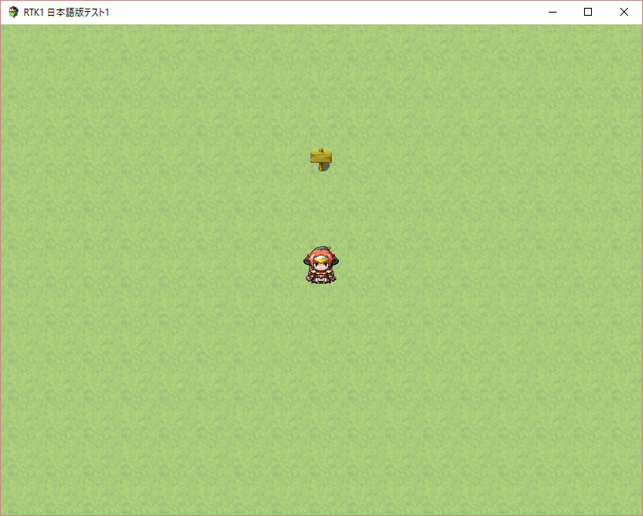

# 201607-pixi

* [Pixi.js](http://www.pixijs.com/) - 2D webGL renderer with canvas fallback

## Hello world of Pixi

From the following simple pixi application, I found the entry point - 'PIXI.Stage'.

```js
var width = 600;
var height = 400;

var stage = new PIXI.Stage(0x000000);
var renderer = PIXI.autoDetectRenderer(width, height);
document.getElementById("pixiview").appendChild(renderer.view);

var word = "Hello World!";
var style = {font:'bold 60pt Arial', fill:'white'};
var textobj = new PIXI.Text(word, style);
textobj.position.x = 60;
textobj.position.y = height / 2;

stage.addChild(textobj);

function animate(){
    requestAnimFrame(animate);
    textobj.rotation += 0.01;
    renderer.render(stage);
}
requestAnimFrame(animate);
```

## Entry point in rpg_core.js

Next, I found the pixi's entry point in JGSS.

```js
function Stage() {
    this.initialize.apply(this, arguments);
}

Stage.prototype = Object.create(PIXI.Stage.prototype);
Stage.prototype.constructor = Stage;

Stage.prototype.initialize = function() {
    PIXI.Stage.call(this);

    // The interactive flag causes a memory leak.
    this.interactive = false;
};
```

Then, I found 'Scene_Base' inherits the Stage and PIXI.Stage.

```js
function Scene_Base() {
    this.initialize.apply(this, arguments);
}

Scene_Base.prototype = Object.create(Stage.prototype);
Scene_Base.prototype.constructor = Scene_Base;

Scene_Base.prototype.initialize = function() {
    Stage.prototype.initialize.call(this);
    this._active = false;
    this._fadeSign = 0;
    this._fadeDuration = 0;
    this._fadeSprite = null;
};
```

## How to search children

OK, let's go on the way to search children of the Stage.

```js
PIXI.DisplayObjectContainer.prototype.addChild = function(child) {
    return this.addChildAt(child, this.children.length);
};

PIXI.DisplayObjectContainer = function() {
    PIXI.DisplayObject.call( this );
    this.children = [];
};
PIXI.DisplayObjectContainer.prototype = Object.create(PIXI.DisplayObject.prototype);
PIXI.DisplayObjectContainer.prototype.constructor = PIXI.DisplayObjectContainer;
```

OK, it looks very simple. :-)


## Tree of a simple map field

OK, let's check the simple field first - it contains onle one event object.



The children of this scene are;

```
SceneManager._scene
  Spriteset_Map
    Sprite
      ScreenSprite
      TilingSprite
      Tilemap
        Sprite
          Sprite x 4
        Sprite_Character x 8
        Sprite
          Sprite x 4
        Sprite
        Sprite_Destination
    Weather
      ScreenSprite
    Sprite
      Sprite_Picture x 100
    Sprite_Timer
    ScreenSprite
    ScreenSprite
  Window_MapName*
  WindowLayer
    Window_Message*
    Window_Gold*
    Window_ChoiceList*
    Window_NumberInput*      
      Sprite_Button x 3
    Window_EventItem*
    Window_ScrollText*
```

all 'Window' class with '\*' mark contain the following 1 PIXI.DisplayObjectContainer and 5 Sprites to show the window frame. I checked it with following code;

```js
Window.prototype._createAllParts = function() {
    this._windowSpriteContainer = new PIXI.DisplayObjectContainer();
    this._windowBackSprite = new Sprite();
    this._windowCursorSprite = new Sprite();
    this._windowFrameSprite = new Sprite();
    this._windowContentsSprite = new Sprite();
    this._downArrowSprite = new Sprite();
    this._upArrowSprite = new Sprite();
    this._windowPauseSignSprite = new Sprite();
    this._windowBackSprite.bitmap = new Bitmap(1, 1);
    this._windowBackSprite.alpha = 192 / 255;
    this.addChild(this._windowSpriteContainer);
    this._windowSpriteContainer.addChild(this._windowBackSprite);
    this._windowSpriteContainer.addChild(this._windowFrameSprite);
    this.addChild(this._windowCursorSprite);
    this.addChild(this._windowContentsSprite);
    this.addChild(this._downArrowSprite);
    this.addChild(this._upArrowSprite);
    this.addChild(this._windowPauseSignSprite);
};
```

For example, the 'Window_Gold' class inherits;

```
Window_Gold
  Window_Base
    Window
      PIXI.DisplayObject
        Object
```

## Follow showPicture() function

The 'showPicture()'' function looks an easy entry to access Pixi layer;

```js
Game_Screen.prototype.showPicture = function(pictureId, name, origin, x, y, scaleX, scaleY, opacity, blendMode) {
    var realPictureId = this.realPictureId(pictureId);
    var picture = new Game_Picture();
    picture.show(name, origin, x, y, scaleX, scaleY, opacity, blendMode);
    this._pictures[realPictureId] = picture;
};

Game_Screen.prototype.realPictureId = function(pictureId) {
    if ($gameParty.inBattle()) {
        return pictureId + this.maxPictures();
    } else {
        return pictureId;
    }
};

Game_Screen.prototype.maxPictures = function() {
    return 100;
};
```

Then, follow the 'Game_Picture' class;

```js
function Game_Picture() {
    this.initialize.apply(this, arguments);
}

Game_Picture.prototype.initialize = function() {
    this.initBasic();
    this.initTarget();
    this.initTone();
    this.initRotation();
};
```

```js
Game_Picture.prototype.show = function(name, origin, x, y, scaleX, scaleY, opacity, blendMode) {
    this._name = name;
    this._origin = origin;
    this._x = x;
    this._y = y;
    this._scaleX = scaleX;
    this._scaleY = scaleY;
    this._opacity = opacity;
    this._blendMode = blendMode;
    this.initTarget();
    this.initTone();
    this.initRotation();
};
```

Oh? 'Game_Picture' looks just a data capsule? Back to 'Game_Screen'.

```js
Game_Screen.prototype.update = function() {
    this.updateFadeOut();
    this.updateFadeIn();
    this.updateTone();
    this.updateFlash();
    this.updateShake();
    this.updateZoom();
    this.updateWeather();
    this.updatePictures();
};

Game_Screen.prototype.updatePictures = function() {
    this._pictures.forEach(function(picture) {
        if (picture) {
            picture.update();
        }
    });
};
```

OK, let's back to 'Game_Picture'...

```js
Game_Picture.prototype.update = function() {
    this.updateMove();
    this.updateTone();
    this.updateRotation();
};

Game_Picture.prototype.updateMove = function() {
    if (this._duration > 0) {
        var d = this._duration;
        this._x = (this._x * (d - 1) + this._targetX) / d;
        this._y = (this._y * (d - 1) + this._targetY) / d;
        this._scaleX  = (this._scaleX  * (d - 1) + this._targetScaleX)  / d;
        this._scaleY  = (this._scaleY  * (d - 1) + this._targetScaleY)  / d;
        this._opacity = (this._opacity * (d - 1) + this._targetOpacity) / d;
        this._duration--;
    }
};

Game_Picture.prototype.updateTone = function() {
    if (this._toneDuration > 0) {
        var d = this._toneDuration;
        for (var i = 0; i < 4; i++) {
            this._tone[i] = (this._tone[i] * (d - 1) + this._toneTarget[i]) / d;
        }
        this._toneDuration--;
    }
};

Game_Picture.prototype.updateRotation = function() {
    if (this._rotationSpeed !== 0) {
        this._angle += this._rotationSpeed / 2;
    }
};
```

Oh? It looks a wrong way - doesn't call Pixi functions...

Think! Maybe, maxPictures() function,,, the number 100 looks important... Oh, I saw 100 'Sprite_Picture' classes in the tree. let's check it.

```js
function Sprite_Picture() {
    this.initialize.apply(this, arguments);
}

Sprite_Picture.prototype = Object.create(Sprite.prototype);
Sprite_Picture.prototype.constructor = Sprite_Picture;

Sprite_Picture.prototype.initialize = function(pictureId) {
    Sprite.prototype.initialize.call(this);
    this._pictureId = pictureId;
    this._pictureName = '';
    this.update();
};
```

Yes! This is a class which relates the Pixi layer. The 100 instances are created here;

```js
Spriteset_Base.prototype.createPictures = function() {
    var width = Graphics.boxWidth;
    var height = Graphics.boxHeight;
    var x = (Graphics.width - width) / 2;
    var y = (Graphics.height - height) / 2;
    this._pictureContainer = new Sprite();
    this._pictureContainer.setFrame(x, y, width, height);
    for (var i = 1; i <= $gameScreen.maxPictures(); i++) {
        this._pictureContainer.addChild(new Sprite_Picture(i));
    }
    this.addChild(this._pictureContainer);
};
```

'Spriteset_Map' class inherits this 'Spriteset_Base' class.

```
Spriteset_Map
  Spriteset_Base
    Sprite
      PIXI.Sprite
        PIXI.DisplayObjectContainer
          PIXI.Display
            Object
```

OK, so the conclusion was located near by the start point;

```
Scene_Map
  Scene_Base
    Stage
      PIXI.Stage
        PIXI.DisplayObjectContainer
          PIXI.DisplayObject
            Object
```

So, 'Scene_Map' inherits 'PIXI.Stage', and has 100 'Sprite_Picture' instances in its child tree. Then 'Sprite_Picture' inherits ''. That's simple!

```
Sprite_Picture
  Sprite
    PIXI.Sprite
      PIXI.DisplayObjectContainer
        PIXI.Display
          Object
```

So the picture show and update cycle is based on Pixi's standard update cycle.

I don't know why RPG Maker MV team decide to create 100 'Sprite_Picture' instances automatically at the start. It looks a little bit funny... Maybe, they have a little historical reason.
